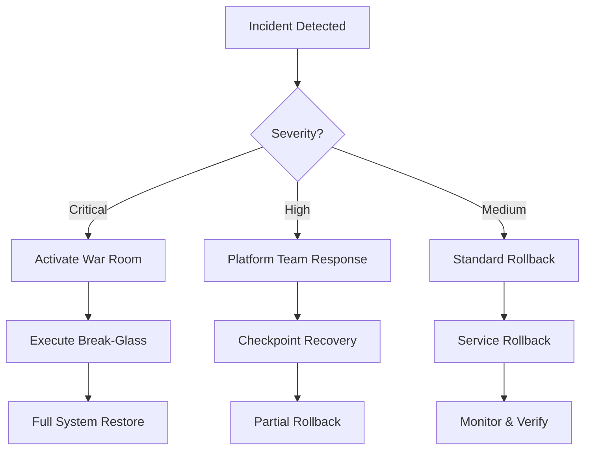

# Candlefish AI Secrets Management - Recovery & Rollback Playbook

> **Version**: 1.0.0  
> **Classification**: CONFIDENTIAL  
> **Purpose**: Disaster recovery and rollback procedures for secrets management deployment  
> **Activation**: Use in case of deployment failure, security breach, or service outage  

## 🚨 Emergency Response Tree



## 📍 Recovery Checkpoints

### Checkpoint Alpha: Pre-Deployment Baseline
**Timestamp**: 2025-09-04 21:00:00 MDT (Before incident)
**State**: Last known good configuration

```bash
# Restore from backup
BACKUP_DIR="/Users/patricksmith/candlefish-backups/20250904-210000"

# Verify backup exists
if [ -d "$BACKUP_DIR" ]; then
    echo "✅ Backup found at $BACKUP_DIR"
    
    # Restore all .env files
    find "$BACKUP_DIR" -name "*.env" -exec sh -c '
        dest=$(echo "$1" | sed "s|$2|/Users/patricksmith/candlefish-ai|")
        cp -v "$1" "$dest"
    ' _ {} "$BACKUP_DIR" \;
else
    echo "❌ CRITICAL: No backup found! Initiate manual recovery"
fi
```

### Checkpoint Bravo: Emergency Credentials Generated
**Timestamp**: 2025-09-04 21:22:16 MDT
**State**: New temporary credentials created

```bash
# Rollback to emergency state
EMERGENCY_DIR="$HOME/.candlefish-secrets-20250904-212216"

# Restore emergency credentials
if [ -f "$EMERGENCY_DIR/.env.new" ]; then
    cp "$EMERGENCY_DIR/.env.new" /Users/patricksmith/candlefish-ai/.env
    echo "✅ Emergency credentials restored"
else
    echo "❌ Emergency credentials not found"
fi

# Revert service configs
for service in clos/api-server projects/promoterOS projects/paintbox; do
    if [ -f "$EMERGENCY_DIR/.env.new" ]; then
        cp "$EMERGENCY_DIR/.env.new" "/Users/patricksmith/candlefish-ai/$service/.env"
    fi
done
```

### Checkpoint Charlie: AWS Secrets Manager Deployed
**Timestamp**: TBD (After Phase 2)
**State**: AWS infrastructure operational

```bash
# Rollback AWS Secrets Manager
cd /Users/patricksmith/candlefish-ai/infrastructure/secrets-management

# Save current state
terraform state pull > terraform.state.backup.$(date +%Y%m%d-%H%M%S)

# Targeted destruction
terraform destroy \
    -target=module.secrets_manager \
    -target=module.kms \
    -auto-approve

# Verify rollback
aws secretsmanager list-secrets --region us-east-1 | jq '.SecretList[] | select(.Name | startswith("/candlefish"))'
```

### Checkpoint Delta: Vault Cluster Initialized
**Timestamp**: TBD (After Phase 3)
**State**: Vault operational but not integrated

```bash
# Vault rollback procedure
cd /Users/patricksmith/candlefish-ai/infrastructure/secrets-management/terraform/vault

# Export Vault data
vault operator raft snapshot save vault-backup-$(date +%Y%m%d-%H%M%S).snap

# Destroy Vault infrastructure
terraform destroy -auto-approve

# Remove Kubernetes resources
kubectl delete namespace vault --grace-period=0 --force

# Clean up persistent volumes
kubectl delete pv -l app=vault
```

## 🔄 Rollback Procedures by Phase

### Phase 1 Rollback: Emergency Rotation Failed

**Trigger Conditions**:
- Unable to revoke compromised credentials
- Emergency credentials not working
- Service outages detected

**Recovery Steps**:
```bash
#!/bin/bash
# Phase 1 Emergency Rollback

echo "⚠️  Initiating Phase 1 Rollback..."

# 1. Stop all services
docker-compose down
kubectl scale deployment --all --replicas=0 -n production

# 2. Restore original credentials
BACKUP_ENV="/Users/patricksmith/candlefish-backups/.env.original"
if [ -f "$BACKUP_ENV" ]; then
    # Restore to all service locations
    services=(
        "clos/api-server"
        "projects/promoterOS"
        "projects/paintbox"
        "brand/website"
        "apps/collaboration-editor"
    )
    
    for service in "${services[@]}"; do
        cp "$BACKUP_ENV" "/Users/patricksmith/candlefish-ai/$service/.env"
        echo "✅ Restored $service/.env"
    done
fi

# 3. Restart services with original config
docker-compose up -d
kubectl scale deployment --all --replicas=1 -n production

# 4. Monitor recovery
./scripts/health-check.sh

echo "✅ Phase 1 Rollback Complete"
```

### Phase 2 Rollback: AWS Secrets Manager Failed

**Trigger Conditions**:
- Terraform deployment errors
- KMS key creation failed
- IAM permissions issues

**Recovery Steps**:
```bash
#!/bin/bash
# Phase 2 AWS Rollback

echo "⚠️  Initiating Phase 2 AWS Rollback..."

# 1. Capture current state
aws secretsmanager list-secrets > aws-secrets-current.json
aws kms list-keys > aws-kms-current.json

# 2. Terraform rollback
cd infrastructure/secrets-management
terraform state list > resources.txt

# Selective destroy
while IFS= read -r resource; do
    if [[ $resource == *"aws_secretsmanager"* ]] || [[ $resource == *"aws_kms"* ]]; then
        terraform destroy -target="$resource" -auto-approve
    fi
done < resources.txt

# 3. Manual cleanup if needed
aws secretsmanager list-secrets --query 'SecretList[?contains(Name, `/candlefish/`)].ARN' \
    | jq -r '.[]' \
    | xargs -I {} aws secretsmanager delete-secret --secret-id {} --force-delete-without-recovery

# 4. Revert to local secrets
cp ~/.candlefish-secrets-20250904-212216/.env.new /Users/patricksmith/candlefish-ai/.env

echo "✅ Phase 2 Rollback Complete"
```

### Phase 3 Rollback: Vault Deployment Failed

**Trigger Conditions**:
- Vault cluster unhealthy
- Auto-unseal not working
- Policy configuration errors

**Recovery Steps**:
```bash
#!/bin/bash
# Phase 3 Vault Rollback

echo "⚠️  Initiating Phase 3 Vault Rollback..."

# 1. Export Vault data if accessible
if vault status > /dev/null 2>&1; then
    vault operator raft snapshot save vault-emergency-backup.snap
    vault secrets list -format=json > vault-secrets-list.json
fi

# 2. Kubernetes cleanup
kubectl delete namespace vault --timeout=60s || \
    kubectl delete namespace vault --grace-period=0 --force

# 3. Terraform destruction
cd terraform/vault
terraform destroy -auto-approve

# 4. Fallback to AWS Secrets Manager only
export SECRET_BACKEND=aws-secrets-manager
./scripts/configure-sdk.sh aws

echo "✅ Phase 3 Rollback Complete"
```

### Phase 4 Rollback: Application Integration Failed

**Trigger Conditions**:
- SDK integration errors
- Application authentication failures
- Performance degradation

**Recovery Steps**:
```bash
#!/bin/bash
# Phase 4 Application Rollback

echo "⚠️  Initiating Phase 4 Application Rollback..."

# 1. Revert application code
cd /Users/patricksmith/candlefish-ai
git stash push -m "Failed secrets integration $(date +%Y%m%d-%H%M%S)"
git checkout main
git pull origin main

# 2. Restore environment configs
for app in $(find . -name ".env.backup" -type f); do
    original="${app%.backup}"
    cp "$app" "$original"
    echo "✅ Restored $original"
done

# 3. Rebuild and redeploy
npm install
npm run build
./scripts/deploy.sh staging

# 4. Verify services
./scripts/integration-test.sh

echo "✅ Phase 4 Rollback Complete"
```

## 🔥 Break-Glass Emergency Procedures

### Scenario 1: Complete System Failure
```bash
#!/bin/bash
# EMERGENCY: Full System Recovery

# 1. Activate emergency mode
export EMERGENCY_MODE=true
export BYPASS_AUTH=true

# 2. Deploy minimal configuration
cat > /tmp/emergency.env << 'EOF'
NODE_ENV=emergency
DATABASE_URL=sqlite:///tmp/emergency.db
JWT_SECRET=EMERGENCY_$(openssl rand -hex 32)
API_KEY=EMERGENCY_ONLY
EOF

# 3. Start emergency services
docker run -d \
    --name emergency-api \
    --env-file /tmp/emergency.env \
    -p 9999:8000 \
    candlefish/emergency-api:latest

# 4. Notify all teams
./scripts/send-emergency-alert.sh "SYSTEM FAILURE - Emergency mode activated"
```

### Scenario 2: Security Breach During Deployment
```bash
#!/bin/bash
# SECURITY: Immediate lockdown

# 1. Revoke all credentials
aws iam list-access-keys --user-name candlefish-deploy \
    | jq -r '.AccessKeyMetadata[].AccessKeyId' \
    | xargs -I {} aws iam delete-access-key --access-key-id {} --user-name candlefish-deploy

# 2. Rotate all secrets immediately
./scripts/emergency-rotation.sh --all --force

# 3. Enable audit mode
export AUDIT_ALL_ACCESS=true
export LOG_LEVEL=DEBUG

# 4. Deploy honeypots
kubectl apply -f k8s/security/honeypot.yaml
```

## 📊 Recovery Validation Checklist

### Service Health Validation
```bash
#!/bin/bash
# Health check script

echo "🔍 Starting recovery validation..."

# Check services
services=(
    "http://localhost:8000/health"  # CLOS API
    "http://localhost:3000/api/health"  # PromoterOS
    "http://localhost:3001/health"  # Paintbox
    "http://localhost:3002/health"  # Brand website
)

for service in "${services[@]}"; do
    if curl -s -o /dev/null -w "%{http_code}" "$service" | grep -q "200"; then
        echo "✅ $service is healthy"
    else
        echo "❌ $service is down"
    fi
done

# Check databases
echo "test" | mongo mongodb://localhost:27017 --quiet && echo "✅ MongoDB connected" || echo "❌ MongoDB failed"
echo "PING" | redis-cli && echo "✅ Redis connected" || echo "❌ Redis failed"

# Check secrets accessibility
vault status > /dev/null 2>&1 && echo "✅ Vault accessible" || echo "❌ Vault inaccessible"
aws secretsmanager list-secrets > /dev/null 2>&1 && echo "✅ AWS Secrets Manager accessible" || echo "❌ AWS SM failed"
```

## 📞 Emergency Contacts & Escalation

### Escalation Matrix

| Level | Condition | Contact | Response Time |
|-------|-----------|---------|---------------|
| L1 | Service degradation | Platform on-call | 15 min |
| L2 | Multiple services down | Platform Lead + Security | 10 min |
| L3 | Security breach | CTO + Security Lead | 5 min |
| L4 | Complete system failure | All hands | Immediate |

### Contact Information
```yaml
emergency_contacts:
  primary:
    platform_oncall: +1-555-PLATFORM
    security_oncall: +1-555-SECURITY
    
  escalation:
    platform_lead: platform-lead@candlefish.ai
    security_lead: security-lead@candlefish.ai
    cto: cto@candlefish.ai
    
  external:
    aws_support: AWS Support Case (Premium)
    mongodb_support: MongoDB Atlas Support
    google_support: GCP Support
    
  communication:
    war_room: https://meet.google.com/emergency-war-room
    slack_channel: #emergency-response
    status_page: https://status.candlefish.ai
```

## 🎬 Recovery Automation

### One-Click Recovery Script
```bash
#!/bin/bash
# Master recovery script
# Usage: ./recovery.sh [checkpoint-name]

CHECKPOINT=${1:-"auto-detect"}

case $CHECKPOINT in
    "alpha")
        ./rollback/restore-baseline.sh
        ;;
    "bravo")
        ./rollback/restore-emergency.sh
        ;;
    "charlie")
        ./rollback/rollback-aws.sh
        ;;
    "delta")
        ./rollback/rollback-vault.sh
        ;;
    "auto-detect")
        ./rollback/smart-recovery.sh
        ;;
    *)
        echo "Unknown checkpoint: $CHECKPOINT"
        echo "Valid options: alpha, bravo, charlie, delta, auto-detect"
        exit 1
        ;;
esac

# Validate recovery
./scripts/validate-recovery.sh

# Generate report
./scripts/generate-recovery-report.sh > "recovery-report-$(date +%Y%m%d-%H%M%S).md"
```

## 📝 Post-Recovery Actions

1. **Document the incident** in incident management system
2. **Conduct post-mortem** within 48 hours
3. **Update runbooks** with lessons learned
4. **Test recovery procedures** in staging
5. **Implement preventive measures**
6. **Schedule disaster recovery drill**

---

**Document Version**: 1.0.0  
**Last Updated**: 2025-09-05  
**Next Review**: After first deployment or incident  
**Owner**: Platform Team  

> **Remember**: In a crisis, stay calm, follow the playbook, and communicate frequently. Recovery is a marathon, not a sprint.