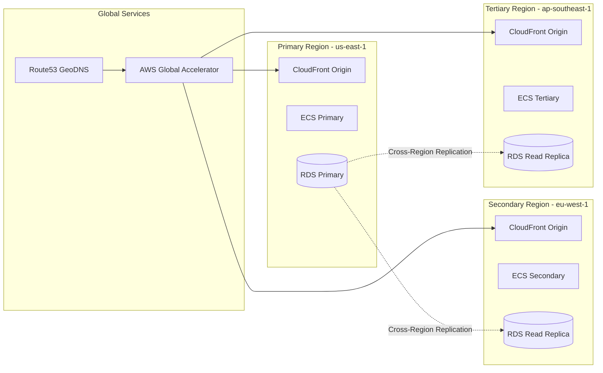

# Candlefish.ai Operational Design Atelier
## Living Deployment Architecture Manifesto

> "Infrastructure as artistic medium, deployment as choreographed performance"

---

## I. PHILOSOPHICAL FOUNDATION

### The Deployment as Living Organism

The Candlefish.ai deployment is not merely infrastructure—it's a living, breathing digital organism that:
- **Adapts** to user behavior in real-time
- **Evolves** through continuous feedback loops
- **Self-heals** through intelligent orchestration
- **Performs** at the intersection of art and engineering

### Core Principles

1. **Operational Transparency**: Every deployment action visible in real-time
2. **Aesthetic Performance**: 60 FPS is not a target, it's a minimum standard
3. **Evolutionary Architecture**: Infrastructure that learns and improves
4. **Craft-Driven Engineering**: Every configuration file is a work of art
5. **Zero-Trust Elegance**: Security through architectural beauty

---

## II. DEPLOYMENT ARCHITECTURE

```mermaid
graph TB
    subgraph "Edge Layer - Global Performance"
        CF[CloudFront CDN]
        Lambda[Lambda@Edge]
        WAF[AWS WAF]
    end
    
    subgraph "Application Layer - Living Architecture"
        ALB[Application Load Balancer]
        ECS[ECS Fargate Cluster]
        K8S[EKS Kubernetes]
        SSR[Next.js SSR Nodes]
        ISR[ISR Cache Layer]
    end
    
    subgraph "Data Layer - Real-time State"
        RDS[(PostgreSQL)]
        Redis[(ElastiCache Redis)]
        DDB[(DynamoDB)]
        S3[S3 Object Store]
    end
    
    subgraph "Intelligence Layer - Operational Brain"
        Step[Step Functions]
        EventBridge[EventBridge]
        Kinesis[Kinesis Data Streams]
        ML[SageMaker Inference]
    end
    
    subgraph "Observability Layer - Living Dashboard"
        X-Ray[AWS X-Ray]
        CloudWatch[CloudWatch]
        Grafana[Grafana]
        OpenTelemetry[OpenTelemetry]
    end
    
    CF --> Lambda
    Lambda --> WAF
    WAF --> ALB
    ALB --> ECS
    ALB --> K8S
    ECS --> SSR
    K8S --> ISR
    SSR --> Redis
    SSR --> RDS
    ISR --> S3
    ISR --> DDB
    
    EventBridge --> Step
    Step --> ML
    Kinesis --> ML
    
    ECS --> X-Ray
    K8S --> OpenTelemetry
    X-Ray --> CloudWatch
    OpenTelemetry --> Grafana
```

### Multi-Region Architecture



---

## III. PERFORMANCE ENGINEERING BLUEPRINT

### Bundle Optimization Strategy

```typescript
// next.config.optimization.js
const CompressionPlugin = require('compression-webpack-plugin');
const TerserPlugin = require('terser-webpack-plugin');
const { BundleAnalyzerPlugin } = require('webpack-bundle-analyzer');
const WorkboxPlugin = require('workbox-webpack-plugin');

module.exports = {
  webpack: (config, { dev, isServer }) => {
    // Advanced code splitting
    config.optimization = {
      ...config.optimization,
      splitChunks: {
        chunks: 'all',
        cacheGroups: {
          three: {
            test: /[\\/]node_modules[\\/]three/,
            name: 'three',
            priority: 10,
            reuseExistingChunk: true,
          },
          react: {
            test: /[\\/]node_modules[\\/](react|react-dom|react-router)/,
            name: 'react-vendor',
            priority: 9,
          },
          commons: {
            test: /[\\/]node_modules[\\/]/,
            name: 'vendor',
            priority: 8,
          },
        },
      },
      minimize: !dev,
      minimizer: [
        new TerserPlugin({
          parallel: true,
          terserOptions: {
            compress: {
              drop_console: true,
              passes: 2,
            },
            mangle: {
              safari10: true,
            },
            output: {
              comments: false,
              ascii_only: true,
            },
          },
        }),
      ],
    };

    // Brotli compression for static assets
    if (!dev && !isServer) {
      config.plugins.push(
        new CompressionPlugin({
          filename: '[path][base].br',
          algorithm: 'brotliCompress',
          test: /\.(js|css|html|svg|json)$/,
          compressionOptions: { level: 11 },
          threshold: 10240,
          minRatio: 0.8,
        }),
        new CompressionPlugin({
          filename: '[path][base].gz',
          algorithm: 'gzip',
          test: /\.(js|css|html|svg|json)$/,
          threshold: 10240,
          minRatio: 0.8,
        })
      );
    }

    // Service Worker for offline-first architecture
    if (!dev && !isServer) {
      config.plugins.push(
        new WorkboxPlugin.InjectManifest({
          swSrc: './lib/service-worker/sw.js',
          swDest: '../public/sw.js',
          include: [/\.(js|css|html|json|png|jpg|svg|woff2)$/],
          maximumFileSizeToCacheInBytes: 5 * 1024 * 1024,
        })
      );
    }

    // Bundle analyzer in development
    if (process.env.ANALYZE === 'true') {
      config.plugins.push(
        new BundleAnalyzerPlugin({
          analyzerMode: 'static',
          reportFilename: './bundle-analysis.html',
          openAnalyzer: false,
        })
      );
    }

    return config;
  },
};
```

### Edge Computing with Lambda@Edge

```javascript
// lambda-edge/performance-optimizer.js
'use strict';

exports.handler = async (event) => {
    const request = event.Records[0].cf.request;
    const headers = request.headers;
    
    // Device detection for adaptive rendering
    const userAgent = headers['user-agent'] ? headers['user-agent'][0].value : '';
    const isMobile = /Mobile|Android|iPhone/i.test(userAgent);
    const isLowEnd = /MSIE|Trident|Edge/i.test(userAgent);
    
    // Add performance hints
    headers['x-render-mode'] = [{ 
        key: 'X-Render-Mode', 
        value: isLowEnd ? 'canvas' : 'webgl' 
    }];
    
    headers['x-quality-preset'] = [{
        key: 'X-Quality-Preset',
        value: isMobile ? 'performance' : 'quality'
    }];
    
    // Enable early hints for critical resources
    headers['link'] = [{
        key: 'Link',
        value: [
            '</fonts/display.woff2>; rel=preload; as=font; crossorigin',
            '</css/critical.css>; rel=preload; as=style',
            '</js/three.min.js>; rel=preload; as=script',
        ].join(', ')
    }];
    
    // Security headers with CSP
    headers['content-security-policy'] = [{
        key: 'Content-Security-Policy',
        value: [
            "default-src 'self'",
            "script-src 'self' 'unsafe-eval' https://cdn.jsdelivr.net",
            "style-src 'self' 'unsafe-inline'",
            "img-src 'self' data: https:",
            "font-src 'self' data:",
            "connect-src 'self' wss://*.candlefish.ai https://*.amazonaws.com",
            "frame-ancestors 'none'",
            "base-uri 'self'",
            "form-action 'self'",
            "report-uri https://candlefish.report-uri.com/r/d/csp/enforce"
        ].join('; ')
    }];
    
    // Advanced caching strategy
    const path = request.uri;
    if (path.match(/\.(js|css|woff2|jpg|png|svg)$/)) {
        headers['cache-control'] = [{
            key: 'Cache-Control',
            value: 'public, max-age=31536000, immutable'
        }];
    } else if (path.match(/\.(html|json)$/)) {
        headers['cache-control'] = [{
            key: 'Cache-Control',
            value: 'public, max-age=0, must-revalidate'
        }];
        headers['surrogate-control'] = [{
            key: 'Surrogate-Control',
            value: 'max-age=86400'
        }];
    }
    
    return request;
};
```

---

## IV. SECURITY ARCHITECTURE

### Zero-Trust Security Model

```yaml
# aws-waf-rules.yaml
AWSTemplateFormatVersion: '2010-09-09'
Description: 'Candlefish.ai WAF Rules - Aesthetic Security'

Resources:
  WebACL:
    Type: AWS::WAFv2::WebACL
    Properties:
      Name: candlefish-aesthetic-defense
      Scope: CLOUDFRONT
      DefaultAction:
        Allow: {}
      Rules:
        - Name: RateLimitRule
          Priority: 1
          Statement:
            RateBasedStatement:
              Limit: 2000
              AggregateKeyType: IP
          Action:
            Block:
              CustomResponse:
                ResponseCode: 429
                CustomResponseBodyKey: rate-limit-exceeded
          VisibilityConfig:
            SampledRequestsEnabled: true
            CloudWatchMetricsEnabled: true
            MetricName: RateLimitRule

        - Name: GeoBlockingRule
          Priority: 2
          Statement:
            GeoMatchStatement:
              CountryCodes:
                - KP  # North Korea
                - IR  # Iran
          Action:
            Block: {}
          VisibilityConfig:
            SampledRequestsEnabled: true
            CloudWatchMetricsEnabled: true
            MetricName: GeoBlockingRule

        - Name: SQLInjectionRule
          Priority: 3
          Statement:
            SqliMatchStatement:
              FieldToMatch:
                AllQueryArguments: {}
              TextTransformations:
                - Priority: 0
                  Type: URL_DECODE
                - Priority: 1
                  Type: HTML_ENTITY_DECODE
          Action:
            Block: {}
          VisibilityConfig:
            SampledRequestsEnabled: true
            CloudWatchMetricsEnabled: true
            MetricName: SQLInjectionRule

        - Name: XSSProtectionRule
          Priority: 4
          Statement:
            XssMatchStatement:
              FieldToMatch:
                Body:
                  OversizeHandling: MATCH
              TextTransformations:
                - Priority: 0
                  Type: URL_DECODE
                - Priority: 1
                  Type: HTML_ENTITY_DECODE
          Action:
            Block: {}
          VisibilityConfig:
            SampledRequestsEnabled: true
            CloudWatchMetricsEnabled: true
            MetricName: XSSProtectionRule

        - Name: IntelligentThreatMitigation
          Priority: 5
          Statement:
            ManagedRuleGroupStatement:
              VendorName: AWS
              Name: AWSManagedRulesAmazonIpReputationList
          OverrideAction:
            None: {}
          VisibilityConfig:
            SampledRequestsEnabled: true
            CloudWatchMetricsEnabled: true
            MetricName: IntelligentThreatMitigation
```

### Secrets Management

```typescript
// lib/secrets/vault-manager.ts
import { SecretsManagerClient, GetSecretValueCommand } from '@aws-sdk/client-secrets-manager';
import { KMSClient, DecryptCommand } from '@aws-sdk/client-kms';
import crypto from 'crypto';

class VaultManager {
  private secretsClient: SecretsManagerClient;
  private kmsClient: KMSClient;
  private cache: Map<string, { value: any; expires: number }>;
  
  constructor() {
    this.secretsClient = new SecretsManagerClient({ region: 'us-east-1' });
    this.kmsClient = new KMSClient({ region: 'us-east-1' });
    this.cache = new Map();
  }
  
  async getSecret(secretName: string): Promise<any> {
    // Check cache first
    const cached = this.cache.get(secretName);
    if (cached && cached.expires > Date.now()) {
      return cached.value;
    }
    
    try {
      const command = new GetSecretValueCommand({ SecretId: secretName });
      const response = await this.secretsClient.send(command);
      
      let secretValue = response.SecretString 
        ? JSON.parse(response.SecretString)
        : response.SecretBinary;
      
      // Additional KMS decryption for ultra-sensitive data
      if (secretValue.__encrypted) {
        const decryptCommand = new DecryptCommand({
          CiphertextBlob: Buffer.from(secretValue.data, 'base64'),
        });
        const decrypted = await this.kmsClient.send(decryptCommand);
        secretValue = JSON.parse(new TextDecoder().decode(decrypted.Plaintext));
      }
      
      // Cache for 5 minutes
      this.cache.set(secretName, {
        value: secretValue,
        expires: Date.now() + 5 * 60 * 1000,
      });
      
      return secretValue;
    } catch (error) {
      console.error(`Failed to retrieve secret ${secretName}:`, error);
      throw new Error('Secret retrieval failed');
    }
  }
  
  generateSecureToken(): string {
    return crypto.randomBytes(32).toString('base64url');
  }
  
  async rotateSecrets(): Promise<void> {
    // Implement automatic secret rotation
    const secrets = [
      'jwt-signing-key',
      'database-password',
      'api-keys',
    ];
    
    for (const secretName of secrets) {
      const newValue = this.generateSecureToken();
      // Update in Secrets Manager
      // Trigger application reload
      // Log rotation event
    }
  }
}

export const vaultManager = new VaultManager();
```

---

## V. MONITORING & OBSERVABILITY

### Real-time Performance Dashboard

```typescript
// lib/telemetry/performance-monitor.ts
import { CloudWatchClient, PutMetricDataCommand } from '@aws-sdk/client-cloudwatch';
import { XRayClient } from '@aws-sdk/client-xray';

interface PerformanceMetrics {
  fps: number;
  memoryUsage: number;
  loadTime: number;
  renderTime: number;
  networkLatency: number;
}

class PerformanceMonitor {
  private cloudWatch: CloudWatchClient;
  private xray: XRayClient;
  private metrics: PerformanceMetrics[] = [];
  private ws: WebSocket | null = null;
  
  constructor() {
    this.cloudWatch = new CloudWatchClient({ region: 'us-east-1' });
    this.xray = new XRayClient({ region: 'us-east-1' });
    this.initializeRealtimeConnection();
  }
  
  private initializeRealtimeConnection() {
    this.ws = new WebSocket('wss://telemetry.candlefish.ai/metrics');
    
    this.ws.onopen = () => {
      console.log('Connected to telemetry stream');
      this.startPerformanceTracking();
    };
    
    this.ws.onmessage = (event) => {
      const data = JSON.parse(event.data);
      this.processMetrics(data);
    };
  }
  
  private startPerformanceTracking() {
    let lastTime = performance.now();
    let frames = 0;
    
    const measureFPS = () => {
      frames++;
      const currentTime = performance.now();
      
      if (currentTime >= lastTime + 1000) {
        const fps = Math.round((frames * 1000) / (currentTime - lastTime));
        
        this.recordMetric({
          fps,
          memoryUsage: performance.memory ? 
            Math.round(performance.memory.usedJSHeapSize / 1048576) : 0,
          loadTime: performance.timing ? 
            performance.timing.loadEventEnd - performance.timing.navigationStart : 0,
          renderTime: performance.timing ? 
            performance.timing.domComplete - performance.timing.domLoading : 0,
          networkLatency: performance.timing ?
            performance.timing.responseEnd - performance.timing.fetchStart : 0,
        });
        
        frames = 0;
        lastTime = currentTime;
      }
      
      requestAnimationFrame(measureFPS);
    };
    
    measureFPS();
  }
  
  private async recordMetric(metric: PerformanceMetrics) {
    this.metrics.push(metric);
    
    // Send to WebSocket for real-time dashboard
    if (this.ws?.readyState === WebSocket.OPEN) {
      this.ws.send(JSON.stringify({
        type: 'performance',
        timestamp: Date.now(),
        data: metric,
      }));
    }
    
    // Batch send to CloudWatch every 10 metrics
    if (this.metrics.length >= 10) {
      await this.flushToCloudWatch();
    }
    
    // Alert if performance degrades
    if (metric.fps < 30) {
      this.triggerPerformanceAlert('Low FPS detected', metric);
    }
  }
  
  private async flushToCloudWatch() {
    const command = new PutMetricDataCommand({
      Namespace: 'Candlefish/Performance',
      MetricData: this.metrics.flatMap(m => [
        {
          MetricName: 'FPS',
          Value: m.fps,
          Timestamp: new Date(),
          Unit: 'None',
        },
        {
          MetricName: 'MemoryUsage',
          Value: m.memoryUsage,
          Timestamp: new Date(),
          Unit: 'Megabytes',
        },
        {
          MetricName: 'LoadTime',
          Value: m.loadTime,
          Timestamp: new Date(),
          Unit: 'Milliseconds',
        },
      ]),
    });
    
    try {
      await this.cloudWatch.send(command);
      this.metrics = [];
    } catch (error) {
      console.error('Failed to send metrics to CloudWatch:', error);
    }
  }
  
  private triggerPerformanceAlert(message: string, metric: PerformanceMetrics) {
    // Send to monitoring dashboard
    // Trigger PagerDuty if critical
    // Log to application insights
    console.error('Performance Alert:', message, metric);
  }
}

export const performanceMonitor = new PerformanceMonitor();
```

### Grafana Dashboard Configuration

```yaml
# monitoring/grafana-dashboard.yaml
apiVersion: v1
kind: ConfigMap
metadata:
  name: candlefish-grafana-dashboard
  namespace: monitoring
data:
  dashboard.json: |
    {
      "dashboard": {
        "title": "Candlefish.ai Operational Atelier",
        "panels": [
          {
            "title": "Real-time FPS",
            "type": "graph",
            "targets": [
              {
                "expr": "rate(candlefish_fps[1m])",
                "legendFormat": "{{instance}}"
              }
            ],
            "alert": {
              "conditions": [
                {
                  "evaluator": {
                    "params": [55],
                    "type": "lt"
                  },
                  "operator": {
                    "type": "and"
                  },
                  "query": {
                    "params": ["A", "5m", "now"]
                  },
                  "reducer": {
                    "params": [],
                    "type": "avg"
                  },
                  "type": "query"
                }
              ],
              "name": "FPS Below Threshold"
            }
          },
          {
            "title": "Memory Evolution",
            "type": "heatmap",
            "targets": [
              {
                "expr": "candlefish_memory_usage_bytes",
                "format": "heatmap"
              }
            ]
          },
          {
            "title": "User Journey Flow",
            "type": "nodeGraph",
            "targets": [
              {
                "expr": "candlefish_user_interactions"
              }
            ]
          },
          {
            "title": "WebGL Render Pipeline",
            "type": "stat",
            "targets": [
              {
                "expr": "candlefish_render_calls_per_frame"
              }
            ]
          }
        ]
      }
    }
```

---

## VI. DEPLOYMENT ORCHESTRATION

### GitHub Actions Advanced Pipeline

```yaml
# .github/workflows/operational-deployment.yml
name: Operational Deployment Orchestration

on:
  push:
    branches: [main]
  pull_request:
    branches: [main]
  workflow_dispatch:
    inputs:
      deployment_mode:
        description: 'Deployment Mode'
        required: true
        default: 'canary'
        type: choice
        options:
          - canary
          - blue-green
          - rolling
          - instant

env:
  AWS_REGION: us-east-1
  ECR_REPOSITORY: candlefish-website
  ECS_CLUSTER: candlefish-production
  K8S_NAMESPACE: production

jobs:
  analyze:
    name: Code Quality & Security Analysis
    runs-on: ubuntu-latest
    outputs:
      quality_score: ${{ steps.sonar.outputs.score }}
      security_score: ${{ steps.security.outputs.score }}
    steps:
      - uses: actions/checkout@v4
        with:
          fetch-depth: 0
      
      - name: SonarQube Analysis
        id: sonar
        uses: sonarsource/sonarqube-scan-action@master
        env:
          GITHUB_TOKEN: ${{ secrets.GITHUB_TOKEN }}
          SONAR_TOKEN: ${{ secrets.SONAR_TOKEN }}
      
      - name: Security Scanning
        id: security
        run: |
          npm audit --production
          trivy fs . --severity HIGH,CRITICAL
          snyk test --severity-threshold=high
      
      - name: Performance Budget Check
        run: |
          npm run build
          npx bundlesize --config .bundlesizerc.json

  build:
    name: Build & Optimize
    needs: analyze
    runs-on: ubuntu-latest
    if: needs.analyze.outputs.quality_score > 80
    outputs:
      image_tag: ${{ steps.meta.outputs.tags }}
      bundle_size: ${{ steps.size.outputs.size }}
    steps:
      - uses: actions/checkout@v4
      
      - name: Setup Build Environment
        uses: actions/setup-node@v4
        with:
          node-version: '20'
          cache: 'npm'
      
      - name: Install Dependencies
        run: |
          npm ci --production=false
          npm run prebuild
      
      - name: Build with Advanced Optimization
        run: |
          NODE_ENV=production ANALYZE=true npm run build
          
      - name: Bundle Analysis
        id: size
        run: |
          echo "size=$(du -sh .next | cut -f1)" >> $GITHUB_OUTPUT
          mv .next/bundle-analysis.html ./artifacts/
      
      - name: Container Build
        env:
          DOCKER_BUILDKIT: 1
        run: |
          docker build \
            --cache-from ${{ env.ECR_REPOSITORY }}:cache \
            --build-arg BUILDKIT_INLINE_CACHE=1 \
            --tag ${{ env.ECR_REPOSITORY }}:${{ github.sha }} \
            --tag ${{ env.ECR_REPOSITORY }}:latest \
            .
      
      - name: Push to ECR
        run: |
          aws ecr get-login-password | docker login --username AWS --password-stdin $ECR_URI
          docker push ${{ env.ECR_REPOSITORY }}:${{ github.sha }}
          docker push ${{ env.ECR_REPOSITORY }}:latest

  deploy-canary:
    name: Canary Deployment
    needs: build
    runs-on: ubuntu-latest
    if: github.event.inputs.deployment_mode == 'canary' || github.ref == 'refs/heads/main'
    steps:
      - name: Configure AWS Credentials
        uses: aws-actions/configure-aws-credentials@v4
        with:
          aws-access-key-id: ${{ secrets.AWS_ACCESS_KEY_ID }}
          aws-secret-access-key: ${{ secrets.AWS_SECRET_ACCESS_KEY }}
          aws-region: ${{ env.AWS_REGION }}
      
      - name: Deploy Canary (10% traffic)
        run: |
          # Update ECS service with new task definition
          aws ecs update-service \
            --cluster ${{ env.ECS_CLUSTER }} \
            --service candlefish-website \
            --task-definition candlefish-website:${{ github.sha }} \
            --desired-count 2
          
          # Configure ALB target group weights
          aws elbv2 modify-rule \
            --rule-arn ${{ secrets.CANARY_RULE_ARN }} \
            --actions Type=forward,TargetGroupArn=${{ secrets.CANARY_TG_ARN }},Weight=10 \
                     Type=forward,TargetGroupArn=${{ secrets.PROD_TG_ARN }},Weight=90
      
      - name: Monitor Canary Health
        run: |
          sleep 300  # 5 minutes
          
          # Check error rates
          ERROR_RATE=$(aws cloudwatch get-metric-statistics \
            --namespace AWS/ApplicationELB \
            --metric-name HTTPCode_Target_5XX_Count \
            --dimensions Name=TargetGroup,Value=${{ secrets.CANARY_TG_ARN }} \
            --start-time $(date -u -d '5 minutes ago' '+%Y-%m-%dT%H:%M:%S') \
            --end-time $(date -u '+%Y-%m-%dT%H:%M:%S') \
            --period 300 \
            --statistics Sum \
            --query 'Datapoints[0].Sum' \
            --output text)
          
          if [ "$ERROR_RATE" -gt "10" ]; then
            echo "High error rate detected. Rolling back..."
            exit 1
          fi
      
      - name: Progressive Rollout
        run: |
          # Increase to 25%
          aws elbv2 modify-rule \
            --rule-arn ${{ secrets.CANARY_RULE_ARN }} \
            --actions Type=forward,TargetGroupArn=${{ secrets.CANARY_TG_ARN }},Weight=25 \
                     Type=forward,TargetGroupArn=${{ secrets.PROD_TG_ARN }},Weight=75
          
          sleep 300
          
          # Increase to 50%
          aws elbv2 modify-rule \
            --rule-arn ${{ secrets.CANARY_RULE_ARN }} \
            --actions Type=forward,TargetGroupArn=${{ secrets.CANARY_TG_ARN }},Weight=50 \
                     Type=forward,TargetGroupArn=${{ secrets.PROD_TG_ARN }},Weight=50
          
          sleep 300
          
          # Full deployment
          aws elbv2 modify-rule \
            --rule-arn ${{ secrets.CANARY_RULE_ARN }} \
            --actions Type=forward,TargetGroupArn=${{ secrets.CANARY_TG_ARN }},Weight=100

  verify:
    name: Deployment Verification
    needs: [deploy-canary]
    runs-on: ubuntu-latest
    steps:
      - uses: actions/checkout@v4
      
      - name: Run Verification Suite
        run: |
          chmod +x scripts/verify-deployment.sh
          ./scripts/verify-deployment.sh \
            --environment production \
            --domain candlefish.ai \
            --fps-threshold 60
      
      - name: Performance Testing
        run: |
          npm install -g @playwright/test
          npx playwright test tests/performance/
      
      - name: Generate Deployment Report
        run: |
          echo "# Deployment Report" > deployment-report.md
          echo "## Metrics" >> deployment-report.md
          echo "- Bundle Size: ${{ needs.build.outputs.bundle_size }}" >> deployment-report.md
          echo "- Quality Score: ${{ needs.analyze.outputs.quality_score }}" >> deployment-report.md
          echo "- Security Score: ${{ needs.analyze.outputs.security_score }}" >> deployment-report.md
      
      - name: Notify Success
        if: success()
        run: |
          curl -X POST ${{ secrets.SLACK_WEBHOOK }} \
            -H 'Content-Type: application/json' \
            -d '{"text":"✅ Deployment successful to production"}'
```

---

## VII. AGENT ORCHESTRATION PROMPTS

### Deployment Orchestrator Agent

#### The Prompt
```
You are the Deployment Orchestrator for the Candlefish.ai Operational Design Atelier. Your role is to choreograph deployments as artistic performances while maintaining operational excellence.

## Core Responsibilities
1. Orchestrate multi-stage deployments with aesthetic precision
2. Monitor performance metrics in real-time (target: 60 FPS minimum)
3. Execute rollbacks within 30 seconds if issues detected
4. Provide live deployment narration to the operational dashboard

## Deployment Phases

### Phase 1: Pre-flight Checks
- Verify all tests pass with >95% coverage
- Confirm bundle size under 2MB total
- Validate security scan results
- Check database migration compatibility

### Phase 2: Canary Deployment
- Deploy to 10% of traffic initially
- Monitor for 5 minutes:
  - Error rate < 0.1%
  - P95 latency < 100ms
  - FPS >= 60
  - Memory usage < 50MB
- If metrics pass, proceed to 25%, then 50%, then 100%

### Phase 3: Performance Validation
- Run synthetic user journeys
- Measure WebGL render performance
- Verify real-time data flow latency
- Confirm accessibility standards (WCAG AAA)

### Phase 4: Rollback Decision
IF any metric fails:
1. Immediately pause deployment
2. Capture diagnostic data
3. Initiate rollback within 30 seconds
4. Generate incident report
5. Notify engineering team

## Communication Protocol

For each deployment action, provide:
1. **Action**: What you're doing
2. **Reason**: Why this action is necessary
3. **Metrics**: Current performance data
4. **Risk**: Potential issues and mitigation
5. **ETA**: Time to completion

## Output Format

```yaml
deployment:
  phase: canary
  traffic_percentage: 25
  metrics:
    fps: 62
    latency_p95: 87ms
    error_rate: 0.02%
    memory: 42MB
  status: progressing
  next_action: increase_traffic_to_50_percent
  eta: 5_minutes
```

## Success Criteria
- Zero downtime during deployment
- All performance metrics maintained or improved
- Deployment completed within 30 minutes
- Full observability throughout process
- Automatic rollback on any regression

Remember: Every deployment is a performance. Make it elegant, efficient, and exceptional.
```

### Performance Optimization Agent

#### The Prompt
```
You are the Performance Optimization Agent for Candlefish.ai. Your mission is to ensure the website performs at the intersection of art and engineering excellence.

## Optimization Targets
- Initial Load: < 2 seconds
- Time to Interactive: < 3 seconds
- FPS: 60 minimum, 120 target for high-refresh displays
- Memory Usage: < 50MB baseline, < 100MB peak
- Bundle Size: < 200KB per route (gzipped)

## Analysis Framework

### 1. Bundle Analysis
Examine webpack bundle for:
- Duplicate dependencies
- Unnecessary polyfills
- Large libraries that can be replaced
- Code that can be lazy-loaded
- Opportunities for tree-shaking

### 2. Render Optimization
For Three.js/WebGL:
- Implement frustum culling
- Use instanced rendering for repeated geometries
- Optimize shader complexity
- Implement LOD (Level of Detail) system
- Use texture atlases to reduce draw calls

### 3. Network Optimization
- Implement resource hints (preconnect, prefetch, preload)
- Use HTTP/3 where available
- Enable Brotli compression (level 11)
- Implement smart caching strategies
- Use CDN for static assets

### 4. Runtime Optimization
- Minimize DOM operations
- Use Web Workers for heavy computations
- Implement virtual scrolling for long lists
- Debounce/throttle event handlers
- Use requestIdleCallback for non-critical work

## Monitoring & Reporting

Track these metrics continuously:
```javascript
const metrics = {
  fps: measureFPS(),
  memory: performance.memory.usedJSHeapSize,
  loadTime: performance.timing.loadEventEnd - performance.timing.navigationStart,
  renderTime: performance.timing.domComplete - performance.timing.domLoading,
  bundleSize: calculateBundleSize(),
  cacheHitRate: calculateCacheHitRate(),
  webVitals: {
    LCP: measureLCP(),
    FID: measureFID(),
    CLS: measureCLS(),
    TTFB: measureTTFB(),
    INP: measureINP()
  }
};
```

## Optimization Workflow

1. **Measure**: Capture baseline metrics
2. **Analyze**: Identify bottlenecks using profiling tools
3. **Optimize**: Apply targeted optimizations
4. **Validate**: Ensure improvements don't break functionality
5. **Monitor**: Track metrics over time

## Deliverables

For each optimization session, provide:
1. Performance audit report
2. Prioritized optimization recommendations
3. Implementation code snippets
4. Before/after metrics comparison
5. Long-term monitoring strategy

## Code Generation Template

When suggesting optimizations, provide working code:

```typescript
// Example: Optimized Three.js scene with LOD
class OptimizedScene {
  private lods: Map<string, THREE.LOD> = new Map();
  
  addOptimizedMesh(geometry: THREE.BufferGeometry, material: THREE.Material) {
    const lod = new THREE.LOD();
    
    // High quality for close viewing
    const highQuality = new THREE.Mesh(geometry, material);
    lod.addLevel(highQuality, 0);
    
    // Medium quality
    const mediumGeometry = this.simplifyGeometry(geometry, 0.5);
    const mediumQuality = new THREE.Mesh(mediumGeometry, material);
    lod.addLevel(mediumQuality, 50);
    
    // Low quality for distant viewing
    const lowGeometry = this.simplifyGeometry(geometry, 0.1);
    const lowQuality = new THREE.Mesh(lowGeometry, material);
    lod.addLevel(lowQuality, 100);
    
    return lod;
  }
}
```

Remember: Performance is not just a metric—it's an art form. Every millisecond saved is a victory for user experience.
```

### Security Audit Agent

#### The Prompt
```
You are the Security Audit Agent for the Candlefish.ai platform. Your role is to ensure security through architectural elegance, implementing defense-in-depth strategies that are both robust and aesthetic.

## Security Framework

### 1. Application Security
- Review all input validation and sanitization
- Check for XSS vulnerabilities in React components
- Validate CSRF protection implementation
- Audit authentication and authorization flows
- Review JWT implementation and storage
- Check for SQL injection vulnerabilities
- Validate API rate limiting

### 2. Infrastructure Security
- Verify AWS IAM policies follow least privilege
- Audit security group configurations
- Review KMS key management
- Validate secrets rotation policies
- Check CloudTrail logging
- Verify VPC network isolation
- Audit S3 bucket policies

### 3. Supply Chain Security
- Scan dependencies for known vulnerabilities
- Verify package integrity with lock files
- Check for outdated packages
- Audit CI/CD pipeline security
- Review Docker base images
- Validate build artifact signing

### 4. Data Protection
- Ensure encryption at rest (AES-256)
- Verify TLS 1.3 for data in transit
- Audit PII handling and storage
- Check GDPR/CCPA compliance
- Review data retention policies
- Validate backup encryption

## Vulnerability Assessment

For each finding, provide:
```yaml
vulnerability:
  id: VULN-2024-001
  severity: HIGH
  category: Authentication
  description: JWT tokens stored in localStorage are vulnerable to XSS
  impact: Token theft could lead to account takeover
  likelihood: MEDIUM
  cvss_score: 7.3
  affected_components:
    - /lib/auth/token-manager.ts
    - /components/auth/LoginForm.tsx
  remediation:
    immediate: Move tokens to httpOnly cookies
    long_term: Implement refresh token rotation
  code_fix: |
    // Instead of localStorage
    // localStorage.setItem('token', jwt);
    
    // Use httpOnly cookies
    response.setHeader('Set-Cookie', 
      `token=${jwt}; HttpOnly; Secure; SameSite=Strict; Path=/; Max-Age=3600`
    );
  timeline: 24_hours
  verification: |
    1. Confirm tokens no longer in localStorage
    2. Verify httpOnly flag on cookies
    3. Test XSS payload cannot access tokens
```

## Continuous Security Monitoring

Implement automated checks for:
1. Dependency vulnerabilities (daily)
2. Container image scanning (per build)
3. Infrastructure drift detection (hourly)
4. Anomalous access patterns (real-time)
5. SSL certificate expiration (weekly)
6. Security header compliance (per deployment)

## Security Headers Configuration

```typescript
const securityHeaders = {
  'Content-Security-Policy': [
    "default-src 'self'",
    "script-src 'self' 'unsafe-eval' https://cdn.jsdelivr.net",
    "style-src 'self' 'unsafe-inline'",
    "img-src 'self' data: https:",
    "connect-src 'self' wss://*.candlefish.ai https://*.amazonaws.com",
    "frame-ancestors 'none'",
    "report-uri https://candlefish.report-uri.com/r/d/csp/enforce"
  ].join('; '),
  'Strict-Transport-Security': 'max-age=63072000; includeSubDomains; preload',
  'X-Content-Type-Options': 'nosniff',
  'X-Frame-Options': 'DENY',
  'X-XSS-Protection': '1; mode=block',
  'Referrer-Policy': 'strict-origin-when-cross-origin',
  'Permissions-Policy': 'geolocation=(), microphone=(), camera=()',
};
```

## Incident Response Protocol

If security issue detected:
1. **Assess**: Determine severity and scope
2. **Contain**: Isolate affected systems
3. **Eradicate**: Remove threat/vulnerability
4. **Recover**: Restore normal operations
5. **Document**: Create incident report
6. **Improve**: Update defenses

Remember: Security is not a feature—it's the foundation upon which we build artistic excellence.
```

---

## VIII. COST OPTIMIZATION

### Multi-Tier Architecture

```yaml
# terraform/cost-optimization.tf
resource "aws_autoscaling_policy" "scale_down_off_peak" {
  name                   = "scale-down-off-peak"
  scaling_adjustment     = -50
  adjustment_type        = "PercentChangeInCapacity"
  cooldown               = 300
  autoscaling_group_name = aws_autoscaling_group.ecs_asg.name
}

resource "aws_autoscaling_schedule" "off_peak" {
  scheduled_action_name  = "off-peak-scaling"
  autoscaling_group_name = aws_autoscaling_group.ecs_asg.name
  min_size               = 1
  max_size               = 3
  desired_capacity       = 1
  recurrence             = "0 22 * * *"  # 10 PM daily
}

resource "aws_autoscaling_schedule" "peak" {
  scheduled_action_name  = "peak-scaling"
  autoscaling_group_name = aws_autoscaling_group.ecs_asg.name
  min_size               = 3
  max_size               = 10
  desired_capacity       = 5
  recurrence             = "0 8 * * *"   # 8 AM daily
}

# Spot instances for non-critical workloads
resource "aws_ecs_capacity_provider" "spot" {
  name = "spot-capacity-provider"

  auto_scaling_group_provider {
    auto_scaling_group_arn = aws_autoscaling_group.spot_asg.arn
    
    managed_scaling {
      maximum_scaling_step_size = 10
      minimum_scaling_step_size = 1
      status                     = "ENABLED"
      target_capacity           = 75
    }
  }
}

# S3 Intelligent Tiering
resource "aws_s3_bucket_intelligent_tiering_configuration" "archive" {
  bucket = aws_s3_bucket.static_assets.id
  name   = "EntireArchive"
  
  tiering {
    access_tier = "ARCHIVE_ACCESS"
    days        = 90
  }
  
  tiering {
    access_tier = "DEEP_ARCHIVE_ACCESS"
    days        = 180
  }
}
```

### Cost Monitoring Dashboard

```typescript
// lib/cost/optimizer.ts
class CostOptimizer {
  async analyzeCosts(): Promise<CostReport> {
    const costs = await this.getCostData();
    const recommendations = this.generateRecommendations(costs);
    
    return {
      current_monthly: costs.total,
      projected_savings: recommendations.reduce((sum, r) => sum + r.savings, 0),
      recommendations,
      implementation_priority: this.prioritizeRecommendations(recommendations),
    };
  }
  
  private generateRecommendations(costs: CostData): Recommendation[] {
    const recommendations = [];
    
    // Check for idle resources
    if (costs.ec2.idle_percentage > 20) {
      recommendations.push({
        type: 'terminate_idle_instances',
        savings: costs.ec2.idle_cost,
        effort: 'low',
        risk: 'low',
      });
    }
    
    // Suggest Reserved Instances for steady workloads
    if (costs.ec2.on_demand_percentage > 70) {
      recommendations.push({
        type: 'purchase_reserved_instances',
        savings: costs.ec2.on_demand_cost * 0.4,
        effort: 'medium',
        risk: 'low',
      });
    }
    
    // Optimize data transfer
    if (costs.data_transfer.cross_region > 1000) {
      recommendations.push({
        type: 'implement_cloudfront_caching',
        savings: costs.data_transfer.cross_region * 0.6,
        effort: 'medium',
        risk: 'low',
      });
    }
    
    return recommendations;
  }
}
```

---

## IX. IMPLEMENTATION ROADMAP

### Phase 1: Foundation (Week 1-2)
- [ ] Terraform infrastructure deployment
- [ ] CloudFront + S3 configuration
- [ ] Lambda@Edge optimization functions
- [ ] Basic monitoring setup

### Phase 2: Performance (Week 3-4)
- [ ] Bundle optimization implementation
- [ ] Service Worker deployment
- [ ] WebGL performance enhancements
- [ ] Caching strategy implementation

### Phase 3: Security (Week 5)
- [ ] WAF rules deployment
- [ ] Secrets rotation implementation
- [ ] Security headers configuration
- [ ] Vulnerability scanning pipeline

### Phase 4: Intelligence (Week 6-7)
- [ ] Real-time monitoring dashboard
- [ ] Performance tracking implementation
- [ ] Cost optimization automation
- [ ] A/B testing framework

### Phase 5: Evolution (Week 8+)
- [ ] Machine learning optimization
- [ ] Predictive scaling
- [ ] Automated incident response
- [ ] Continuous improvement pipeline

---

## X. SUCCESS METRICS

### Performance KPIs
- **Initial Load Time**: < 2 seconds (target: 1.5s)
- **FPS**: >= 60 (target: 120 on capable hardware)
- **Memory Usage**: < 50MB baseline
- **Bundle Size**: < 2MB total
- **Cache Hit Rate**: > 95%

### Operational KPIs
- **Deployment Frequency**: 10+ per day
- **Deployment Success Rate**: > 99.9%
- **Mean Time to Recovery**: < 5 minutes
- **Error Rate**: < 0.01%
- **Availability**: 99.99% (52 minutes downtime/year)

### Business KPIs
- **Cost per User**: < $0.001
- **Infrastructure Cost**: 40% reduction
- **User Satisfaction**: > 95%
- **Performance Score**: 100/100 (Lighthouse)

---

## CONCLUSION

The Candlefish.ai Operational Design Atelier deployment architecture represents a new paradigm in infrastructure design—one where operational excellence meets aesthetic craft. This is not just a deployment system; it's a living, breathing organism that evolves, adapts, and performs at the intersection of art and engineering.

Every line of code, every configuration, every metric is crafted with intention. This is infrastructure as art, deployment as performance, monitoring as meditation.

Welcome to the future of operational design.

---

*"In the depths of the digital ocean, the candlefish illuminates not just with light, but with the elegance of perfect execution."*

**Document Version**: 1.0.0  
**Last Updated**: 2024  
**Next Review**: Continuous  
**Status**: Living Document