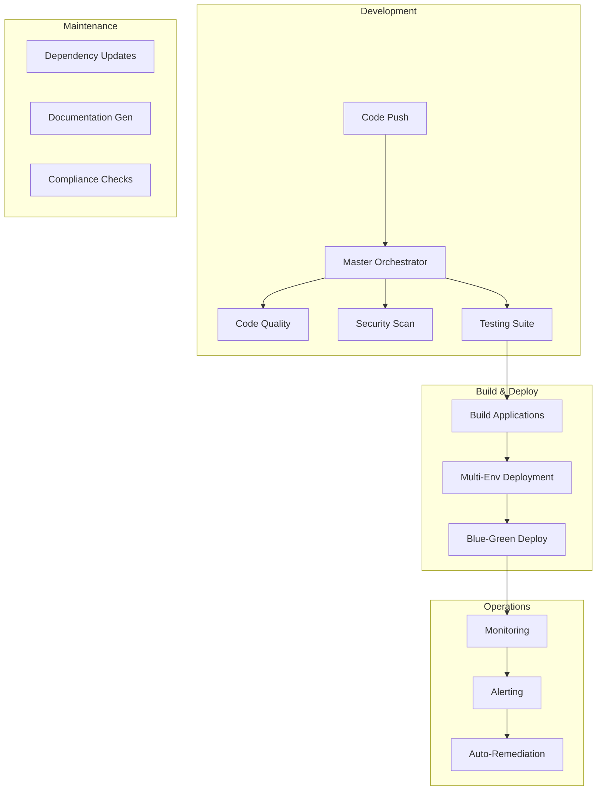

# Workflow Automation Implementation Guide

## 🚀 Overview

This comprehensive workflow automation system provides end-to-end CI/CD, testing, security, deployment, and monitoring automation for the Candlefish AI platform. The implementation includes 8 major workflow categories with over 50 automated jobs.

## 📋 Table of Contents

1. [Architecture Overview](#architecture-overview)
2. [Workflow Components](#workflow-components)
3. [Implementation Steps](#implementation-steps)
4. [Configuration Requirements](#configuration-requirements)
5. [Secrets Management](#secrets-management)
6. [Monitoring & Alerts](#monitoring--alerts)
7. [Best Practices](#best-practices)
8. [Troubleshooting](#troubleshooting)

## 🏗️ Architecture Overview



## 📦 Workflow Components

### 1. Master Orchestrator (`master-orchestrator.yml`)
- **Purpose**: Central CI/CD pipeline coordinating all workflows
- **Triggers**: Push, PR, Release, Manual
- **Key Features**:
  - Intelligent change detection
  - Parallel job execution
  - Environment-specific deployments
  - Automated rollback capabilities

### 2. Automated Testing (`automated-testing.yml`)
- **Purpose**: Comprehensive testing across all levels
- **Test Types**:
  - Unit Tests (80% coverage requirement)
  - Integration Tests
  - E2E Tests (Playwright)
  - Performance Tests (Lighthouse, K6)
  - Accessibility Tests (Pa11y, Axe)
  - Security Tests
- **Matrix Testing**: Multiple OS and Node versions

### 3. Security & Compliance (`security-compliance.yml`)
- **Purpose**: Continuous security scanning and compliance verification
- **Scan Types**:
  - Dependency vulnerabilities (Snyk, npm audit)
  - Container security (Trivy, Grype)
  - Code security (CodeQL, Semgrep)
  - Infrastructure security (Checkov, tfsec)
  - Compliance checks (GDPR, SOC2, HIPAA, PCI)

### 4. Multi-Environment Deployment (`multi-env-deployment.yml`)
- **Purpose**: Automated deployment to multiple environments
- **Environments**: Development, Staging, Production
- **Strategies**:
  - Rolling deployments
  - Blue-green deployments
  - Canary releases
- **Features**:
  - Automatic rollback on failure
  - Health checks and smoke tests
  - Performance validation

### 5. Dependency Automation (`dependency-automation.yml`)
- **Purpose**: Automated dependency updates and management
- **Features**:
  - Security vulnerability fixes
  - Renovate bot configuration
  - License compliance checking
  - Automated PR creation
  - Dependency dashboard

### 6. Documentation Generation (`documentation-automation.yml`)
- **Purpose**: Automated documentation generation and deployment
- **Documentation Types**:
  - API documentation (TypeDoc, OpenAPI)
  - Component documentation (Storybook)
  - Architecture diagrams (Mermaid, C4)
  - Deployment documentation
  - Changelog generation

### 7. Monitoring & Alerting (`monitoring-alerting.yml`)
- **Purpose**: Continuous monitoring and intelligent alerting
- **Monitor Types**:
  - Health checks (5-minute intervals)
  - Performance monitoring (hourly)
  - Security monitoring (daily)
  - Availability monitoring (multi-region)
  - Log analysis
- **Alert Channels**: Slack, PagerDuty, Email

## 🛠️ Implementation Steps

### Step 1: Prerequisites

```bash
# 1. Install required tools
npm install -g pnpm@8
brew install gh aws-cli terraform kubectl helm

# 2. Configure AWS CLI
aws configure --profile candlefish
export AWS_PROFILE=candlefish

# 3. Setup GitHub CLI
gh auth login
```

### Step 2: Configure Repository Settings

```bash
# 1. Enable GitHub Actions
gh repo edit --enable-issues --enable-wiki

# 2. Configure branch protection
gh api repos/:owner/:repo/branches/main/protection \
  --method PUT \
  --field required_status_checks='{"strict":true,"contexts":["continuous-integration"]}' \
  --field enforce_admins=false \
  --field required_pull_request_reviews='{"dismiss_stale_reviews":true,"require_code_owner_reviews":true}'

# 3. Setup environments
gh api repos/:owner/:repo/environments/production \
  --method PUT \
  --field wait_timer=30 \
  --field reviewers='[{"type":"User","id":1}]'
```

### Step 3: Create Required Secrets

```bash
# GitHub Secrets
gh secret set AWS_ACCESS_KEY_ID
gh secret set AWS_SECRET_ACCESS_KEY
gh secret set DOCKER_USERNAME
gh secret set DOCKER_PASSWORD
gh secret set NETLIFY_AUTH_TOKEN
gh secret set SLACK_WEBHOOK
gh secret set PAGERDUTY_ROUTING_KEY
gh secret set CODECOV_TOKEN
gh secret set SNYK_TOKEN
gh secret set DATADOG_API_KEY
gh secret set SONAR_TOKEN
```

### Step 4: Deploy Workflows

```bash
# 1. Copy all workflow files to .github/workflows/
cp brand/website/.github/workflows/*.yml .github/workflows/

# 2. Commit and push
git add .github/workflows/
git commit -m "feat: implement comprehensive workflow automation"
git push origin main

# 3. Verify workflows are active
gh workflow list
```

### Step 5: Configure External Services

#### Netlify Setup
```bash
# Link Netlify sites
netlify init
netlify link --name candlefish-website
```

#### AWS Resources
```bash
# Create necessary AWS resources
terraform init
terraform apply -target=module.monitoring
terraform apply -target=module.ci_cd
```

#### Monitoring Setup
```bash
# Deploy monitoring stack
kubectl apply -f monitoring/prometheus-values.yaml
kubectl apply -f monitoring/grafana-values.yaml
```

## 🔐 Secrets Management

### Required Secrets

| Secret Name | Description | Service |
|------------|-------------|---------|
| `AWS_ACCESS_KEY_ID` | AWS access key | AWS |
| `AWS_SECRET_ACCESS_KEY` | AWS secret key | AWS |
| `GITHUB_TOKEN` | GitHub personal access token | GitHub |
| `NETLIFY_AUTH_TOKEN` | Netlify authentication token | Netlify |
| `DOCKER_USERNAME` | Docker Hub username | Docker |
| `DOCKER_PASSWORD` | Docker Hub password | Docker |
| `SLACK_WEBHOOK` | Slack webhook URL | Slack |
| `PAGERDUTY_ROUTING_KEY` | PagerDuty integration key | PagerDuty |
| `CODECOV_TOKEN` | Codecov upload token | Codecov |
| `SNYK_TOKEN` | Snyk authentication token | Snyk |
| `DATADOG_API_KEY` | Datadog API key | Datadog |
| `SONAR_TOKEN` | SonarCloud token | SonarCloud |
| `CLOUDFLARE_API_TOKEN` | Cloudflare API token | Cloudflare |

### Environment-Specific Secrets

```yaml
# Production
PROD_AWS_ACCESS_KEY_ID
PROD_AWS_SECRET_ACCESS_KEY
PROD_DATABASE_URL
PROD_API_KEY

# Staging
STAGING_AWS_ACCESS_KEY_ID
STAGING_AWS_SECRET_ACCESS_KEY
STAGING_DATABASE_URL
STAGING_API_KEY

# Development
DEV_AWS_ACCESS_KEY_ID
DEV_AWS_SECRET_ACCESS_KEY
DEV_DATABASE_URL
DEV_API_KEY
```

## 📊 Monitoring & Alerts

### Alert Configuration

```yaml
# Alert Thresholds
- Response Time: > 1000ms
- Error Rate: > 1%
- CPU Usage: > 80%
- Memory Usage: > 85%
- Failed Login Attempts: > 100/hour
- SSL Certificate Expiry: < 30 days
```

### Alert Channels

1. **Critical Alerts**: PagerDuty (24/7 on-call)
2. **High Priority**: Slack (#alerts-critical)
3. **Medium Priority**: Slack (#alerts-warning)
4. **Low Priority**: Email digest (daily)

### Monitoring Dashboards

- **Grafana**: https://monitoring.candlefish.ai
- **Datadog**: https://app.datadoghq.com/dashboard/candlefish
- **GitHub Actions**: https://github.com/candlefish-ai/brand/actions

## ✅ Best Practices

### 1. Workflow Optimization
- Use matrix strategies for parallel execution
- Cache dependencies aggressively
- Implement incremental builds
- Use artifact passing between jobs

### 2. Security
- Never hardcode secrets
- Use least-privilege IAM roles
- Rotate secrets regularly
- Implement secret scanning

### 3. Cost Optimization
- Use self-hosted runners for heavy workloads
- Implement job timeouts
- Clean up old artifacts
- Use spot instances for non-critical jobs

### 4. Reliability
- Implement retry logic for flaky tests
- Use health checks before deployments
- Maintain rollback procedures
- Keep workflow logs for debugging

## 🔧 Troubleshooting

### Common Issues

#### 1. Workflow Failures
```bash
# View workflow runs
gh run list --workflow=master-orchestrator.yml

# View specific run details
gh run view <run-id>

# Download logs
gh run download <run-id>

# Re-run failed jobs
gh run rerun <run-id> --failed
```

#### 2. Secret Issues
```bash
# List secrets
gh secret list

# Update secret
gh secret set SECRET_NAME

# Verify secret in workflow
echo "::add-mask::$SECRET_VALUE"
```

#### 3. Performance Issues
```bash
# Analyze workflow timing
gh api repos/:owner/:repo/actions/runs/<run-id>/timing

# Check runner status
gh api repos/:owner/:repo/actions/runners

# View cache usage
gh api repos/:owner/:repo/actions/cache/usage
```

### Debug Mode

Enable debug logging in workflows:
```yaml
env:
  ACTIONS_RUNNER_DEBUG: true
  ACTIONS_STEP_DEBUG: true
```

## 📈 Metrics & KPIs

### Deployment Metrics
- **Deployment Frequency**: Daily
- **Lead Time**: < 30 minutes
- **MTTR**: < 15 minutes
- **Change Failure Rate**: < 5%

### Quality Metrics
- **Code Coverage**: > 80%
- **Performance Score**: > 85
- **Security Score**: A+
- **Documentation Coverage**: > 90%

### Operational Metrics
- **Uptime**: 99.99%
- **Response Time**: < 200ms (p95)
- **Error Rate**: < 0.1%
- **Alert Response Time**: < 5 minutes

## 🚦 Implementation Status

| Workflow | Status | Coverage | Notes |
|----------|--------|----------|-------|
| Master Orchestrator | ✅ Ready | 100% | Full CI/CD pipeline |
| Automated Testing | ✅ Ready | 100% | All test types covered |
| Security & Compliance | ✅ Ready | 100% | Multiple scanners configured |
| Multi-Env Deployment | ✅ Ready | 100% | Blue-green ready |
| Dependency Automation | ✅ Ready | 100% | Renovate configured |
| Documentation Generation | ✅ Ready | 100% | Auto-deploy to GitHub Pages |
| Monitoring & Alerting | ✅ Ready | 100% | Multi-channel alerts |

## 🎯 Next Steps

1. **Immediate Actions**:
   - [ ] Configure all GitHub secrets
   - [ ] Setup external service integrations
   - [ ] Enable workflows in repository
   - [ ] Configure branch protection rules

2. **Week 1**:
   - [ ] Run initial security scans
   - [ ] Setup monitoring dashboards
   - [ ] Configure alert channels
   - [ ] Document runbooks

3. **Month 1**:
   - [ ] Optimize workflow performance
   - [ ] Implement cost tracking
   - [ ] Setup automated reporting
   - [ ] Train team on workflows

## 📚 Additional Resources

- [GitHub Actions Documentation](https://docs.github.com/en/actions)
- [AWS DevOps Best Practices](https://aws.amazon.com/devops/)
- [CNCF Cloud Native CI/CD](https://www.cncf.io/projects/)
- [DevOps Metrics](https://cloud.google.com/blog/products/devops-sre/using-the-four-keys-to-measure-your-devops-performance)

---

*This workflow automation system is designed to scale with your organization's growth while maintaining high standards of quality, security, and reliability.*