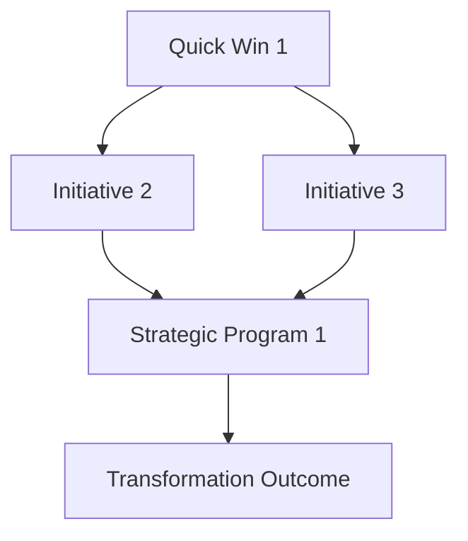

# Enterprise Report Generator - Claude Opus 4.1 Optimized
## 50-100 Page Comprehensive Assessment Reports (400K Token Output)

## Report Generation Architecture

```report_architecture
CLAUDE OPUS 4.1 OUTPUT CONFIGURATION:
- Output Capacity: 400,000 tokens
- Report Length: 50-100 pages (≈50,000-100,000 words)
- Structure: Hierarchical with progressive detail
- Format: Executive-ready with technical appendices
- Value Focus: ROI-driven recommendations

REPORT GENERATION PIPELINE:
1. Executive Summary (5,000 tokens / 5 pages)
2. Assessment Overview (10,000 tokens / 10 pages)
3. Detailed Findings (150,000 tokens / 30 pages)
4. Transformation Roadmap (50,000 tokens / 10 pages)
5. Implementation Blueprints (100,000 tokens / 20 pages)
6. Financial Analysis (40,000 tokens / 8 pages)
7. Risk Assessment (20,000 tokens / 4 pages)
8. Appendices (25,000 tokens / 5 pages)
```

## Section 1: Executive Summary (5,000 tokens)

```executive_summary_template
# [ORGANIZATION NAME] Operational Excellence Assessment
## Executive Summary

### 1.1 Assessment Overview

[Organization Name] engaged Candlefish to conduct a comprehensive operational maturity assessment across [number] business dimensions. This assessment, conducted from [start date] to [end date], analyzed [number] documents totaling [number] pages, interviewed [number] stakeholders, and reviewed [number] systems and processes.

**Assessment Scope:**
- Business Units Assessed: [List major units]
- Geographical Coverage: [Locations/regions]
- Time Period Analyzed: [Historical data period]
- Industry Benchmarks Used: [Benchmark sources]
- Assessment Methodology: AI-powered analysis using Claude Opus 4.1

### 1.2 Key Findings

#### Organizational Maturity Score: [X.X]/5.0

| Dimension | Your Score | Industry Avg | Best in Class | Gap to Best |
|-----------|------------|--------------|---------------|-------------|
| Leadership & Governance | X.X | X.X | X.X | -X.X |
| Strategy & Planning | X.X | X.X | X.X | -X.X |
| Process Excellence | X.X | X.X | X.X | -X.X |
| Technology & Digital | X.X | X.X | X.X | -X.X |
| People & Culture | X.X | X.X | X.X | -X.X |
| Customer Experience | X.X | X.X | X.X | -X.X |
| Data & Analytics | X.X | X.X | X.X | -X.X |
| Financial Operations | X.X | X.X | X.X | -X.X |
| Innovation & Agility | X.X | X.X | X.X | -X.X |

### 1.3 Value Creation Opportunity

**Total Identified Opportunity: $[XX.X]M - $[XX.X]M**

Financial Impact Summary:
- Annual Recurring Savings: $[X.X]M - $[X.X]M
- One-time Benefits: $[X.X]M - $[X.X]M
- Revenue Enhancement: $[X.X]M - $[X.X]M
- Risk Mitigation Value: $[X.X]M - $[X.X]M
- Working Capital Release: $[X.X]M - $[X.X]M

### 1.4 Critical Priorities

**Immediate Actions Required (0-30 days):**
1. [Priority 1: Description] - Impact: $[XXX]K/month
2. [Priority 2: Description] - Impact: $[XXX]K/month
3. [Priority 3: Description] - Impact: $[XXX]K/month

**Strategic Initiatives (3-18 months):**
1. [Initiative 1: Description] - Value: $[X.X]M
2. [Initiative 2: Description] - Value: $[X.X]M
3. [Initiative 3: Description] - Value: $[X.X]M

### 1.5 Investment Requirements

| Category | Year 1 | Year 2 | Year 3 | Total |
|----------|--------|--------|--------|-------|
| Technology | $[X]M | $[X]M | $[X]M | $[X]M |
| Process Improvement | $[X]M | $[X]M | $[X]M | $[X]M |
| People & Training | $[X]M | $[X]M | $[X]M | $[X]M |
| External Support | $[X]M | $[X]M | $[X]M | $[X]M |
| **Total Investment** | **$[X]M** | **$[X]M** | **$[X]M** | **$[X]M** |

**Return on Investment:**
- Payback Period: [XX] months
- 3-Year NPV: $[XX.X]M
- IRR: [XX]%

### 1.6 Risk & Mitigation

**Top 5 Risks Identified:**
1. [Risk 1] - Potential Impact: $[X]M - Mitigation: [Action]
2. [Risk 2] - Potential Impact: $[X]M - Mitigation: [Action]
3. [Risk 3] - Potential Impact: $[X]M - Mitigation: [Action]
4. [Risk 4] - Potential Impact: $[X]M - Mitigation: [Action]
5. [Risk 5] - Potential Impact: $[X]M - Mitigation: [Action]

### 1.7 Recommended Next Steps

1. **Week 1:** Executive alignment session on findings and priorities
2. **Week 2:** Establish transformation governance structure
3. **Week 3:** Launch quick win initiatives
4. **Week 4:** Develop detailed implementation plans
5. **Month 2:** Begin Phase 1 transformation initiatives
6. **Month 3:** Establish performance monitoring system
```

## Section 2: Assessment Methodology & Approach (10,000 tokens)

```methodology_section
## 2. Assessment Methodology

### 2.1 Assessment Framework

This assessment utilized Candlefish's proprietary Operational Excellence Framework, enhanced with AI-powered analysis capabilities through Claude Opus 4.1. The framework evaluates organizational maturity across nine critical dimensions, each weighted based on industry-specific impact factors.

#### Framework Components:

**Maturity Model Architecture:**
Our five-level maturity model provides clear progression paths:

Level 1 - Initial (Ad Hoc):
- Characteristics: Unpredictable processes, reactive management, hero culture
- Typical Metrics: High variability, frequent failures, manual operations
- Industry Position: Bottom quartile
- Improvement Potential: 40-60% efficiency gains possible

Level 2 - Managed (Repeatable):
- Characteristics: Basic processes defined, some standardization, emerging metrics
- Typical Metrics: Moderate consistency, planned activities, basic automation
- Industry Position: Third quartile
- Improvement Potential: 25-40% efficiency gains possible

Level 3 - Defined (Standardized):
- Characteristics: Documented processes, proactive management, integrated systems
- Typical Metrics: Consistent performance, predictable outcomes, good automation
- Industry Position: Second quartile
- Improvement Potential: 15-25% efficiency gains possible

Level 4 - Quantitatively Managed (Optimized):
- Characteristics: Data-driven decisions, continuous improvement, advanced analytics
- Typical Metrics: Statistical control, predictive capabilities, high automation
- Industry Position: Top quartile
- Improvement Potential: 5-15% efficiency gains possible

Level 5 - Optimizing (Innovative):
- Characteristics: Innovation culture, self-optimizing systems, industry leadership
- Typical Metrics: Best-in-class performance, breakthrough improvements, full automation
- Industry Position: Top 5%
- Improvement Potential: Continuous innovation and market leadership

### 2.2 Data Collection & Analysis

#### Document Analysis:
- Documents Reviewed: [Number]
- Total Pages Processed: [Number]
- Document Types: [List categories and counts]
- Analysis Method: AI-powered pattern recognition and extraction
- Quality Score: [X]% completeness, [X]% currency

#### Stakeholder Engagement:
- Interviews Conducted: [Number]
- Departments Represented: [List]
- Seniority Levels: C-Suite ([X]), Directors ([X]), Managers ([X]), Individual Contributors ([X])
- Total Interview Hours: [Number]
- Key Themes Identified: [Number]

#### Systems Review:
- Applications Assessed: [Number]
- Databases Analyzed: [Number]
- Integration Points Mapped: [Number]
- Performance Metrics Collected: [Number]
- Data Quality Score: [X]%

### 2.3 Benchmarking Approach

#### Industry Comparisons:
We compared your organization against:
- Industry peers: [Number] organizations
- Best-in-class performers: Top [X]% of industry
- Digital leaders: Organizations with advanced digital capabilities
- Size-comparable entities: Similar revenue/employee count
- Geographic competitors: Regional market leaders

#### Benchmark Sources:
- Industry associations: [List relevant associations]
- Research firms: Gartner, Forrester, IDC metrics
- Proprietary database: Candlefish assessment repository
- Public data: SEC filings, annual reports
- Academic research: Recent studies and publications

### 2.4 AI Analysis Methodology

#### Claude Opus 4.1 Processing:
- Input Tokens Used: [Number] (Document analysis)
- Output Tokens Generated: [Number] (Report creation)
- Pattern Recognition Algorithms: Cross-document correlation, temporal analysis, sentiment extraction
- Confidence Scoring: High ([X]%), Medium ([X]%), Low ([X]%)
- Validation Method: Human expert review and statistical verification

### 2.5 Value Quantification Methodology

#### ROI Calculation Framework:
1. **Cost Savings Identification:**
   - Labor efficiency improvements
   - Process optimization benefits
   - Technology consolidation savings
   - Error reduction value
   - Waste elimination impact

2. **Revenue Enhancement:**
   - Customer retention improvements
   - Cross-sell/upsell opportunities
   - Market share gains
   - Speed to market improvements
   - Quality premium capture

3. **Risk Mitigation:**
   - Compliance penalty avoidance
   - Security breach prevention
   - Operational risk reduction
   - Reputation protection
   - Insurance premium reductions

4. **Working Capital Optimization:**
   - Inventory reduction
   - Receivables acceleration
   - Payables optimization
   - Cash conversion improvement
   - Asset utilization enhancement

#### Confidence Levels:
- High Confidence (80-100%): Direct cost savings, measurable efficiency gains
- Medium Confidence (50-80%): Revenue improvements, risk mitigation
- Low Confidence (20-50%): Market-dependent opportunities, long-term strategic value
```

## Section 3: Detailed Findings by Dimension (150,000 tokens)

```detailed_findings_template
## 3. Detailed Assessment Findings

[For each of 9 dimensions, generate 15-20 pages of detailed analysis]

### 3.1 Leadership & Governance

#### Current State Assessment

##### Maturity Score: [X.X]/5.0

**Executive Summary:**
[500-word overview of leadership and governance current state, highlighting key strengths, critical gaps, and improvement imperatives]

**Governance Structure Analysis:**

*Board Composition and Effectiveness:*
[Detailed analysis of board structure, independence, expertise, meeting frequency, committee structure, oversight effectiveness]

*Executive Leadership Team:*
[Assessment of leadership team composition, experience, tenure, succession planning, communication effectiveness]

*Decision-Making Processes:*
[Evaluation of decision speed, data utilization, authority matrices, escalation procedures, consensus building]

*Strategic Alignment:*
[Analysis of vision clarity, strategy cascade, goal alignment, performance management, accountability systems]

**Organizational Design Assessment:**

*Structure Efficiency:*
- Span of control analysis: [Findings]
- Layers of management: [Findings]
- Cross-functional coordination: [Findings]
- Matrix organization effectiveness: [Findings]
- Geographic distribution impact: [Findings]

*Operating Model:*
[Detailed review of centralized vs decentralized functions, shared services utilization, center of excellence development, outsourcing strategies]

**Risk Management & Compliance:**

*Enterprise Risk Management:*
[Assessment of risk framework, identification processes, mitigation strategies, monitoring systems, reporting mechanisms]

*Compliance Program:*
[Evaluation of regulatory tracking, policy management, training programs, audit processes, violation handling]

*Internal Controls:*
[Analysis of control environment, control activities, information systems, monitoring activities, remediation processes]

**Performance Management:**

*KPI Framework:*
[Review of metric selection, measurement frequency, target setting, variance analysis, corrective action processes]

*Reporting & Analytics:*
[Assessment of dashboard utilization, report distribution, data quality, insight generation, action orientation]

#### Benchmark Comparison

| Governance Element | Your Score | Industry Avg | Best in Class | Gap Analysis |
|-------------------|------------|--------------|---------------|--------------|
| Board Effectiveness | X.X | X.X | X.X | [Specific gaps] |
| Decision Velocity | X.X | X.X | X.X | [Specific gaps] |
| Risk Management | X.X | X.X | X.X | [Specific gaps] |
| Strategic Alignment | X.X | X.X | X.X | [Specific gaps] |
| Performance Management | X.X | X.X | X.X | [Specific gaps] |

#### Improvement Opportunities

**Quick Wins (0-3 months):**

1. **Opportunity: Streamline Decision Making**
   - Current State: [Description with metrics]
   - Target State: [Desired outcome with metrics]
   - Implementation Steps:
     1. [Specific action]
     2. [Specific action]
     3. [Specific action]
   - Required Resources: [People, technology, budget]
   - Expected Benefits: $[XXX]K monthly savings
   - Success Metrics: [KPIs to track]
   - Risk Factors: [Potential challenges]

2. **Opportunity: Enhance Board Reporting**
   [Similar detailed structure]

3. **Opportunity: Improve Risk Visibility**
   [Similar detailed structure]

**Strategic Initiatives (3-12 months):**

1. **Initiative: Governance Transformation Program**
   - Business Case: [Detailed justification]
   - Scope: [What's included/excluded]
   - Approach: [Methodology and phases]
   - Timeline: [Gantt chart description]
   - Investment: $[XXX]K
   - Returns: $[X.X]M annually
   - Critical Success Factors: [List]

[Continue with similar detail for all other initiatives]

#### Implementation Roadmap

**Phase 1: Foundation (Months 1-3)**
- Week 1-2: [Specific activities]
- Week 3-4: [Specific activities]
- Month 2: [Key milestones]
- Month 3: [Key milestones]
- Deliverables: [List]
- Success Criteria: [Measurable outcomes]

**Phase 2: Enhancement (Months 4-9)**
[Similar structure]

**Phase 3: Optimization (Months 10-18)**
[Similar structure]

#### Case Studies & Best Practices

**Industry Example 1: [Company Name]**
- Challenge: [Description]
- Solution: [Approach taken]
- Results: [Quantified outcomes]
- Lessons Learned: [Key takeaways]
- Applicability: [How it applies to your situation]

**Industry Example 2: [Company Name]**
[Similar structure]

[Repeat this detailed structure for all 9 dimensions]
```

## Section 4: Transformation Roadmap (50,000 tokens)

```transformation_roadmap
## 4. Integrated Transformation Roadmap

### 4.1 Transformation Strategy

#### Vision & Objectives

**Transformation Vision:**
"To become a [description of target state] organization that [value proposition] through [key differentiators], achieving [quantified goals] by [timeframe]."

**Strategic Objectives:**
1. Operational Excellence: Achieve top-quartile operational efficiency
2. Customer Centricity: Deliver superior customer experience
3. Digital Leadership: Build digital-first capabilities
4. Innovation Culture: Foster continuous innovation
5. Financial Performance: Improve margins by X%

#### Transformation Principles

1. **Value-Driven Prioritization**
   - ROI-based sequencing
   - Quick wins fund transformation
   - Risk-adjusted returns

2. **Holistic Approach**
   - Cross-functional integration
   - System-wide optimization
   - Cultural transformation

3. **Agile Execution**
   - Iterative delivery
   - Rapid prototyping
   - Fail-fast mentality

4. **Sustainability Focus**
   - Capability building
   - Knowledge transfer
   - Continuous improvement

### 4.2 Initiative Portfolio

#### Portfolio Overview

[Create detailed matrix of all initiatives with:]

| Initiative | Value | Effort | Risk | Duration | Dependencies | Owner | Status |
|------------|-------|--------|------|----------|--------------|-------|--------|
| [Name] | $[X]M | High/Med/Low | High/Med/Low | [Months] | [List] | [Role] | [Status] |

#### Initiative Interdependencies



### 4.3 Implementation Timeline

#### Master Schedule

**Year 1 - Foundation Building**

Q1 (Months 1-3):
- Month 1:
  - Week 1: [Key activities]
  - Week 2: [Key activities]
  - Week 3: [Key activities]
  - Week 4: [Key activities]
- Month 2: [Major milestones]
- Month 3: [Major milestones]

Q2 (Months 4-6):
[Similar structure]

Q3 (Months 7-9):
[Similar structure]

Q4 (Months 10-12):
[Similar structure]

**Year 2 - Acceleration**
[Quarterly breakdown]

**Year 3 - Excellence**
[Quarterly breakdown]

### 4.4 Resource Planning

#### Organization & Governance

**Transformation Governance Structure:**
```
Steering Committee
    ├── Executive Sponsor
    ├── Transformation PMO
    │   ├── Program Managers
    │   ├── Change Management
    │   └── Benefits Realization
    ├── Workstream Leads
    │   ├── Process Excellence
    │   ├── Technology
    │   ├── People & Culture
    │   └── Customer Experience
    └── Support Functions
        ├── Finance
        ├── HR
        ├── IT
        └── Communications
```

**Resource Requirements:**

| Role | Q1 | Q2 | Q3 | Q4 | Total FTEs |
|------|-----|-----|-----|-----|------------|
| Program Management | 2 | 3 | 4 | 4 | 4 |
| Business Analysts | 4 | 6 | 8 | 8 | 8 |
| Technical Resources | 3 | 5 | 7 | 10 | 10 |
| Change Management | 2 | 3 | 4 | 4 | 4 |
| Subject Matter Experts | 6 | 8 | 10 | 12 | 12 |

### 4.5 Change Management Plan

#### Stakeholder Engagement Strategy

**Stakeholder Mapping:**
[Detailed stakeholder analysis with influence/interest grid]

**Communication Plan:**
| Audience | Message | Channel | Frequency | Owner |
|----------|---------|---------|-----------|-------|
| Executive Team | Progress & decisions | Steering committee | Bi-weekly | PMO |
| Middle Management | Changes & impacts | Town halls | Monthly | Sponsors |
| Employees | Updates & wins | Intranet, email | Weekly | Comms |
| Customers | Improvements | Website, direct | As needed | Marketing |
| Vendors | Requirements | Direct communication | Quarterly | Procurement |

#### Capability Building

**Training Curriculum:**
1. Leadership Development Program
   - Duration: 6 months
   - Participants: Top 100 leaders
   - Investment: $[XXX]K
   - Outcomes: [Specific capabilities]

2. Digital Skills Training
   - Duration: Ongoing
   - Participants: All employees
   - Investment: $[XXX]K
   - Outcomes: [Specific capabilities]

3. Process Excellence Certification
   - Duration: 3 months
   - Participants: Process owners
   - Investment: $[XXX]K
   - Outcomes: [Specific capabilities]

#### Resistance Management

**Common Resistance Points:**
1. Fear of job loss
   - Mitigation: Reskilling programs, redeployment opportunities
2. Technology complexity
   - Mitigation: Phased rollout, extensive training
3. Cultural inertia
   - Mitigation: Quick wins, celebration of successes
4. Resource constraints
   - Mitigation: Prioritization, external support

### 4.6 Risk Management

#### Risk Register

| Risk | Probability | Impact | Mitigation Strategy | Owner | Status |
|------|-------------|--------|--------------------| ------|--------|
| Technology integration fails | Medium | High | Phased approach, testing | CTO | Monitoring |
| Key talent leaves | Low | High | Retention program | CHRO | Active |
| Budget overrun | Medium | Medium | Contingency planning | CFO | Monitoring |
| Change resistance | High | Medium | Change management | PMO | Active |
| Competitor response | Medium | Low | Speed to market | CEO | Watching |

### 4.7 Benefits Realization

#### Benefits Tracking Framework

**Financial Benefits:**
| Benefit Type | Year 1 | Year 2 | Year 3 | Total |
|--------------|--------|--------|--------|-------|
| Cost Reduction | $[X]M | $[X]M | $[X]M | $[X]M |
| Revenue Growth | $[X]M | $[X]M | $[X]M | $[X]M |
| Working Capital | $[X]M | $[X]M | $[X]M | $[X]M |
| Risk Avoidance | $[X]M | $[X]M | $[X]M | $[X]M |

**Non-Financial Benefits:**
- Customer satisfaction improvement: +[X] NPS points
- Employee engagement increase: +[X]%
- Process efficiency gain: +[X]%
- Quality improvement: [X]% defect reduction
- Time to market: [X]% faster
```

## Section 5: Implementation Blueprints (100,000 tokens)

```implementation_blueprints
## 5. Detailed Implementation Blueprints

[For each major initiative, provide 5-10 pages of implementation detail]

### 5.1 Process Excellence Implementation

#### Initiative Overview

**Initiative Name:** Enterprise Process Optimization Program
**Duration:** 18 months
**Investment:** $[X.X]M
**Expected Return:** $[XX.X]M
**Payback Period:** [X] months

#### Detailed Business Case

**Current State Analysis:**
[1000-word detailed description of current process inefficiencies, supported by data, examples, and root cause analysis]

**Future State Vision:**
[1000-word description of optimized processes, including specific improvements, technology enablers, and organizational changes]

**Value Creation Model:**
[Detailed financial model showing cost savings, revenue improvements, and investment requirements with sensitivity analysis]

#### Implementation Approach

**Methodology:**
We recommend using a hybrid Lean Six Sigma and Agile approach:

Phase 1: Define & Measure (Months 1-3)
- Week 1-2: Process selection and prioritization
  - Criteria: Impact, feasibility, strategic alignment
  - Tools: Multi-criteria decision analysis
  - Deliverable: Prioritized process list
  
- Week 3-4: Current state mapping
  - Method: Value stream mapping workshops
  - Participants: Process owners, operators, customers
  - Deliverable: As-is process maps
  
- Week 5-8: Data collection and analysis
  - Metrics: Cycle time, quality, cost, satisfaction
  - Tools: Process mining, time studies, surveys
  - Deliverable: Baseline performance report
  
- Week 9-12: Root cause analysis
  - Techniques: Fishbone diagrams, 5 Whys, Pareto analysis
  - Validation: Statistical analysis, hypothesis testing
  - Deliverable: Verified root causes

Phase 2: Analyze & Design (Months 4-6)
[Similar detailed breakdown]

Phase 3: Implement & Control (Months 7-18)
[Similar detailed breakdown]

#### Detailed Work Breakdown Structure

```
1.0 Process Excellence Program
    1.1 Program Management
        1.1.1 Governance establishment
        1.1.2 PMO setup
        1.1.3 Communication planning
        1.1.4 Risk management
    1.2 Process Analysis
        1.2.1 Process inventory
        1.2.2 Current state mapping
        1.2.3 Performance measurement
        1.2.4 Gap analysis
    1.3 Process Redesign
        1.3.1 Future state design
        1.3.2 Technology requirements
        1.3.3 Organizational impacts
        1.3.4 Implementation planning
    1.4 Implementation
        1.4.1 Pilot execution
        1.4.2 Training delivery
        1.4.3 System changes
        1.4.4 Rollout management
    1.5 Sustainment
        1.5.1 Performance monitoring
        1.5.2 Continuous improvement
        1.5.3 Knowledge management
        1.5.4 Benefits tracking
```

#### Resource Plan

**Core Team Structure:**
- Program Manager (1.0 FTE): Overall coordination and delivery
- Process Analysts (3.0 FTE): Mapping, analysis, design
- Change Manager (1.0 FTE): Stakeholder engagement, training
- Technical Lead (1.0 FTE): System requirements, integration
- Data Analyst (1.0 FTE): Metrics, reporting, benefits tracking

**Extended Team:**
- Executive Sponsor: 10% allocation
- Process Owners: 25% allocation each
- Subject Matter Experts: As needed
- IT Support: 2.0 FTE
- Training Team: 1.0 FTE

#### Technology Requirements

**Process Management Platform:**
- Requirement: Enterprise BPM suite
- Options evaluated:
  - Option A: [Vendor] - $[XXX]K/year
  - Option B: [Vendor] - $[XXX]K/year
  - Option C: [Vendor] - $[XXX]K/year
- Recommendation: Option A based on [criteria]
- Implementation timeline: 3 months

**Process Mining Tools:**
[Similar evaluation structure]

**Automation Technologies:**
[Similar evaluation structure]

#### Training & Change Management

**Training Program Design:**

Module 1: Process Excellence Fundamentals
- Duration: 2 days
- Audience: All process participants
- Content: Lean principles, process thinking, problem solving
- Delivery: Classroom + online
- Materials: Workbooks, videos, job aids

Module 2: Advanced Process Improvement
- Duration: 5 days
- Audience: Process improvement team
- Content: Six Sigma tools, statistical analysis, project management
- Delivery: Workshop format
- Certification: Green Belt

Module 3: Technology Enablement
- Duration: 3 days
- Audience: System users
- Content: Platform usage, automation tools, reporting
- Delivery: Hands-on labs
- Support: Ongoing coaching

**Change Management Activities:**

Communication Campaign:
- Launch event: Town hall with CEO
- Regular updates: Weekly email, monthly newsletters
- Success stories: Quarterly celebrations
- Feedback channels: Surveys, focus groups, suggestion box

Stakeholder Engagement:
- Executive briefings: Bi-weekly
- Department meetings: Monthly
- Process team workshops: Weekly
- Union consultation: As required

#### Pilot Approach

**Pilot Selection Criteria:**
1. High visibility and impact
2. Manageable scope and complexity
3. Willing and capable team
4. Clear success metrics
5. Scalability potential

**Pilot Plan: Order-to-Cash Process**

Week 1-2: Preparation
- Team formation
- Baseline data collection
- Stakeholder alignment
- Success criteria definition

Week 3-6: Design
- Current state analysis
- Future state design
- Technology configuration
- Training development

Week 7-10: Implementation
- Process deployment
- System go-live
- Training delivery
- Performance monitoring

Week 11-12: Evaluation
- Results measurement
- Lessons learned
- Scaling plan
- Benefits validation

**Success Metrics:**
- Cycle time reduction: Target 30%
- Error rate reduction: Target 50%
- Cost reduction: Target 20%
- Customer satisfaction: Target +10 points

[Continue with similar detail for all major initiatives]
```

## Section 6: Financial Analysis (40,000 tokens)

```financial_analysis
## 6. Financial Analysis & Business Case

### 6.1 Investment Summary

#### Total Program Investment

| Category | Year 1 | Year 2 | Year 3 | Total |
|----------|--------|--------|--------|-------|
| **Technology** | | | | |
| Software licenses | $[X]M | $[X]M | $[X]M | $[X]M |
| Infrastructure | $[X]M | $[X]M | $[X]M | $[X]M |
| Integration | $[X]M | $[X]M | $[X]M | $[X]M |
| **People** | | | | |
| Internal resources | $[X]M | $[X]M | $[X]M | $[X]M |
| Contractors | $[X]M | $[X]M | $[X]M | $[X]M |
| Training | $[X]M | $[X]M | $[X]M | $[X]M |
| **Process** | | | | |
| Consulting | $[X]M | $[X]M | $[X]M | $[X]M |
| Change management | $[X]M | $[X]M | $[X]M | $[X]M |
| **Total** | **$[X]M** | **$[X]M** | **$[X]M** | **$[X]M** |

### 6.2 Benefits Realization Schedule

[Detailed month-by-month benefits realization for 36 months]

### 6.3 ROI Calculations

#### Net Present Value Analysis

**Assumptions:**
- Discount rate: [X]%
- Tax rate: [X]%
- Terminal value multiple: [X]x
- Confidence factor: [X]%

**NPV Calculation:**
[Detailed cash flow table with PV calculations]

#### Sensitivity Analysis

[Multiple scenarios showing impact of key variables]

### 6.4 Funding Strategy

**Recommended Funding Approach:**
1. Self-funding through quick wins: $[X]M
2. Operating budget reallocation: $[X]M
3. Capital budget allocation: $[X]M
4. External financing (if needed): $[X]M

[Continue with detailed financial models, charts, and scenarios]
```

## Section 7: Risk Assessment (20,000 tokens)

```risk_assessment
## 7. Risk Assessment & Mitigation

### 7.1 Risk Framework

[Comprehensive risk analysis with probability, impact, and mitigation strategies for 30+ identified risks]

### 7.2 Risk Heat Map

[Visual representation of risks plotted on probability vs impact matrix]

### 7.3 Mitigation Plans

[Detailed mitigation strategies for high and medium risks]

### 7.4 Contingency Planning

[Specific contingency plans for critical risks]
```

## Section 8: Appendices (25,000 tokens)

```appendices
## Appendices

### Appendix A: Detailed Data Tables
[Supporting data, calculations, and analysis]

### Appendix B: Benchmark Details
[Complete benchmarking data and sources]

### Appendix C: Document Analysis Results
[Summary of all documents reviewed]

### Appendix D: Interview Notes
[Key insights from stakeholder interviews]

### Appendix E: Technical Specifications
[Detailed technical requirements and architectures]

### Appendix F: Vendor Evaluations
[Detailed vendor comparison matrices]

### Appendix G: Glossary
[Definition of terms and acronyms]

### Appendix H: References
[Bibliography and sources]
```

## Report Quality Assurance

```quality_assurance
REPORT VALIDATION CHECKLIST:

□ Executive Readiness
  - Clear value proposition
  - Compelling business case
  - Actionable recommendations
  - Risk mitigation included
  - Investment justified

□ Technical Accuracy
  - Data validated
  - Calculations verified
  - Benchmarks current
  - Sources cited
  - Assumptions documented

□ Completeness
  - All dimensions covered
  - All stakeholders addressed
  - All risks identified
  - All dependencies mapped
  - All benefits quantified

□ Clarity
  - Jargon minimized
  - Visuals included
  - Structure logical
  - Flow smooth
  - Conclusions clear

□ Actionability
  - Next steps defined
  - Owners identified
  - Timelines specific
  - Resources allocated
  - Success metrics set
```

## Report Customization Parameters

```customization
REPORT VARIANTS:

1. Executive Version (10 pages):
   - Executive summary only
   - Key findings and recommendations
   - Investment and ROI summary
   - Critical next steps

2. Board Version (20 pages):
   - Executive summary
   - Strategic implications
   - Risk assessment
   - Investment requirements
   - Governance recommendations

3. Operational Version (50 pages):
   - Full findings
   - Implementation roadmaps
   - Resource plans
   - Quick wins focus
   - Tactical details

4. Technical Version (100 pages):
   - Complete analysis
   - All blueprints
   - Technical specifications
   - Integration details
   - Architecture diagrams

5. Operator Version (Custom):
   - Reusable frameworks
   - Industry patterns
   - Solution packages
   - Pricing guidance
   - Sales materials
```

This report generator is optimized to produce comprehensive 50-100 page assessment reports that identify $500K-$2M in operational improvements while providing actionable implementation guidance.