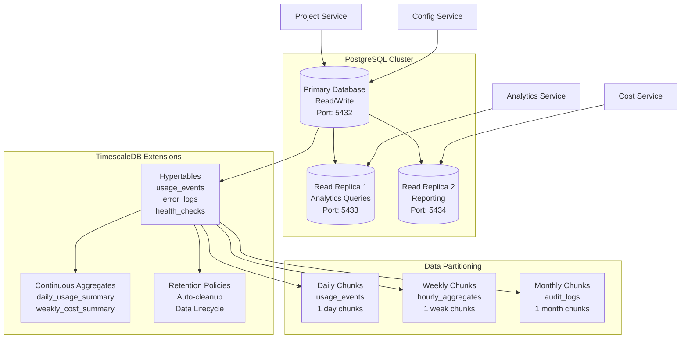
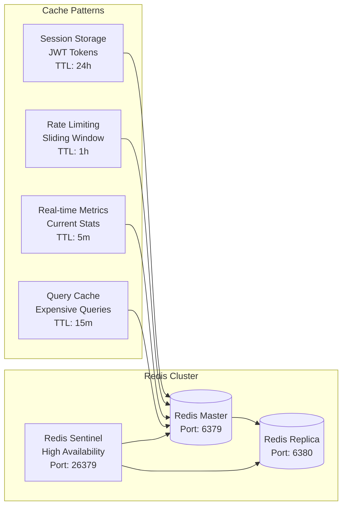
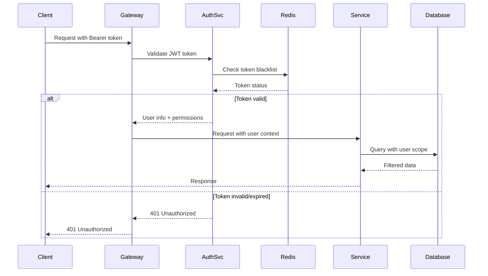
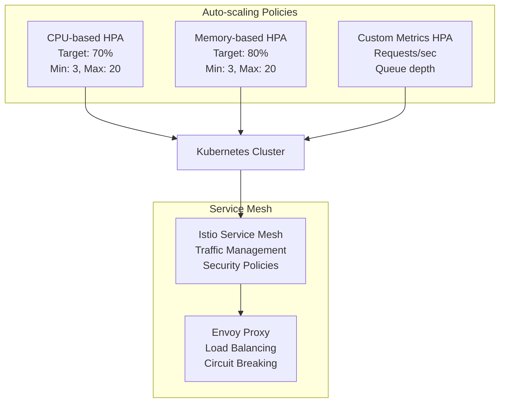

# Claude Configuration Dashboard - Service Architecture

## System Architecture Diagram

```mermaid
graph TB
    subgraph "Client Layer"
        WEB[Web Dashboard<br/>React + Next.js<br/>Port: 3000]
        MOBILE[Mobile App<br/>React Native<br/>PWA Support]
        CLI[Claude CLI<br/>Direct API Access]
    end

    subgraph "Load Balancer & CDN"
        LB[AWS ALB<br/>SSL Termination<br/>Health Checks]
        CDN[CloudFront CDN<br/>Static Assets<br/>Edge Caching]
    end

    subgraph "API Gateway Layer"
        GATEWAY[API Gateway<br/>Kong/AWS API Gateway<br/>Port: 8000]
        AUTH_SVC[Auth Service<br/>JWT + OAuth<br/>Port: 8001]
        RATE_LIMIT[Rate Limiter<br/>Redis-based<br/>Quota Management]
    end

    subgraph "Core Services"
        PROJECT_SVC[Project Service<br/>CRUD Operations<br/>Port: 8002]
        CONFIG_SVC[Configuration Service<br/>Claude Configs<br/>Port: 8003]
        METRICS_SVC[Analytics Service<br/>Usage Tracking<br/>Port: 8004]
        COST_SVC[Cost Management<br/>Budgets & Alerts<br/>Port: 8005]
        DEPLOY_SVC[Deployment Service<br/>Config Deployment<br/>Port: 8006]
    end

    subgraph "Real-time Services"
        WS_SVC[WebSocket Service<br/>Real-time Updates<br/>Port: 8007]
        NOTIFY_SVC[Notification Service<br/>Alerts & Events<br/>Port: 8008]
        STREAM[Event Streaming<br/>Apache Kafka<br/>Real-time Data]
    end

    subgraph "AI/ML Services"
        MODEL_ROUTER[Model Router<br/>Intelligent Routing<br/>Port: 8009]
        COST_PREDICTOR[Cost Predictor<br/>ML Forecasting<br/>Port: 8010]
        ANOMALY[Anomaly Detection<br/>Usage Monitoring<br/>Port: 8011]
    end

    subgraph "Data Layer"
        POSTGRES[(PostgreSQL<br/>Primary Database<br/>Port: 5432)]
        TIMESCALE[(TimescaleDB<br/>Time-series Metrics<br/>Built on PostgreSQL)]
        REDIS[(Redis<br/>Session + Cache<br/>Port: 6379)]
        S3[(AWS S3<br/>File Storage<br/>Config Backups)]
    end

    subgraph "External Services"
        ANTHROPIC[Anthropic API<br/>Claude Models]
        OPENAI[OpenAI API<br/>GPT Models]
        GOOGLE[Google AI<br/>Gemini Models]
        OLLAMA[Ollama<br/>Local Models]
        AWS_SECRETS[AWS Secrets<br/>Key Management]
    end

    subgraph "Monitoring & Observability"
        PROMETHEUS[Prometheus<br/>Metrics Collection]
        GRAFANA[Grafana<br/>Dashboards]
        JAEGER[Jaeger<br/>Distributed Tracing]
        LOGS[Centralized Logging<br/>ELK Stack]
    end

    %% Client connections
    WEB --> LB
    MOBILE --> LB
    CLI --> GATEWAY

    %% Load balancer routing
    LB --> GATEWAY
    CDN --> S3

    %% API Gateway routing
    GATEWAY --> AUTH_SVC
    GATEWAY --> PROJECT_SVC
    GATEWAY --> CONFIG_SVC
    GATEWAY --> METRICS_SVC
    GATEWAY --> COST_SVC
    GATEWAY --> DEPLOY_SVC

    %% Authentication flow
    AUTH_SVC --> REDIS
    AUTH_SVC --> POSTGRES
    RATE_LIMIT --> REDIS

    %% Service data connections
    PROJECT_SVC --> POSTGRES
    CONFIG_SVC --> POSTGRES
    CONFIG_SVC --> S3
    METRICS_SVC --> TIMESCALE
    COST_SVC --> POSTGRES
    DEPLOY_SVC --> POSTGRES

    %% Real-time connections
    WS_SVC --> REDIS
    WS_SVC --> STREAM
    NOTIFY_SVC --> STREAM
    METRICS_SVC --> STREAM

    %% AI service connections
    MODEL_ROUTER --> ANTHROPIC
    MODEL_ROUTER --> OPENAI
    MODEL_ROUTER --> GOOGLE
    MODEL_ROUTER --> OLLAMA
    COST_PREDICTOR --> TIMESCALE
    ANOMALY --> TIMESCALE

    %% External integrations
    AUTH_SVC --> AWS_SECRETS
    CONFIG_SVC --> AWS_SECRETS

    %% Monitoring connections
    PROMETHEUS --> PROJECT_SVC
    PROMETHEUS --> CONFIG_SVC
    PROMETHEUS --> METRICS_SVC
    PROMETHEUS --> COST_SVC
    GRAFANA --> PROMETHEUS
    JAEGER --> PROJECT_SVC
    JAEGER --> CONFIG_SVC
    LOGS --> PROJECT_SVC
    LOGS --> CONFIG_SVC

    %% Styling
    classDef client fill:#e1f5fe
    classDef gateway fill:#f3e5f5
    classDef service fill:#e8f5e8
    classDef realtime fill:#fff3e0
    classDef ai fill:#fce4ec
    classDef data fill:#f1f8e9
    classDef external fill:#fff8e1
    classDef monitoring fill:#f3e5f5

    class WEB,MOBILE,CLI client
    class LB,CDN,GATEWAY,AUTH_SVC,RATE_LIMIT gateway
    class PROJECT_SVC,CONFIG_SVC,METRICS_SVC,COST_SVC,DEPLOY_SVC service
    class WS_SVC,NOTIFY_SVC,STREAM realtime
    class MODEL_ROUTER,COST_PREDICTOR,ANOMALY ai
    class POSTGRES,TIMESCALE,REDIS,S3 data
    class ANTHROPIC,OPENAI,GOOGLE,OLLAMA,AWS_SECRETS external
    class PROMETHEUS,GRAFANA,JAEGER,LOGS monitoring
```



## Service Boundaries & Responsibilities

### 1. API Gateway Layer (Port 8000)
**Responsibilities:**
- Request routing and load balancing
- SSL termination and security headers
- API versioning and backwards compatibility
- Request/response transformation
- Cross-cutting concerns (CORS, compression)

**Technology Stack:**
- Kong Gateway or AWS API Gateway
- Nginx for load balancing
- Let's Encrypt for SSL certificates

### 2. Authentication Service (Port 8001)
**Responsibilities:**
- User authentication (JWT + OAuth 2.0)
- Authorization and RBAC
- Session management
- API key management for service-to-service auth
- Password reset and email verification

**Key Features:**
- JWT with refresh tokens
- Multi-factor authentication support
- Social login integration (GitHub, Google)
- Rate limiting per user/API key

### 3. Project Management Service (Port 8002)
**Responsibilities:**
- CRUD operations for projects
- Team and collaboration management
- Project access control
- Repository integration
- Project lifecycle management

**Database Schema:**
- projects.projects
- projects.teams
- projects.team_members
- projects.project_collaborators

### 4. Configuration Service (Port 8003)
**Responsibilities:**
- Claude configuration management
- Version control for configurations
- Configuration validation
- Template management
- S3 sync for configuration backups

**Key Features:**
- Configuration versioning
- Template library
- Validation engine
- Deployment pipeline integration

### 5. Analytics Service (Port 8004)
**Responsibilities:**
- Usage metrics collection
- Real-time analytics processing
- Historical data aggregation
- Performance monitoring
- Custom dashboard creation

**Data Flow:**
- Ingest usage events from all services
- Process and aggregate data in TimescaleDB
- Provide real-time metrics via WebSocket
- Generate historical reports

### 6. Cost Management Service (Port 8005)
**Responsibilities:**
- Cost calculation and tracking
- Budget management
- Alert system for overspending
- Cost optimization recommendations
- Billing integration

**Features:**
- Per-project cost tracking
- Budget alerts and notifications
- Cost forecasting with ML
- Multi-currency support

## Data Architecture

### PostgreSQL + TimescaleDB Setup



### Redis Architecture



## Security Architecture

### Authentication & Authorization Flow



### Security Controls

1. **Network Security**
   - VPC with private subnets
   - Security groups with least privilege
   - WAF for DDoS protection
   - SSL/TLS everywhere

2. **Application Security**
   - JWT with short expiration (15 minutes)
   - Refresh token rotation
   - API rate limiting per user/IP
   - Input validation and sanitization
   - SQL injection prevention

3. **Data Security**
   - Encryption at rest (PostgreSQL + S3)
   - Encryption in transit (TLS 1.3)
   - Secrets management (AWS Secrets Manager)
   - PII data masking in logs

4. **Compliance**
   - GDPR compliance for EU users
   - SOC 2 Type II controls
   - Audit logging for all data changes
   - Data retention policies

## Deployment Strategy

### Kubernetes Deployment

```yaml
# Example service deployment
apiVersion: apps/v1
kind: Deployment
metadata:
  name: claude-config-api
spec:
  replicas: 3
  selector:
    matchLabels:
      app: claude-config-api
  template:
    spec:
      containers:
      - name: api
        image: candlefish/claude-config-api:latest
        ports:
        - containerPort: 8000
        resources:
          requests:
            memory: "256Mi"
            cpu: "100m"
          limits:
            memory: "1Gi"
            cpu: "500m"
        env:
        - name: DATABASE_URL
          valueFrom:
            secretKeyRef:
              name: database-secret
              key: url
```

### Auto-scaling Configuration



## Performance Considerations

### Database Optimization

1. **Connection Pooling**
   - PgBouncer for connection pooling
   - Max 100 connections per service
   - Connection timeout: 30s

2. **Query Optimization**
   - Proper indexing strategy
   - Query plan analysis
   - Materialized views for complex aggregations
   - Partitioning for time-series data

3. **Caching Strategy**
   - L1 Cache: Application-level (in-memory)
   - L2 Cache: Redis (shared cache)
   - L3 Cache: CDN (static content)
   - Cache invalidation patterns

### API Performance

1. **Response Time Targets**
   - 95th percentile: < 200ms
   - 99th percentile: < 500ms
   - Timeout: 30s for long-running operations

2. **Rate Limiting**
   - Tier-based limits (free/pro/enterprise)
   - Per-endpoint rate limits
   - Burst capacity for temporary spikes
   - Graceful degradation under load

3. **Monitoring & Alerting**
   - SLA monitoring (99.9% uptime)
   - Performance dashboards
   - Automated alerting
   - Incident response procedures

## Disaster Recovery

### Backup Strategy

1. **Database Backups**
   - Continuous WAL archiving
   - Daily full backups to S3
   - Point-in-time recovery (35 days)
   - Cross-region replication

2. **Application Backups**
   - Configuration snapshots
   - Docker image registry backups
   - Infrastructure as code (Terraform)

### Failover Procedures

1. **Multi-AZ Deployment**
   - Primary region: us-east-1
   - Secondary region: us-west-2
   - Automatic failover for database
   - Manual failover for application

2. **Recovery Time Objectives**
   - RTO: 4 hours (manual failover)
   - RPO: 15 minutes (data loss tolerance)
   - Health checks every 30 seconds
   - Automated rollback procedures