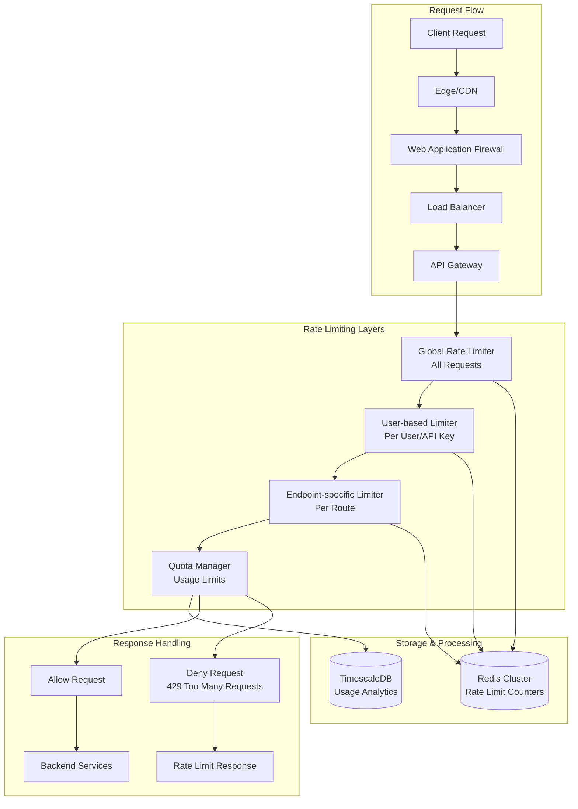

# Claude Configuration Dashboard - Rate Limiting & Quota Management

## Overview

This document outlines the comprehensive rate limiting and quota management system for the Claude Configuration Dashboard. The system implements multiple layers of rate limiting to ensure fair usage, prevent abuse, and maintain system stability.

## Rate Limiting Architecture



## Rate Limiting Strategies

### 1. Token Bucket Algorithm

```typescript
interface TokenBucket {
  capacity: number;      // Maximum tokens
  tokens: number;        // Current tokens
  refillRate: number;    // Tokens per second
  lastRefill: number;    // Last refill timestamp
}

class TokenBucketLimiter {
  constructor(
    private redis: Redis,
    private capacity: number,
    private refillRate: number
  ) {}

  async checkLimit(key: string): Promise<{
    allowed: boolean;
    tokensRemaining: number;
    resetTime: number;
  }> {
    const now = Date.now() / 1000;
    const bucketKey = `token_bucket:${key}`;
    
    // Get current bucket state
    const bucket = await this.redis.hmget(
      bucketKey,
      'tokens',
      'lastRefill'
    );

    let tokens = parseFloat(bucket[0] || this.capacity.toString());
    let lastRefill = parseFloat(bucket[1] || now.toString());

    // Calculate tokens to add
    const timePassed = now - lastRefill;
    const tokensToAdd = timePassed * this.refillRate;
    tokens = Math.min(this.capacity, tokens + tokensToAdd);

    const allowed = tokens >= 1;
    if (allowed) {
      tokens -= 1;
    }

    // Update bucket state
    await this.redis.hmset(bucketKey, {
      tokens: tokens.toString(),
      lastRefill: now.toString()
    });
    await this.redis.expire(bucketKey, 3600); // 1 hour TTL

    return {
      allowed,
      tokensRemaining: Math.floor(tokens),
      resetTime: Math.ceil(now + (this.capacity - tokens) / this.refillRate)
    };
  }
}
```

### 2. Sliding Window Algorithm

```typescript
class SlidingWindowLimiter {
  constructor(
    private redis: Redis,
    private windowSizeMs: number,
    private maxRequests: number
  ) {}

  async checkLimit(key: string): Promise<{
    allowed: boolean;
    remaining: number;
    resetTime: number;
  }> {
    const now = Date.now();
    const windowStart = now - this.windowSizeMs;
    const redisKey = `sliding_window:${key}`;

    const pipeline = this.redis.pipeline();
    
    // Remove expired entries
    pipeline.zremrangebyscore(redisKey, 0, windowStart);
    
    // Count current requests in window
    pipeline.zcard(redisKey);
    
    // Add current request timestamp
    const requestId = `${now}-${Math.random()}`;
    pipeline.zadd(redisKey, now, requestId);
    
    // Set expiration
    pipeline.expire(redisKey, Math.ceil(this.windowSizeMs / 1000));
    
    const results = await pipeline.exec();
    const currentCount = results![1][1] as number;
    
    const allowed = currentCount < this.maxRequests;
    const remaining = Math.max(0, this.maxRequests - currentCount - 1);
    
    // If not allowed, remove the request we just added
    if (!allowed) {
      await this.redis.zrem(redisKey, requestId);
    }

    return {
      allowed,
      remaining,
      resetTime: now + this.windowSizeMs
    };
  }
}
```

### 3. Fixed Window with Burst

```typescript
class FixedWindowBurstLimiter {
  constructor(
    private redis: Redis,
    private windowSizeMs: number,
    private sustainedRate: number,
    private burstCapacity: number
  ) {}

  async checkLimit(key: string): Promise<{
    allowed: boolean;
    remaining: number;
    resetTime: number;
    burstRemaining: number;
  }> {
    const now = Date.now();
    const window = Math.floor(now / this.windowSizeMs);
    const sustainedKey = `fixed_window:${key}:${window}`;
    const burstKey = `burst:${key}`;

    const pipeline = this.redis.pipeline();
    
    // Increment sustained counter
    pipeline.incr(sustainedKey);
    pipeline.expire(sustainedKey, Math.ceil(this.windowSizeMs / 1000));
    
    // Check burst counter
    pipeline.get(burstKey);
    
    const results = await pipeline.exec();
    const sustainedCount = results![0][1] as number;
    const burstCount = parseInt(results![2][1] as string || '0');

    // Check sustained rate first
    if (sustainedCount > this.sustainedRate) {
      return {
        allowed: false,
        remaining: 0,
        resetTime: (window + 1) * this.windowSizeMs,
        burstRemaining: Math.max(0, this.burstCapacity - burstCount)
      };
    }

    // Check burst capacity
    if (burstCount >= this.burstCapacity) {
      return {
        allowed: false,
        remaining: Math.max(0, this.sustainedRate - sustainedCount),
        resetTime: (window + 1) * this.windowSizeMs,
        burstRemaining: 0
      };
    }

    // Increment burst counter
    await this.redis.incr(burstKey);
    await this.redis.expire(burstKey, 60); // Reset burst every minute

    return {
      allowed: true,
      remaining: Math.max(0, this.sustainedRate - sustainedCount),
      resetTime: (window + 1) * this.windowSizeMs,
      burstRemaining: Math.max(0, this.burstCapacity - burstCount - 1)
    };
  }
}
```

## Tiered Rate Limiting

### User Tiers and Limits

```typescript
enum UserTier {
  FREE = 'free',
  PRO = 'pro',
  ENTERPRISE = 'enterprise',
  ADMIN = 'admin'
}

interface RateLimitConfig {
  requestsPerHour: number;
  requestsPerMinute: number;
  burstCapacity: number;
  concurrentRequests: number;
  quotas: {
    tokensPerMonth: number;
    costPerMonth: number;
    projectsLimit: number;
    teamMembersLimit: number;
  };
}

const TIER_LIMITS: Record<UserTier, RateLimitConfig> = {
  [UserTier.FREE]: {
    requestsPerHour: 100,
    requestsPerMinute: 10,
    burstCapacity: 20,
    concurrentRequests: 3,
    quotas: {
      tokensPerMonth: 50000,
      costPerMonth: 10.00,
      projectsLimit: 3,
      teamMembersLimit: 1
    }
  },
  [UserTier.PRO]: {
    requestsPerHour: 1000,
    requestsPerMinute: 50,
    burstCapacity: 100,
    concurrentRequests: 10,
    quotas: {
      tokensPerMonth: 500000,
      costPerMonth: 100.00,
      projectsLimit: 25,
      teamMembersLimit: 10
    }
  },
  [UserTier.ENTERPRISE]: {
    requestsPerHour: 5000,
    requestsPerMinute: 200,
    burstCapacity: 500,
    concurrentRequests: 50,
    quotas: {
      tokensPerMonth: 5000000,
      costPerMonth: 1000.00,
      projectsLimit: 100,
      teamMembersLimit: 100
    }
  },
  [UserTier.ADMIN]: {
    requestsPerHour: 10000,
    requestsPerMinute: 500,
    burstCapacity: 1000,
    concurrentRequests: 100,
    quotas: {
      tokensPerMonth: -1, // Unlimited
      costPerMonth: -1,   // Unlimited
      projectsLimit: -1,  // Unlimited
      teamMembersLimit: -1 // Unlimited
    }
  }
};
```

### Dynamic Rate Limiting

```typescript
class DynamicRateLimiter {
  constructor(
    private redis: Redis,
    private userService: UserService,
    private metricsService: MetricsService
  ) {}

  async getRateLimitConfig(userId: string): Promise<RateLimitConfig> {
    // Get base config from user tier
    const user = await this.userService.findById(userId);
    const baseConfig = TIER_LIMITS[user.tier];

    // Check for system load adjustments
    const systemLoad = await this.getSystemLoad();
    let adjustmentFactor = 1.0;

    if (systemLoad > 0.8) {
      adjustmentFactor = 0.5; // Reduce limits by 50% under high load
    } else if (systemLoad > 0.6) {
      adjustmentFactor = 0.75; // Reduce limits by 25% under moderate load
    }

    // Check user behavior patterns
    const userBehavior = await this.getUserBehaviorScore(userId);
    if (userBehavior.trustScore > 0.8) {
      adjustmentFactor *= 1.2; // Increase limits for trusted users
    } else if (userBehavior.trustScore < 0.3) {
      adjustmentFactor *= 0.5; // Decrease limits for suspicious users
    }

    return {
      requestsPerHour: Math.floor(baseConfig.requestsPerHour * adjustmentFactor),
      requestsPerMinute: Math.floor(baseConfig.requestsPerMinute * adjustmentFactor),
      burstCapacity: Math.floor(baseConfig.burstCapacity * adjustmentFactor),
      concurrentRequests: Math.floor(baseConfig.concurrentRequests * adjustmentFactor),
      quotas: baseConfig.quotas
    };
  }

  private async getSystemLoad(): Promise<number> {
    // Get system metrics from monitoring
    const metrics = await this.metricsService.getCurrentSystemMetrics();
    return Math.max(
      metrics.cpuUsage,
      metrics.memoryUsage,
      metrics.databaseLoad
    );
  }

  private async getUserBehaviorScore(userId: string): Promise<{
    trustScore: number;
    riskFactors: string[];
  }> {
    // Analyze user behavior patterns
    const recentActivity = await this.metricsService.getUserActivity(
      userId,
      { period: '24h' }
    );

    let trustScore = 0.5; // Neutral starting score
    const riskFactors: string[] = [];

    // Positive factors
    if (recentActivity.errorRate < 0.01) trustScore += 0.2;
    if (recentActivity.avgResponseTime < 200) trustScore += 0.1;
    if (recentActivity.consistentUsage) trustScore += 0.1;

    // Negative factors
    if (recentActivity.errorRate > 0.1) {
      trustScore -= 0.3;
      riskFactors.push('high_error_rate');
    }
    if (recentActivity.suspiciousPatterns) {
      trustScore -= 0.4;
      riskFactors.push('suspicious_patterns');
    }
    if (recentActivity.rapidBurstRequests > 5) {
      trustScore -= 0.2;
      riskFactors.push('burst_requests');
    }

    return {
      trustScore: Math.max(0, Math.min(1, trustScore)),
      riskFactors
    };
  }
}
```

## Endpoint-Specific Rate Limiting

```typescript
const ENDPOINT_LIMITS: Record<string, {
  weight: number;           // Cost multiplier for this endpoint
  specificLimit?: number;   // Override default limits
  requiresAuth: boolean;
  cacheable: boolean;
}> = {
  'GET /api/v2/health': {
    weight: 0.1,
    requiresAuth: false,
    cacheable: true
  },
  'GET /api/v2/projects': {
    weight: 1,
    requiresAuth: true,
    cacheable: true
  },
  'POST /api/v2/projects': {
    weight: 5,
    requiresAuth: true,
    cacheable: false
  },
  'POST /api/v2/projects/:id/deploy': {
    weight: 10,
    specificLimit: 10, // Max 10 deployments per hour
    requiresAuth: true,
    cacheable: false
  },
  'GET /api/v2/metrics': {
    weight: 2,
    requiresAuth: true,
    cacheable: true
  },
  'POST /api/v2/metrics': {
    weight: 1,
    requiresAuth: true,
    cacheable: false
  },
  'DELETE /api/v2/projects/:id': {
    weight: 15,
    specificLimit: 5, // Max 5 deletions per hour
    requiresAuth: true,
    cacheable: false
  }
};

class WeightedRateLimiter {
  constructor(private redis: Redis) {}

  async checkEndpointLimit(
    userId: string,
    endpoint: string,
    baseLimit: number
  ): Promise<{
    allowed: boolean;
    cost: number;
    remaining: number;
  }> {
    const endpointConfig = ENDPOINT_LIMITS[endpoint];
    if (!endpointConfig) {
      return { allowed: true, cost: 1, remaining: baseLimit };
    }

    const cost = endpointConfig.weight;
    const effectiveLimit = endpointConfig.specificLimit || baseLimit;
    
    // Use token bucket with weighted costs
    const bucket = new TokenBucketLimiter(
      this.redis,
      effectiveLimit,
      effectiveLimit / 3600 // Refill rate per second
    );

    const result = await bucket.checkLimit(`endpoint:${userId}:${endpoint}`);
    
    return {
      allowed: result.allowed && result.tokensRemaining >= cost,
      cost,
      remaining: Math.floor(result.tokensRemaining / cost)
    };
  }
}
```

## Quota Management System

### Usage Tracking

```typescript
interface UsageQuota {
  id: string;
  userId?: string;
  teamId?: string;
  projectId?: string;
  quotaType: 'tokens' | 'requests' | 'cost' | 'storage';
  limit: number;
  period: 'hour' | 'day' | 'week' | 'month' | 'year';
  used: number;
  resetAt: Date;
  warningThresholds: number[]; // [0.7, 0.9, 0.95]
  isActive: boolean;
  metadata: Record<string, any>;
}

class QuotaManager {
  constructor(
    private redis: Redis,
    private database: Database,
    private notificationService: NotificationService
  ) {}

  async checkAndConsumeQuota(
    userId: string,
    quotaType: 'tokens' | 'requests' | 'cost',
    amount: number,
    metadata?: Record<string, any>
  ): Promise<{
    allowed: boolean;
    quota: UsageQuota | null;
    remaining: number;
    resetAt: Date;
    warnings: string[];
  }> {
    const quota = await this.getActiveQuota(userId, quotaType);
    
    if (!quota) {
      // No quota means unlimited usage
      await this.recordUsage(userId, quotaType, amount, metadata);
      return {
        allowed: true,
        quota: null,
        remaining: Infinity,
        resetAt: new Date(Date.now() + 24 * 60 * 60 * 1000),
        warnings: []
      };
    }

    // Check if quota period has reset
    if (new Date() >= quota.resetAt) {
      await this.resetQuota(quota);
    }

    const wouldExceed = (quota.used + amount) > quota.limit;
    const newUsage = quota.used + (wouldExceed ? 0 : amount);
    const remaining = quota.limit - newUsage;
    const usagePercentage = newUsage / quota.limit;

    // Check for warnings
    const warnings: string[] = [];
    for (const threshold of quota.warningThresholds) {
      if (usagePercentage >= threshold && quota.used / quota.limit < threshold) {
        warnings.push(`${(threshold * 100).toFixed(0)}% quota usage reached`);
      }
    }

    if (!wouldExceed) {
      // Update quota usage
      await this.updateQuotaUsage(quota.id, newUsage);
      await this.recordUsage(userId, quotaType, amount, metadata);

      // Send warnings if any
      if (warnings.length > 0) {
        await this.notificationService.sendQuotaWarning(userId, quota, warnings);
      }
    }

    return {
      allowed: !wouldExceed,
      quota,
      remaining: Math.max(0, remaining),
      resetAt: quota.resetAt,
      warnings
    };
  }

  async createQuota(request: {
    userId?: string;
    teamId?: string;
    projectId?: string;
    quotaType: 'tokens' | 'requests' | 'cost' | 'storage';
    limit: number;
    period: 'hour' | 'day' | 'week' | 'month' | 'year';
    warningThresholds?: number[];
  }): Promise<UsageQuota> {
    const quota: UsageQuota = {
      id: uuidv4(),
      ...request,
      used: 0,
      resetAt: this.calculateResetDate(request.period),
      warningThresholds: request.warningThresholds || [0.8, 0.9, 0.95],
      isActive: true,
      metadata: {}
    };

    await this.database.quotas.save(quota);
    return quota;
  }

  private async resetQuota(quota: UsageQuota): Promise<void> {
    quota.used = 0;
    quota.resetAt = this.calculateResetDate(quota.period);
    await this.database.quotas.save(quota);
  }

  private calculateResetDate(period: string): Date {
    const now = new Date();
    switch (period) {
      case 'hour':
        return new Date(now.getTime() + 60 * 60 * 1000);
      case 'day':
        const tomorrow = new Date(now);
        tomorrow.setDate(tomorrow.getDate() + 1);
        tomorrow.setHours(0, 0, 0, 0);
        return tomorrow;
      case 'week':
        const nextWeek = new Date(now);
        const daysUntilSunday = (7 - nextWeek.getDay()) % 7;
        nextWeek.setDate(nextWeek.getDate() + daysUntilSunday);
        nextWeek.setHours(0, 0, 0, 0);
        return nextWeek;
      case 'month':
        const nextMonth = new Date(now.getFullYear(), now.getMonth() + 1, 1);
        return nextMonth;
      case 'year':
        return new Date(now.getFullYear() + 1, 0, 1);
      default:
        return new Date(now.getTime() + 24 * 60 * 60 * 1000);
    }
  }
}
```

## Circuit Breaker Pattern

```typescript
enum CircuitState {
  CLOSED = 'closed',     // Normal operation
  OPEN = 'open',         // Blocking requests
  HALF_OPEN = 'half_open' // Testing recovery
}

interface CircuitBreakerConfig {
  failureThreshold: number;    // Number of failures before opening
  recoveryTimeout: number;     // Timeout before trying half-open
  monitoringWindow: number;    // Window to count failures
  successThreshold: number;    // Successes needed to close from half-open
}

class CircuitBreaker {
  private state: CircuitState = CircuitState.CLOSED;
  private failureCount: number = 0;
  private lastFailureTime: number = 0;
  private successCount: number = 0;

  constructor(
    private config: CircuitBreakerConfig,
    private redis: Redis
  ) {}

  async execute<T>(
    key: string,
    operation: () => Promise<T>
  ): Promise<T> {
    const state = await this.getState(key);
    
    if (state === CircuitState.OPEN) {
      if (Date.now() - this.lastFailureTime < this.config.recoveryTimeout) {
        throw new Error('Circuit breaker is OPEN');
      }
      // Try half-open
      await this.setState(key, CircuitState.HALF_OPEN);
    }

    try {
      const result = await operation();
      await this.onSuccess(key);
      return result;
    } catch (error) {
      await this.onFailure(key);
      throw error;
    }
  }

  private async onSuccess(key: string): Promise<void> {
    const state = await this.getState(key);
    
    if (state === CircuitState.HALF_OPEN) {
      this.successCount++;
      if (this.successCount >= this.config.successThreshold) {
        await this.setState(key, CircuitState.CLOSED);
        await this.resetCounters(key);
      }
    }
  }

  private async onFailure(key: string): Promise<void> {
    this.failureCount++;
    this.lastFailureTime = Date.now();
    
    await this.redis.hincrby(`circuit:${key}`, 'failures', 1);
    await this.redis.hset(`circuit:${key}`, 'lastFailure', this.lastFailureTime);
    
    if (this.failureCount >= this.config.failureThreshold) {
      await this.setState(key, CircuitState.OPEN);
    }
  }

  private async getState(key: string): Promise<CircuitState> {
    const state = await this.redis.hget(`circuit:${key}`, 'state');
    return (state as CircuitState) || CircuitState.CLOSED;
  }

  private async setState(key: string, state: CircuitState): Promise<void> {
    await this.redis.hset(`circuit:${key}`, 'state', state);
    await this.redis.expire(`circuit:${key}`, 3600); // 1 hour TTL
  }
}
```

## Rate Limit Response Format

### HTTP Headers

```typescript
interface RateLimitHeaders {
  'X-RateLimit-Limit': string;           // Maximum requests allowed
  'X-RateLimit-Remaining': string;       // Requests remaining in current window
  'X-RateLimit-Reset': string;           // When the rate limit resets (Unix timestamp)
  'X-RateLimit-Used': string;            // Requests used in current window
  'X-RateLimit-Window': string;          // Window size in seconds
  'X-RateLimit-Policy': string;          // Rate limiting policy identifier
  'Retry-After'?: string;                // Seconds to wait before retrying (429 only)
}

function setRateLimitHeaders(
  res: Response,
  result: {
    limit: number;
    remaining: number;
    resetTime: number;
    used: number;
    windowSize: number;
    policy: string;
  }
): void {
  res.set({
    'X-RateLimit-Limit': result.limit.toString(),
    'X-RateLimit-Remaining': result.remaining.toString(),
    'X-RateLimit-Reset': Math.ceil(result.resetTime / 1000).toString(),
    'X-RateLimit-Used': result.used.toString(),
    'X-RateLimit-Window': result.windowSize.toString(),
    'X-RateLimit-Policy': result.policy
  });
}
```

### Error Response Format

```typescript
interface RateLimitErrorResponse {
  success: false;
  error: {
    code: 'RATE_LIMIT_EXCEEDED' | 'QUOTA_EXCEEDED' | 'CIRCUIT_BREAKER_OPEN';
    message: string;
    details: {
      limit: number;
      used: number;
      resetAt: string;
      retryAfter: number;
      quotaType?: string;
      suggestions?: string[];
    };
  };
  metadata: {
    timestamp: string;
    requestId: string;
    userTier: string;
  };
}

// Example 429 response
const rateLimitResponse: RateLimitErrorResponse = {
  success: false,
  error: {
    code: 'RATE_LIMIT_EXCEEDED',
    message: 'API rate limit exceeded. Please reduce request frequency.',
    details: {
      limit: 100,
      used: 100,
      resetAt: '2024-01-01T00:00:00Z',
      retryAfter: 3600,
      suggestions: [
        'Implement exponential backoff',
        'Cache frequently accessed data',
        'Consider upgrading to Pro tier for higher limits'
      ]
    }
  },
  metadata: {
    timestamp: '2024-01-01T00:00:00Z',
    requestId: 'req_123456789',
    userTier: 'free'
  }
};
```

## Monitoring & Analytics

### Rate Limit Metrics

```typescript
// Prometheus metrics
const rateLimitMetrics = {
  requests_total: new Counter({
    name: 'rate_limit_requests_total',
    help: 'Total number of requests processed by rate limiter',
    labelNames: ['user_tier', 'endpoint', 'result'] // result: allowed/denied
  }),
  
  quota_usage: new Gauge({
    name: 'quota_usage_percentage',
    help: 'Current quota usage percentage',
    labelNames: ['user_id', 'quota_type', 'period']
  }),
  
  rate_limit_duration: new Histogram({
    name: 'rate_limit_check_duration_seconds',
    help: 'Time spent checking rate limits',
    buckets: [0.001, 0.005, 0.01, 0.05, 0.1, 0.5, 1]
  }),
  
  circuit_breaker_state: new Gauge({
    name: 'circuit_breaker_state',
    help: 'Circuit breaker state (0=closed, 1=open, 2=half-open)',
    labelNames: ['service', 'endpoint']
  })
};

// Usage tracking
class RateLimitAnalytics {
  async recordRateLimitEvent(event: {
    userId: string;
    endpoint: string;
    result: 'allowed' | 'denied';
    userTier: string;
    quotaType?: string;
    cost?: number;
  }): Promise<void> {
    // Update Prometheus metrics
    rateLimitMetrics.requests_total.labels(
      event.userTier,
      event.endpoint,
      event.result
    ).inc();

    // Store detailed analytics
    await this.database.analytics.save({
      timestamp: new Date(),
      type: 'rate_limit_event',
      userId: event.userId,
      data: event
    });

    // Update real-time dashboard
    await this.redis.publish('rate_limit_events', JSON.stringify(event));
  }

  async getUsageReport(
    userId: string,
    period: 'day' | 'week' | 'month'
  ): Promise<{
    quotas: Array<{
      type: string;
      limit: number;
      used: number;
      percentage: number;
      resetAt: Date;
    }>;
    rateLimits: {
      totalRequests: number;
      deniedRequests: number;
      denialRate: number;
      topEndpoints: Array<{
        endpoint: string;
        requests: number;
        denials: number;
      }>;
    };
    recommendations: string[];
  }> {
    // Implementation details...
    return {} as any;
  }
}
```

This comprehensive rate limiting and quota management system provides multiple layers of protection, fair usage enforcement, and detailed analytics to ensure the Claude Configuration Dashboard remains stable and performant under various load conditions.