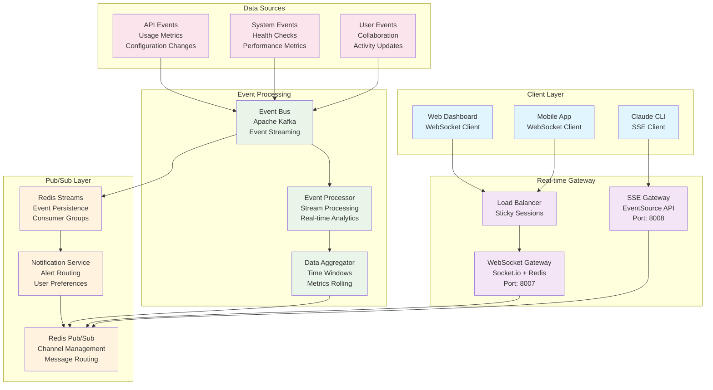

# Claude Configuration Dashboard - Real-time Architecture

## Real-time Communication Overview

The Claude Configuration Dashboard implements a comprehensive real-time communication system using WebSockets, Server-Sent Events (SSE), and event streaming to provide instant updates on usage metrics, configuration changes, system health, and collaborative features.



## WebSocket Implementation

### Socket.io Server Configuration

```typescript
import { Server as SocketIOServer } from 'socket.io';
import { createAdapter } from '@socket.io/redis-adapter';
import Redis from 'ioredis';

interface SocketUser {
  id: string;
  email: string;
  role: string;
  projects: string[];
  teams: string[];
}

interface AuthenticatedSocket extends Socket {
  user: SocketUser;
  rateLimiter: RateLimiter;
}

class WebSocketServer {
  private io: SocketIOServer;
  private redis: Redis;
  private pubClient: Redis;
  private subClient: Redis;

  constructor(server: any) {
    this.redis = new Redis(process.env.REDIS_URL);
    this.pubClient = new Redis(process.env.REDIS_URL);
    this.subClient = new Redis(process.env.REDIS_URL);

    this.io = new SocketIOServer(server, {
      cors: {
        origin: process.env.ALLOWED_ORIGINS?.split(',') || ['http://localhost:3000'],
        credentials: true
      },
      transports: ['websocket', 'polling'],
      pingTimeout: 60000,
      pingInterval: 25000,
      maxHttpBufferSize: 1e6, // 1MB
      allowRequest: this.authenticateConnection.bind(this)
    });

    // Redis adapter for horizontal scaling
    this.io.adapter(createAdapter(this.pubClient, this.subClient));

    this.setupEventHandlers();
    this.setupRateLimiting();
  }

  private async authenticateConnection(
    req: any,
    callback: (err: string | null | undefined, success?: boolean) => void
  ): Promise<void> {
    try {
      const token = req.handshake.auth.token || req.handshake.headers.authorization;
      
      if (!token) {
        return callback('Authentication token required');
      }

      const user = await this.validateToken(token.replace('Bearer ', ''));
      if (!user) {
        return callback('Invalid authentication token');
      }

      req.user = user;
      callback(null, true);
    } catch (error) {
      callback('Authentication failed');
    }
  }

  private setupEventHandlers(): void {
    this.io.on('connection', async (socket: AuthenticatedSocket) => {
      const user = socket.handshake.auth.user || socket.request.user;
      socket.user = user;

      console.log(`User ${user.email} connected via WebSocket`);

      // Join user-specific rooms
      await this.joinUserRooms(socket);

      // Set up event listeners
      this.setupSocketEventListeners(socket);

      // Handle disconnection
      socket.on('disconnect', (reason) => {
        console.log(`User ${user.email} disconnected: ${reason}`);
        this.handleDisconnection(socket);
      });
    });
  }

  private async joinUserRooms(socket: AuthenticatedSocket): Promise<void> {
    const { user } = socket;
    
    // Join personal room
    socket.join(`user:${user.id}`);
    
    // Join project rooms
    for (const projectId of user.projects) {
      socket.join(`project:${projectId}`);
    }
    
    // Join team rooms
    for (const teamId of user.teams) {
      socket.join(`team:${teamId}`);
    }

    // Send initial data
    await this.sendInitialData(socket);
  }

  private setupSocketEventListeners(socket: AuthenticatedSocket): void {
    // Subscribe to real-time metrics
    socket.on('subscribe:metrics', async (data: {
      projectId?: string;
      interval?: number;
    }) => {
      await this.handleMetricsSubscription(socket, data);
    });

    // Configuration change events
    socket.on('config:update', async (data: {
      projectId: string;
      configData: any;
    }) => {
      await this.handleConfigUpdate(socket, data);
    });

    // Collaboration events
    socket.on('collaboration:join', async (data: {
      projectId: string;
      type: 'editing' | 'viewing';
    }) => {
      await this.handleCollaborationJoin(socket, data);
    });

    socket.on('collaboration:cursor', async (data: {
      projectId: string;
      position: { line: number; column: number; };
      selection?: { start: any; end: any; };
    }) => {
      await this.handleCursorUpdate(socket, data);
    });

    // System monitoring
    socket.on('subscribe:health', async () => {
      await this.handleHealthSubscription(socket);
    });

    // Error reporting
    socket.on('error:report', async (data: {
      error: string;
      context: any;
      severity: 'low' | 'medium' | 'high' | 'critical';
    }) => {
      await this.handleErrorReport(socket, data);
    });
  }
}
```

### Event Handlers Implementation

```typescript
class WebSocketEventHandlers {
  constructor(
    private io: SocketIOServer,
    private redis: Redis,
    private metricsService: MetricsService,
    private configService: ConfigurationService
  ) {}

  async handleMetricsSubscription(
    socket: AuthenticatedSocket,
    data: { projectId?: string; interval?: number }
  ): Promise<void> {
    const { projectId, interval = 1000 } = data;
    const userId = socket.user.id;

    // Validate permissions
    if (projectId && !socket.user.projects.includes(projectId)) {
      socket.emit('error', {
        code: 'PERMISSION_DENIED',
        message: 'Access denied to project metrics'
      });
      return;
    }

    // Rate limiting for metric subscriptions
    const rateLimitKey = `metrics_subscription:${userId}:${projectId || 'global'}`;
    const canSubscribe = await this.checkRateLimit(rateLimitKey, 10, 60000); // 10 per minute
    
    if (!canSubscribe) {
      socket.emit('error', {
        code: 'RATE_LIMIT_EXCEEDED',
        message: 'Too many metric subscriptions'
      });
      return;
    }

    // Store subscription
    const subscriptionKey = `sub:metrics:${socket.id}`;
    await this.redis.setex(subscriptionKey, 3600, JSON.stringify({
      userId,
      projectId,
      interval,
      timestamp: Date.now()
    }));

    // Join metrics room
    const room = projectId ? `metrics:project:${projectId}` : `metrics:user:${userId}`;
    socket.join(room);

    // Send initial metrics
    const currentMetrics = await this.metricsService.getCurrentMetrics({
      userId,
      projectId,
      period: 'realtime'
    });

    socket.emit('metrics:initial', {
      timestamp: Date.now(),
      data: currentMetrics
    });

    socket.emit('subscription:confirmed', {
      type: 'metrics',
      room,
      interval
    });
  }

  async handleConfigUpdate(
    socket: AuthenticatedSocket,
    data: { projectId: string; configData: any }
  ): Promise<void> {
    const { projectId, configData } = data;
    const userId = socket.user.id;

    try {
      // Validate permissions
      const hasPermission = await this.configService.hasUpdatePermission(
        userId,
        projectId
      );

      if (!hasPermission) {
        socket.emit('error', {
          code: 'PERMISSION_DENIED',
          message: 'No permission to update configuration'
        });
        return;
      }

      // Validate configuration data
      const validationResult = await this.configService.validateConfiguration(configData);
      if (!validationResult.valid) {
        socket.emit('config:validation-error', {
          errors: validationResult.errors,
          timestamp: Date.now()
        });
        return;
      }

      // Save configuration
      const updatedConfig = await this.configService.updateConfiguration(
        projectId,
        configData,
        userId
      );

      // Broadcast to project collaborators
      socket.to(`project:${projectId}`).emit('config:updated', {
        projectId,
        config: updatedConfig,
        updatedBy: {
          id: userId,
          name: socket.user.email
        },
        timestamp: Date.now()
      });

      // Confirm update to sender
      socket.emit('config:update-success', {
        projectId,
        configId: updatedConfig.id,
        timestamp: Date.now()
      });

      // Log audit event
      await this.logAuditEvent({
        userId,
        action: 'config_update',
        resourceType: 'project',
        resourceId: projectId,
        details: { configId: updatedConfig.id }
      });

    } catch (error) {
      socket.emit('error', {
        code: 'CONFIG_UPDATE_FAILED',
        message: error.message,
        timestamp: Date.now()
      });
    }
  }

  async handleCollaborationJoin(
    socket: AuthenticatedSocket,
    data: { projectId: string; type: 'editing' | 'viewing' }
  ): Promise<void> {
    const { projectId, type } = data;
    const userId = socket.user.id;

    // Join collaboration room
    const collaborationRoom = `collab:${projectId}`;
    socket.join(collaborationRoom);

    // Update presence
    const presenceKey = `presence:${projectId}:${userId}`;
    await this.redis.setex(presenceKey, 30, JSON.stringify({
      userId,
      name: socket.user.email,
      type,
      joinedAt: Date.now(),
      socketId: socket.id
    }));

    // Get current collaborators
    const collaborators = await this.getCurrentCollaborators(projectId);

    // Broadcast join event
    socket.to(collaborationRoom).emit('collaboration:user-joined', {
      user: {
        id: userId,
        name: socket.user.email,
        type
      },
      timestamp: Date.now()
    });

    // Send current collaborators to new user
    socket.emit('collaboration:current-users', {
      collaborators,
      timestamp: Date.now()
    });

    // Set up heartbeat for presence
    const heartbeatInterval = setInterval(async () => {
      await this.redis.setex(presenceKey, 30, JSON.stringify({
        userId,
        name: socket.user.email,
        type,
        lastSeen: Date.now(),
        socketId: socket.id
      }));
    }, 15000); // 15 second heartbeat

    // Clean up on disconnect
    socket.on('disconnect', async () => {
      clearInterval(heartbeatInterval);
      await this.redis.del(presenceKey);
      
      socket.to(collaborationRoom).emit('collaboration:user-left', {
        userId,
        timestamp: Date.now()
      });
    });
  }

  async handleCursorUpdate(
    socket: AuthenticatedSocket,
    data: {
      projectId: string;
      position: { line: number; column: number };
      selection?: { start: any; end: any };
    }
  ): Promise<void> {
    const { projectId, position, selection } = data;
    const userId = socket.user.id;

    // Rate limit cursor updates (max 10 per second)
    const rateLimitKey = `cursor_updates:${userId}:${projectId}`;
    const canUpdate = await this.checkRateLimit(rateLimitKey, 10, 1000);
    
    if (!canUpdate) return; // Silently drop excessive updates

    // Broadcast cursor position to other collaborators
    socket.to(`collab:${projectId}`).emit('collaboration:cursor-update', {
      userId,
      name: socket.user.email,
      position,
      selection,
      timestamp: Date.now()
    });
  }

  async handleHealthSubscription(socket: AuthenticatedSocket): Promise<void> {
    const userId = socket.user.id;

    // Check if user has admin permissions
    if (socket.user.role !== 'admin' && socket.user.role !== 'owner') {
      socket.emit('error', {
        code: 'PERMISSION_DENIED',
        message: 'Admin access required for system health monitoring'
      });
      return;
    }

    // Join health monitoring room
    socket.join(`health:admin`);

    // Send current system health
    const healthData = await this.getSystemHealth();
    socket.emit('health:initial', {
      data: healthData,
      timestamp: Date.now()
    });

    socket.emit('subscription:confirmed', {
      type: 'health',
      room: 'health:admin'
    });
  }

  async handleErrorReport(
    socket: AuthenticatedSocket,
    data: {
      error: string;
      context: any;
      severity: 'low' | 'medium' | 'high' | 'critical';
    }
  ): Promise<void> {
    const { error, context, severity } = data;
    const userId = socket.user.id;

    // Log error to monitoring system
    await this.logError({
      userId,
      error,
      context,
      severity,
      source: 'websocket_client',
      timestamp: new Date()
    });

    // Send to monitoring room if critical
    if (severity === 'critical' || severity === 'high') {
      this.io.to('health:admin').emit('error:critical', {
        userId,
        error,
        context,
        severity,
        timestamp: Date.now()
      });
    }

    socket.emit('error:acknowledged', {
      timestamp: Date.now()
    });
  }
}
```

## Server-Sent Events (SSE) Implementation

```typescript
import { Request, Response } from 'express';

class SSEController {
  private connections: Map<string, SSEConnection> = new Map();
  private redis: Redis;

  constructor(redis: Redis) {
    this.redis = redis;
    this.setupRedisSubscriptions();
  }

  async handleSSEConnection(req: Request, res: Response): Promise<void> {
    const userId = req.user?.id;
    const projectId = req.query.projectId as string;
    
    if (!userId) {
      return res.status(401).json({ error: 'Authentication required' });
    }

    // Set SSE headers
    res.writeHead(200, {
      'Content-Type': 'text/event-stream',
      'Cache-Control': 'no-cache',
      'Connection': 'keep-alive',
      'Access-Control-Allow-Origin': '*',
      'Access-Control-Allow-Headers': 'Cache-Control'
    });

    // Create connection
    const connectionId = `${userId}_${Date.now()}`;
    const connection: SSEConnection = {
      id: connectionId,
      userId,
      projectId,
      response: res,
      lastPing: Date.now(),
      subscriptions: new Set()
    };

    this.connections.set(connectionId, connection);

    // Send initial connection event
    this.sendSSEEvent(connection, 'connected', {
      connectionId,
      timestamp: Date.now()
    });

    // Handle client disconnect
    req.on('close', () => {
      this.connections.delete(connectionId);
      console.log(`SSE connection ${connectionId} closed`);
    });

    // Set up heartbeat
    const heartbeat = setInterval(() => {
      if (this.connections.has(connectionId)) {
        this.sendSSEEvent(connection, 'ping', { timestamp: Date.now() });
        connection.lastPing = Date.now();
      } else {
        clearInterval(heartbeat);
      }
    }, 30000); // 30 second heartbeat

    // Subscribe to relevant channels
    await this.subscribeToChannels(connection);
  }

  private async subscribeToChannels(connection: SSEConnection): Promise<void> {
    const { userId, projectId } = connection;

    // Subscribe to user-specific events
    const userChannel = `user:${userId}`;
    connection.subscriptions.add(userChannel);

    // Subscribe to project events if specified
    if (projectId) {
      const projectChannel = `project:${projectId}`;
      connection.subscriptions.add(projectChannel);
    }

    // Subscribe to general system events
    connection.subscriptions.add('system:general');
  }

  private sendSSEEvent(
    connection: SSEConnection,
    event: string,
    data: any
  ): void {
    try {
      const eventData = `event: ${event}\ndata: ${JSON.stringify(data)}\n\n`;
      connection.response.write(eventData);
    } catch (error) {
      console.error('Failed to send SSE event:', error);
      this.connections.delete(connection.id);
    }
  }

  private setupRedisSubscriptions(): void {
    const subscriber = new Redis(process.env.REDIS_URL);

    subscriber.psubscribe('sse:*');
    
    subscriber.on('pmessage', (pattern, channel, message) => {
      const eventType = channel.split(':')[1];
      const data = JSON.parse(message);

      // Route to appropriate connections
      this.routeSSEEvent(eventType, data);
    });
  }

  private routeSSEEvent(eventType: string, data: any): void {
    for (const [connectionId, connection] of this.connections) {
      const { userId, projectId, subscriptions } = connection;

      let shouldSend = false;

      // Check if connection should receive this event
      switch (eventType) {
        case 'user':
          shouldSend = data.userId === userId;
          break;
        case 'project':
          shouldSend = data.projectId === projectId;
          break;
        case 'system':
          shouldSend = true; // Send system events to all connections
          break;
        case 'metrics':
          shouldSend = (data.userId === userId) || 
                      (data.projectId === projectId);
          break;
      }

      if (shouldSend) {
        this.sendSSEEvent(connection, eventType, data);
      }
    }
  }
}

interface SSEConnection {
  id: string;
  userId: string;
  projectId?: string;
  response: Response;
  lastPing: number;
  subscriptions: Set<string>;
}
```

## Event Bus & Stream Processing

### Apache Kafka Integration

```typescript
import { Kafka, Producer, Consumer } from 'kafkajs';

class EventBusService {
  private kafka: Kafka;
  private producer: Producer;
  private consumers: Map<string, Consumer> = new Map();

  constructor() {
    this.kafka = new Kafka({
      clientId: 'claude-config-dashboard',
      brokers: process.env.KAFKA_BROKERS?.split(',') || ['localhost:9092'],
      retry: {
        initialRetryTime: 100,
        retries: 8
      }
    });

    this.producer = this.kafka.producer({
      maxInFlightRequests: 1,
      idempotent: true,
      transactionTimeout: 30000
    });
  }

  async initialize(): Promise<void> {
    await this.producer.connect();
    await this.setupTopics();
    await this.startConsumers();
  }

  private async setupTopics(): Promise<void> {
    const admin = this.kafka.admin();
    await admin.connect();

    const topics = [
      {
        topic: 'usage-events',
        numPartitions: 12,
        replicationFactor: 3,
        configEntries: [
          { name: 'retention.ms', value: '604800000' }, // 7 days
          { name: 'compression.type', value: 'lz4' }
        ]
      },
      {
        topic: 'config-changes',
        numPartitions: 6,
        replicationFactor: 3
      },
      {
        topic: 'system-events',
        numPartitions: 3,
        replicationFactor: 3
      },
      {
        topic: 'collaboration-events',
        numPartitions: 6,
        replicationFactor: 3
      },
      {
        topic: 'notifications',
        numPartitions: 3,
        replicationFactor: 3
      }
    ];

    await admin.createTopics({ topics });
    await admin.disconnect();
  }

  async publishEvent(
    topic: string,
    event: {
      type: string;
      data: any;
      metadata?: any;
    }
  ): Promise<void> {
    const message = {
      timestamp: Date.now().toString(),
      key: event.type,
      value: JSON.stringify({
        ...event,
        timestamp: Date.now(),
        id: uuidv4()
      })
    };

    try {
      await this.producer.send({
        topic,
        messages: [message]
      });
    } catch (error) {
      console.error(`Failed to publish event to ${topic}:`, error);
      throw error;
    }
  }

  async subscribeToTopic(
    topic: string,
    groupId: string,
    handler: (message: any) => Promise<void>
  ): Promise<void> {
    const consumer = this.kafka.consumer({
      groupId,
      sessionTimeout: 30000,
      heartbeatInterval: 3000
    });

    await consumer.connect();
    await consumer.subscribe({ topic, fromBeginning: false });

    await consumer.run({
      eachMessage: async ({ message, partition, topic }) => {
        try {
          const eventData = JSON.parse(message.value!.toString());
          await handler(eventData);
        } catch (error) {
          console.error(`Error processing message from ${topic}:`, error);
          // Implement dead letter queue logic here
        }
      }
    });

    this.consumers.set(`${topic}-${groupId}`, consumer);
  }

  private async startConsumers(): Promise<void> {
    // Real-time metrics processor
    await this.subscribeToTopic(
      'usage-events',
      'realtime-metrics',
      this.processUsageEvent.bind(this)
    );

    // Configuration change processor
    await this.subscribeToTopic(
      'config-changes',
      'config-processor',
      this.processConfigChange.bind(this)
    );

    // System event processor
    await this.subscribeToTopic(
      'system-events',
      'system-processor',
      this.processSystemEvent.bind(this)
    );

    // Collaboration processor
    await this.subscribeToTopic(
      'collaboration-events',
      'collaboration-processor',
      this.processCollaborationEvent.bind(this)
    );
  }

  private async processUsageEvent(event: any): Promise<void> {
    const { type, data } = event;

    switch (type) {
      case 'api_request':
        await this.updateRealTimeMetrics(data);
        await this.checkQuotaLimits(data);
        break;
      case 'model_usage':
        await this.updateModelMetrics(data);
        await this.calculateCosts(data);
        break;
      case 'error_occurred':
        await this.updateErrorMetrics(data);
        await this.triggerErrorAlerts(data);
        break;
    }
  }

  private async processConfigChange(event: any): Promise<void> {
    const { type, data } = event;

    // Broadcast to WebSocket clients
    await this.broadcastToWebSocket(`config:${type}`, data);

    // Update configuration cache
    await this.updateConfigCache(data);

    // Trigger deployment if needed
    if (type === 'deploy_requested') {
      await this.triggerDeployment(data);
    }
  }

  private async processSystemEvent(event: any): Promise<void> {
    const { type, data } = event;

    switch (type) {
      case 'health_check':
        await this.updateSystemHealth(data);
        break;
      case 'service_restart':
        await this.notifyServiceRestart(data);
        break;
      case 'high_load_detected':
        await this.handleHighLoad(data);
        break;
    }
  }

  private async processCollaborationEvent(event: any): Promise<void> {
    const { type, data } = event;

    // Broadcast to collaboration rooms
    await this.broadcastToCollaboration(data.projectId, type, data);

    // Update presence information
    if (type === 'user_presence_update') {
      await this.updateUserPresence(data);
    }
  }
}
```

## Real-time Analytics Processing

```typescript
class RealTimeAnalyticsProcessor {
  private redis: Redis;
  private kafkaProducer: Producer;
  private windowSize: number = 60000; // 1 minute windows

  constructor(redis: Redis, kafkaProducer: Producer) {
    this.redis = redis;
    this.kafkaProducer = kafkaProducer;
    this.startProcessingWindows();
  }

  async processUsageMetric(event: {
    userId: string;
    projectId: string;
    modelId: string;
    tokens: number;
    cost: number;
    responseTime: number;
    timestamp: number;
  }): Promise<void> {
    const window = Math.floor(event.timestamp / this.windowSize);
    const windowKey = `metrics:${window}`;

    // Update rolling counters
    const pipeline = this.redis.pipeline();
    
    // Global metrics
    pipeline.hincrby(`${windowKey}:global`, 'requests', 1);
    pipeline.hincrbyfloat(`${windowKey}:global`, 'tokens', event.tokens);
    pipeline.hincrbyfloat(`${windowKey}:global`, 'cost', event.cost);
    pipeline.hincrby(`${windowKey}:global`, 'response_time_sum', event.responseTime);

    // User metrics
    pipeline.hincrby(`${windowKey}:user:${event.userId}`, 'requests', 1);
    pipeline.hincrbyfloat(`${windowKey}:user:${event.userId}`, 'tokens', event.tokens);
    pipeline.hincrbyfloat(`${windowKey}:user:${event.userId}`, 'cost', event.cost);

    // Project metrics
    pipeline.hincrby(`${windowKey}:project:${event.projectId}`, 'requests', 1);
    pipeline.hincrbyfloat(`${windowKey}:project:${event.projectId}`, 'tokens', event.tokens);
    pipeline.hincrbyfloat(`${windowKey}:project:${event.projectId}`, 'cost', event.cost);

    // Model metrics
    pipeline.hincrby(`${windowKey}:model:${event.modelId}`, 'requests', 1);
    pipeline.hincrbyfloat(`${windowKey}:model:${event.modelId}`, 'tokens', event.tokens);
    pipeline.hincrbyfloat(`${windowKey}:model:${event.modelId}`, 'cost', event.cost);

    // Set expiration (keep for 24 hours)
    pipeline.expire(windowKey, 86400);

    await pipeline.exec();

    // Publish real-time update
    await this.publishRealTimeUpdate({
      type: 'metrics_update',
      window,
      userId: event.userId,
      projectId: event.projectId,
      data: {
        requests: 1,
        tokens: event.tokens,
        cost: event.cost,
        avgResponseTime: event.responseTime
      }
    });
  }

  async getCurrentMetrics(filters: {
    userId?: string;
    projectId?: string;
    modelId?: string;
    windows?: number;
  }): Promise<any> {
    const currentWindow = Math.floor(Date.now() / this.windowSize);
    const windows = filters.windows || 5; // Last 5 minutes by default
    
    const results: any = {
      realtime: {},
      trend: []
    };

    // Get current window data
    let key = `metrics:${currentWindow}`;
    if (filters.userId) key += `:user:${filters.userId}`;
    else if (filters.projectId) key += `:project:${filters.projectId}`;
    else if (filters.modelId) key += `:model:${filters.modelId}`;
    else key += ':global';

    const currentData = await this.redis.hgetall(key);
    if (currentData.requests) {
      results.realtime = {
        requests: parseInt(currentData.requests),
        tokens: parseFloat(currentData.tokens || '0'),
        cost: parseFloat(currentData.cost || '0'),
        avgResponseTime: parseInt(currentData.response_time_sum || '0') / parseInt(currentData.requests)
      };
    }

    // Get historical windows for trend
    for (let i = 0; i < windows; i++) {
      const windowNum = currentWindow - i;
      const windowKey = `metrics:${windowNum}${key.substring(key.indexOf(':'))}`;
      const windowData = await this.redis.hgetall(windowKey);
      
      if (windowData.requests) {
        results.trend.unshift({
          window: windowNum,
          timestamp: windowNum * this.windowSize,
          requests: parseInt(windowData.requests),
          tokens: parseFloat(windowData.tokens || '0'),
          cost: parseFloat(windowData.cost || '0'),
          avgResponseTime: parseInt(windowData.response_time_sum || '0') / parseInt(windowData.requests)
        });
      }
    }

    return results;
  }

  private async publishRealTimeUpdate(update: any): Promise<void> {
    // Publish to Redis for WebSocket distribution
    await this.redis.publish('realtime:metrics', JSON.stringify(update));

    // Also send to Kafka for persistent processing
    await this.kafkaProducer.send({
      topic: 'realtime-updates',
      messages: [{
        key: update.type,
        value: JSON.stringify(update)
      }]
    });
  }

  private startProcessingWindows(): void {
    // Process completed windows every minute
    setInterval(async () => {
      const completedWindow = Math.floor((Date.now() - this.windowSize) / this.windowSize);
      await this.processCompletedWindow(completedWindow);
    }, this.windowSize);
  }

  private async processCompletedWindow(windowNum: number): Promise<void> {
    const windowKey = `metrics:${windowNum}`;
    
    // Get all window data
    const globalData = await this.redis.hgetall(`${windowKey}:global`);
    
    if (globalData.requests) {
      // Calculate final metrics
      const finalMetrics = {
        window: windowNum,
        timestamp: windowNum * this.windowSize,
        requests: parseInt(globalData.requests),
        tokens: parseFloat(globalData.tokens || '0'),
        cost: parseFloat(globalData.cost || '0'),
        avgResponseTime: parseInt(globalData.response_time_sum || '0') / parseInt(globalData.requests)
      };

      // Store in TimescaleDB for historical analysis
      await this.storeHistoricalMetrics(finalMetrics);

      // Trigger any alerts based on thresholds
      await this.checkMetricAlerts(finalMetrics);
    }
  }
}
```

## Notification System

```typescript
enum NotificationType {
  QUOTA_WARNING = 'quota_warning',
  QUOTA_EXCEEDED = 'quota_exceeded',
  CONFIG_DEPLOYED = 'config_deployed',
  DEPLOYMENT_FAILED = 'deployment_failed',
  SYSTEM_ALERT = 'system_alert',
  COLLABORATION_INVITE = 'collaboration_invite',
  COST_ALERT = 'cost_alert'
}

interface Notification {
  id: string;
  type: NotificationType;
  userId: string;
  title: string;
  message: string;
  data?: any;
  channels: ('websocket' | 'email' | 'sms' | 'slack')[];
  priority: 'low' | 'normal' | 'high' | 'urgent';
  readAt?: Date;
  createdAt: Date;
  expiresAt?: Date;
}

class NotificationService {
  constructor(
    private redis: Redis,
    private emailService: EmailService,
    private smsService: SMSService,
    private slackService: SlackService,
    private eventBus: EventBusService
  ) {}

  async sendNotification(notification: Omit<Notification, 'id' | 'createdAt'>): Promise<void> {
    const fullNotification: Notification = {
      ...notification,
      id: uuidv4(),
      createdAt: new Date()
    };

    // Store notification
    await this.storeNotification(fullNotification);

    // Send via requested channels
    const promises = notification.channels.map(channel => 
      this.sendViaChannel(channel, fullNotification)
    );

    await Promise.allSettled(promises);

    // Update user notification count
    await this.updateNotificationCount(notification.userId);
  }

  private async sendViaChannel(
    channel: string,
    notification: Notification
  ): Promise<void> {
    try {
      switch (channel) {
        case 'websocket':
          await this.sendWebSocketNotification(notification);
          break;
        case 'email':
          await this.sendEmailNotification(notification);
          break;
        case 'sms':
          await this.sendSMSNotification(notification);
          break;
        case 'slack':
          await this.sendSlackNotification(notification);
          break;
      }
    } catch (error) {
      console.error(`Failed to send ${channel} notification:`, error);
    }
  }

  private async sendWebSocketNotification(notification: Notification): Promise<void> {
    // Publish to Redis for WebSocket distribution
    await this.redis.publish(`user:${notification.userId}:notifications`, JSON.stringify({
      type: 'notification',
      data: notification
    }));
  }

  private async sendEmailNotification(notification: Notification): Promise<void> {
    await this.emailService.send({
      to: await this.getUserEmail(notification.userId),
      subject: notification.title,
      template: 'notification',
      data: {
        notification,
        unsubscribeUrl: `${process.env.BASE_URL}/unsubscribe?token=${notification.id}`
      }
    });
  }

  async getUnreadNotifications(userId: string): Promise<Notification[]> {
    const notifications = await this.redis.lrange(`notifications:${userId}`, 0, -1);
    return notifications
      .map(n => JSON.parse(n))
      .filter((n: Notification) => !n.readAt);
  }

  async markAsRead(userId: string, notificationId: string): Promise<void> {
    // Update notification
    const notificationKey = `notification:${notificationId}`;
    await this.redis.hset(notificationKey, 'readAt', Date.now().toString());

    // Update count
    await this.redis.decr(`notification_count:${userId}`);

    // Broadcast update
    await this.redis.publish(`user:${userId}:notifications`, JSON.stringify({
      type: 'notification_read',
      data: { notificationId }
    }));
  }
}
```

This comprehensive real-time architecture provides instant updates, collaborative features, and scalable event processing for the Claude Configuration Dashboard. The system supports horizontal scaling, graceful degradation, and provides multiple communication channels to ensure reliable real-time functionality.