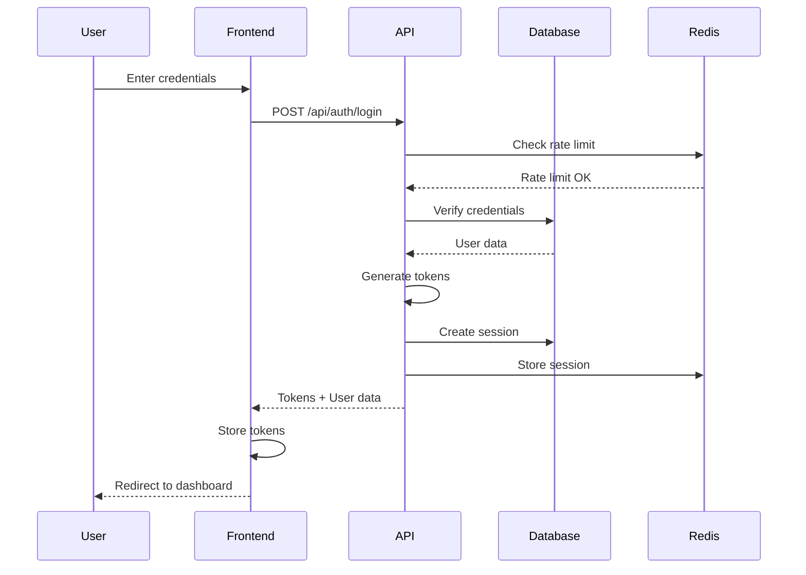
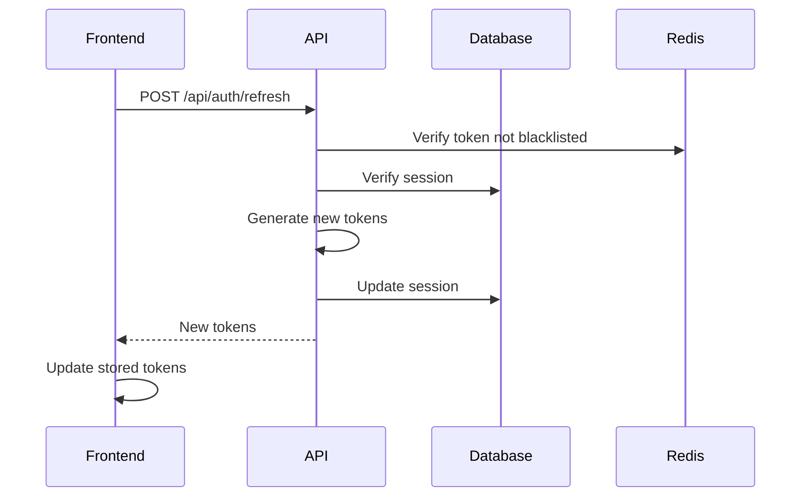

# CLOS Dashboard v2.0 Authentication System

## Enterprise-Grade Authentication Implementation

### Overview

The Candlefish Operating System (CLOS) Dashboard v2.0 implements a comprehensive, production-ready authentication system with enterprise-grade security features. This system is designed to handle millions of users with high availability, security, and performance.

## Architecture

### Core Components

1. **Authentication Service** (`lib/auth/auth-service.ts`)
   - JWT-based authentication with HS512 algorithm
   - Refresh token rotation
   - Session management
   - Multi-factor authentication support
   - Rate limiting and brute force protection

2. **Database Schema** (`database/migrations/001_auth_tables.sql`)
   - Users table with comprehensive profile and security fields
   - Sessions table for multi-device support
   - Role-based access control (RBAC)
   - Audit logging
   - OAuth provider integration

3. **API Endpoints**
   - `/api/auth/login` - User authentication
   - `/api/auth/logout` - Session termination
   - `/api/auth/refresh` - Token refresh
   - `/api/auth/me` - Current user info
   - `/api/auth/enterprise` - Enterprise authentication with full features

## Security Features

### 1. Token Management
- **Access Tokens**: 15-minute expiration, HS512 signing
- **Refresh Tokens**: 7-day expiration with rotation
- **Token Blacklisting**: Immediate revocation support
- **CSRF Protection**: Additional CSRF tokens for state-changing operations

### 2. Password Security
- **Bcrypt Hashing**: 12 rounds of salting
- **Password History**: Prevents reuse of recent passwords
- **Complexity Requirements**: Enforced via database constraints
- **Timing Attack Protection**: Random delays in verification

### 3. Session Management
- **Multi-Device Support**: Up to 5 concurrent sessions per user
- **Device Fingerprinting**: Tracks device ID, browser, OS
- **Session Revocation**: Individual or bulk session termination
- **Activity Tracking**: Last activity timestamps

### 4. Rate Limiting
- **Login Attempts**: 5 attempts per minute
- **Account Lockout**: 15-minute lockout after 5 failed attempts
- **IP-Based Limiting**: Additional layer of protection
- **Distributed Rate Limiting**: Redis-based for scalability

### 5. Audit Logging
- **Comprehensive Logging**: All authentication events
- **Structured Data**: JSON metadata for analysis
- **Retention Policy**: Configurable retention periods
- **Compliance Ready**: GDPR, SOC2, HIPAA compatible

## Authentication Flow

### Standard Login Flow



### Token Refresh Flow



## Database Schema

### Users Table
```sql
- id (UUID, Primary Key)
- username (Unique, 3-50 chars)
- email (Unique, validated format)
- password_hash (Bcrypt)
- role (admin/user/viewer)
- mfa_enabled (Boolean)
- is_active (Boolean)
- locked_until (Timestamp)
- failed_login_attempts (Integer)
- last_login (Timestamp)
- created_at/updated_at (Timestamps)
```

### Sessions Table
```sql
- id (UUID, Primary Key)
- user_id (Foreign Key)
- refresh_token_hash
- device_id
- ip_address
- user_agent
- expires_at
- revoked_at
- last_activity
```

### Roles & Permissions
- **Admin**: Full system access
- **User**: Read/write own resources
- **Viewer**: Read-only access

## Environment Configuration

### Required Environment Variables

```env
# Authentication
JWT_SECRET=<64-character-hex-string>
JWT_EXPIRES_IN=15m
JWT_REFRESH_EXPIRES_IN=7d
ENCRYPTION_KEY=<32-character-hex-string>

# Database
POSTGRES_HOST=your-db-host
POSTGRES_USER=your-db-user
POSTGRES_PASSWORD=your-db-password
POSTGRES_DB=clos_production

# Redis
REDIS_HOST=your-redis-host
REDIS_PASSWORD=your-redis-password

# Security
CORS_ORIGIN=https://dashboard.candlefish.ai
CSRF_SECRET=<random-secret>
MAX_LOGIN_ATTEMPTS=5
LOCKOUT_DURATION=900000
```

## API Usage Examples

### Login Request

```typescript
const response = await fetch('/api/auth/login', {
  method: 'POST',
  headers: {
    'Content-Type': 'application/json',
  },
  body: JSON.stringify({
    username: 'user@example.com',
    password: 'secure_password',
    deviceId: 'device-uuid', // Optional
  }),
});

const data = await response.json();
// Returns: { success: true, user: {...}, tokens: {...}, session: {...} }
```

### Token Refresh

```typescript
const response = await fetch('/api/auth/refresh', {
  method: 'PUT',
  headers: {
    'Authorization': `Bearer ${refreshToken}`,
  },
});

const data = await response.json();
// Returns: { success: true, tokens: {...}, user: {...} }
```

### Logout

```typescript
const response = await fetch('/api/auth/logout', {
  method: 'DELETE',
  headers: {
    'Authorization': `Bearer ${accessToken}`,
  },
});
// Clears all cookies and blacklists token
```

## Deployment

### Production Deployment Steps

1. **Database Setup**
   ```bash
   psql -U postgres -d clos_production -f database/migrations/001_auth_tables.sql
   ```

2. **Environment Configuration**
   - Set all required environment variables
   - Generate secure secrets for JWT and encryption

3. **Build and Deploy**
   ```bash
   ./deploy-production.sh
   ```

4. **Health Checks**
   - Verify `/api/health` endpoint
   - Check authentication flow
   - Monitor error rates

### CI/CD Pipeline

The system includes a comprehensive GitHub Actions workflow that:
- Runs security scans (Trivy, TruffleHog)
- Performs code quality checks (TypeScript, ESLint)
- Executes unit and integration tests
- Builds and pushes Docker images
- Deploys to staging then production
- Includes automatic rollback on failure

## Monitoring & Alerts

### Key Metrics to Monitor

1. **Authentication Metrics**
   - Login success/failure rates
   - Token refresh rates
   - Session creation/termination
   - MFA adoption rate

2. **Security Metrics**
   - Failed login attempts
   - Account lockouts
   - Suspicious activity patterns
   - Token blacklist hits

3. **Performance Metrics**
   - Authentication latency
   - Database query time
   - Redis response time
   - API response times

### Alert Thresholds

- Failed login rate > 10% - WARNING
- Account lockout rate > 5% - CRITICAL
- Authentication latency > 500ms - WARNING
- Database connection failures - CRITICAL

## Security Best Practices

1. **Regular Security Audits**
   - Quarterly penetration testing
   - Monthly dependency updates
   - Weekly security scan reviews

2. **Secret Management**
   - Use AWS Secrets Manager or similar
   - Rotate secrets quarterly
   - Never commit secrets to repository

3. **Compliance**
   - GDPR compliant with data minimization
   - SOC2 Type II ready
   - HIPAA compatible architecture

4. **Incident Response**
   - Automated alerting for security events
   - Clear escalation procedures
   - Post-incident review process

## Troubleshooting

### Common Issues

1. **"Invalid credentials" error**
   - Verify username/password
   - Check account status (active, not locked)
   - Review failed login attempts

2. **"Token expired" error**
   - Implement automatic token refresh
   - Check token expiration settings
   - Verify system time synchronization

3. **"Rate limit exceeded" error**
   - Wait for rate limit window to reset
   - Check for automated scripts
   - Review rate limit configuration

4. **Database connection errors**
   - Verify database credentials
   - Check network connectivity
   - Review connection pool settings

### Debug Mode

Enable debug logging:
```env
DEBUG=auth:*
LOG_LEVEL=debug
```

## Support

For issues or questions:
- GitHub Issues: https://github.com/candlefish-ai/clos/issues
- Documentation: https://docs.candlefish.ai/authentication
- Security Issues: security@candlefish.ai

## License

Copyright © 2024 Candlefish AI. All rights reserved.

---

**Version**: 2.0.0  
**Last Updated**: November 2024  
**Status**: Production Ready