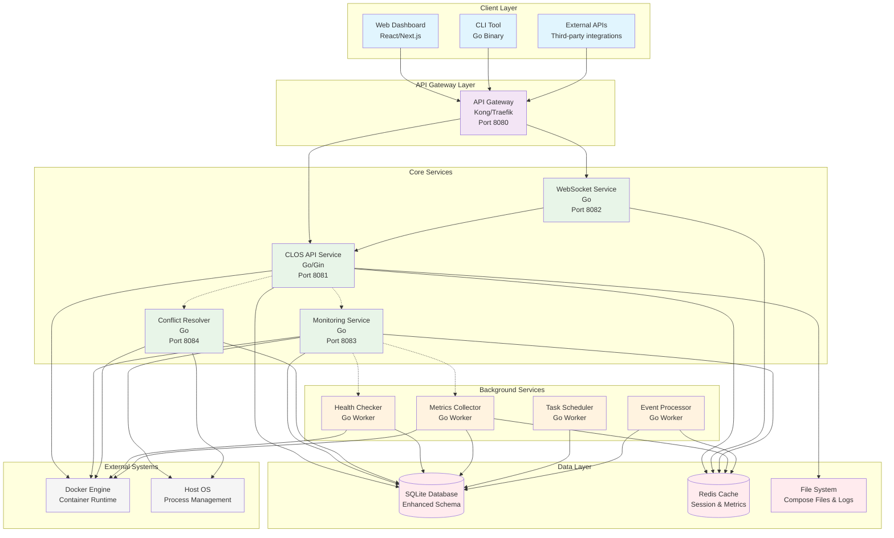
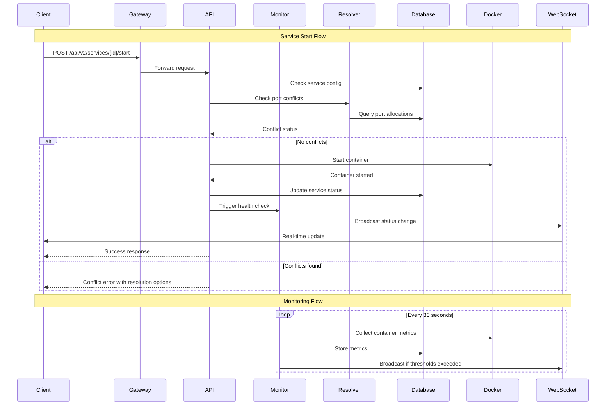
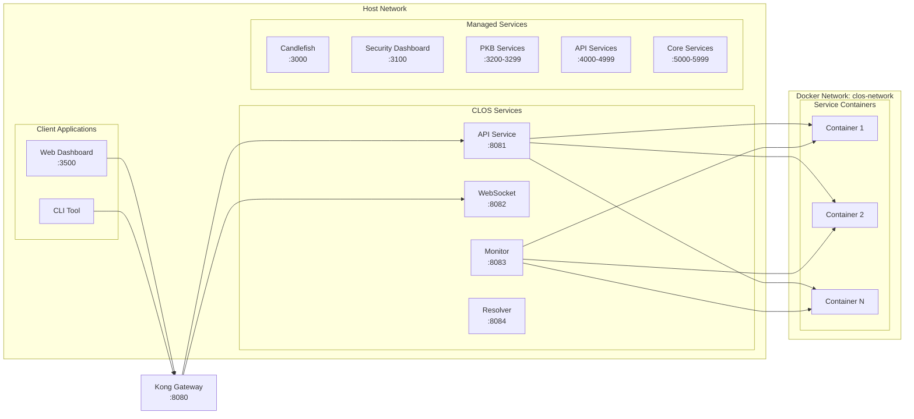

# CLOS v2.0 - Microservices Architecture Design

## System Overview

CLOS (Candlefish Localhost Orchestration System) v2.0 is designed as a distributed microservices architecture for managing local development environments with Docker containers.

## Service Architecture

## Service Boundaries and Responsibilities

### 1. API Service (clos-api)
**Port:** 8081  
**Technology:** Go with Gin framework  
**Responsibilities:**
- RESTful API endpoints for all CLOS operations
- Service registration and lifecycle management
- Port allocation and management
- Configuration management
- Authentication and authorization

**Key Endpoints:**
- `/api/v2/services` - Service CRUD operations
- `/api/v2/groups` - Service group management
- `/api/v2/ports` - Port allocation
- `/api/v2/conflicts` - Conflict detection

### 2. WebSocket Service (clos-websocket)
**Port:** 8082  
**Technology:** Go with Gorilla WebSocket  
**Responsibilities:**
- Real-time updates to connected clients
- Event broadcasting
- Connection management
- Message queuing for offline clients

**Event Types:**
- Service status changes
- Metric updates
- System alerts
- Port conflicts

### 3. Monitoring Service (clos-monitor)
**Port:** 8083  
**Technology:** Go with system monitoring libraries  
**Responsibilities:**
- System resource monitoring
- Docker container monitoring
- Service health aggregation
- Alert generation

**Metrics Collected:**
- CPU, Memory, Disk usage
- Container statistics
- Network metrics
- Response times

### 4. Conflict Resolver Service (clos-resolver)
**Port:** 8084  
**Technology:** Go with system process management  
**Responsibilities:**
- Port conflict detection
- Resolution strategy recommendation
- Automated conflict resolution
- Process management integration

## Data Flow Architecture

## Database Architecture

### Enhanced SQLite Schema
- **Performance optimized** with proper indexing
- **ACID compliance** with foreign key constraints
- **Comprehensive audit trail** with operation tracking
- **Metrics storage** with time-series optimization
- **Event sourcing** for system history

### Key Tables:
1. **services** - Core service definitions with health status
2. **service_groups** - Group orchestration and dependencies
3. **service_metrics** - Time-series performance data
4. **service_operations** - Operation tracking and audit
5. **port_conflicts** - Conflict detection and resolution
6. **system_events** - Event sourcing and audit log

## Network Architecture

## Security Architecture

### Authentication & Authorization
- **JWT tokens** for API authentication
- **API keys** for service-to-service communication
- **Role-based access control** (RBAC)
- **Session management** with Redis

### Security Measures
- **Input validation** on all endpoints
- **Rate limiting** per client/API key
- **CORS protection** for web dashboard
- **Audit logging** for all operations
- **Secret management** for sensitive configuration

## Performance Optimizations

### Database Optimizations
- **WAL mode** for better concurrent access
- **Strategic indexing** for common queries
- **Connection pooling** for API service
- **Prepared statements** for security and performance

### Caching Strategy
- **Redis caching** for:
  - Session data
  - Frequently accessed service configs
  - Real-time metrics (5-minute sliding window)
  - WebSocket connection state

### API Optimizations
- **Response compression** (gzip)
- **Pagination** for large result sets
- **Field selection** for reducing payload size
- **ETags** for cache validation
- **Connection keep-alive** for Docker API

## Scalability Considerations

### Horizontal Scaling Readiness
- **Stateless services** design
- **Shared cache** (Redis) for session state
- **Database connection pooling**
- **Asynchronous processing** for long-running operations

### Resource Management
- **Service resource limits** (CPU, memory)
- **Container lifecycle management**
- **Automatic cleanup** of old metrics and logs
- **Health check optimization**

## Monitoring & Observability

### Application Monitoring
- **Health check endpoints** for all services
- **Structured logging** with levels
- **Metrics collection** (Prometheus format)
- **Distributed tracing** readiness

### Infrastructure Monitoring
- **System resource tracking**
- **Docker daemon health**
- **Database performance metrics**
- **Network connectivity checks**

### Alerting Strategy
- **Threshold-based alerts** for resource usage
- **Service failure notifications**
- **Port conflict alerts**
- **Performance degradation detection**

## Deployment Strategy

### Service Deployment
- **Docker containers** for all services
- **Health checks** with proper timeouts
- **Rolling updates** for zero-downtime
- **Configuration management** via environment variables

### Development vs Production
- **Development:** Single-node deployment
- **Production:** Multi-container orchestration with Docker Compose
- **Testing:** Isolated test environments

## API Versioning Strategy

### Version Management
- **URL-based versioning** (`/api/v2/`)
- **Backward compatibility** for at least 2 major versions
- **Deprecation warnings** in API responses
- **Migration guides** for version upgrades

### Breaking Changes Protocol
1. **Announce** deprecation 3 months in advance
2. **Provide** migration documentation
3. **Support** parallel versions during transition
4. **Remove** deprecated endpoints after grace period

## Error Handling & Resilience

### Error Handling
- **Consistent error responses** across all endpoints
- **Structured error codes** for programmatic handling
- **Detailed error messages** for debugging
- **Context preservation** in error chains

### Resilience Patterns
- **Circuit breaker** for Docker API calls
- **Retry logic** with exponential backoff
- **Timeout handling** for all external calls
- **Graceful degradation** when services are unavailable

## Technology Stack Recommendations

### Core Services
- **Language:** Go (performance, concurrency, single binary deployment)
- **Web Framework:** Gin (lightweight, fast, good ecosystem)
- **WebSocket:** Gorilla WebSocket (reliable, feature-complete)
- **Database:** SQLite with WAL mode (embedded, ACID, good performance)

### Infrastructure
- **Cache:** Redis (session management, real-time data)
- **Reverse Proxy:** Kong or Traefik (API gateway, load balancing)
- **Container Runtime:** Docker (industry standard)
- **Process Management:** systemd (reliable service management)

### Frontend
- **Framework:** Next.js/React (modern, TypeScript support)
- **State Management:** Zustand or Redux Toolkit
- **Real-time:** WebSocket with reconnection logic
- **UI Components:** Tailwind CSS + Headless UI

### Development Tools
- **API Documentation:** OpenAPI 3.0 specification
- **Testing:** Go testing framework + testcontainers
- **Code Quality:** golangci-lint, gofmt
- **Dependency Management:** Go modules

This architecture provides a solid foundation for the CLOS v2.0 system with proper separation of concerns, scalability, and maintainability.