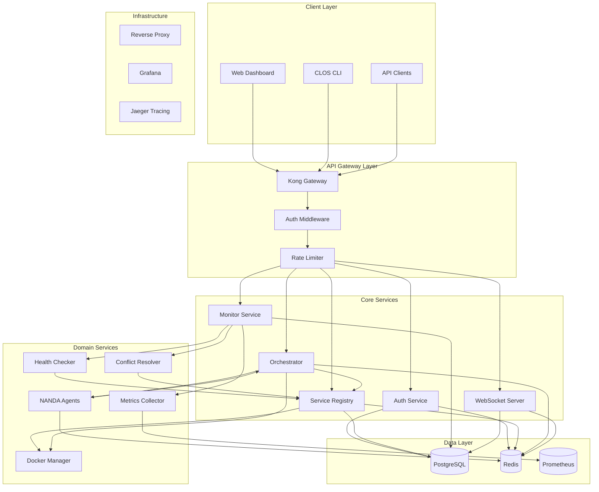

# CLOS Backend Architecture v2.0

## System Overview

The Candlefish Localhost Orchestration System (CLOS) backend is a comprehensive microservices platform built entirely in TypeScript, providing service discovery, orchestration, monitoring, and automation for containerized environments.

## Architecture Principles

- **Service-Oriented Architecture**: Modular microservices with clear boundaries
- **Event-Driven**: Asynchronous communication via Redis pub/sub and queues
- **API-First**: Contract-first design with OpenAPI specifications
- **Security by Design**: Multi-layer authentication and authorization
- **Observability**: Built-in monitoring, metrics, and distributed tracing
- **Resilience**: Circuit breakers, retries, and graceful degradation

## Service Architecture



## Service Definitions

### 1. API Gateway (Kong)
- **Port**: 8080
- **Purpose**: Central entry point, routing, authentication, rate limiting
- **Technologies**: Kong, Redis (session store)

### 2. Authentication Service
- **Port**: 4001
- **Purpose**: JWT token management, API key validation, RBAC
- **Technologies**: Node.js, TypeScript, jsonwebtoken, bcrypt

### 3. Service Registry
- **Port**: 4002
- **Purpose**: Service discovery, health tracking, configuration management
- **Technologies**: Node.js, TypeScript, Docker API

### 4. Orchestrator Service
- **Port**: 4003
- **Purpose**: Service lifecycle, dependency management, deployment orchestration
- **Technologies**: Node.js, TypeScript, BullMQ, Docker Compose

### 5. Monitor Service
- **Port**: 4004
- **Purpose**: Health checks, metrics collection, alerting
- **Technologies**: Node.js, TypeScript, Prometheus client, Docker stats

### 6. WebSocket Server
- **Port**: 4005
- **Purpose**: Real-time updates, live dashboard, event streaming
- **Technologies**: Socket.IO, Redis adapter

### 7. Docker Manager
- **Port**: 4006
- **Purpose**: Container lifecycle, image management, network operations
- **Technologies**: Node.js, Dockerode

### 8. Metrics Collector
- **Port**: 4007
- **Purpose**: System metrics, performance data, resource monitoring
- **Technologies**: Node.js, Prometheus, system stats

### 9. Conflict Resolver
- **Port**: 4008
- **Purpose**: Port conflict detection, automatic resolution strategies
- **Technologies**: Node.js, TypeScript, netstat parsing

### 10. NANDA Agent Framework
- **Port**: 4009
- **Purpose**: Agent orchestration, decision trees, self-healing
- **Technologies**: Node.js, TypeScript, State machines

## Database Architecture

### PostgreSQL Schema
- **Primary Database**: Service definitions, configurations, operational state
- **Connection Pool**: 20 connections per service
- **Migrations**: Flyway-based versioning
- **Backup**: Daily automated backups to S3

### Redis Architecture
- **Instance 1 (Port 6379)**: Session store, caching
- **Instance 2 (Port 6380)**: Message queues, pub/sub
- **Instance 3 (Port 6381)**: Rate limiting, temporary data
- **Clustering**: Redis Sentinel for high availability

## Security Model

### Authentication Methods
1. **JWT Tokens**: User sessions, short-lived (1 hour)
2. **API Keys**: Service-to-service, long-lived, scoped permissions
3. **Refresh Tokens**: Token renewal, secure HTTP-only cookies

### Authorization (RBAC)
- **Admin**: Patrick (full access, destructive operations)
- **Users**: Tyler, Aaron, James (read/write, no destructive operations)
- **Services**: Limited scope, specific permissions

### Security Features
- HTTPS everywhere (TLS 1.3)
- Rate limiting (1000 requests/minute per client)
- Request validation (JSON Schema)
- SQL injection prevention (parameterized queries)
- XSS protection (CSP headers)
- CORS configuration
- Audit logging for all operations

## API Design

### RESTful Endpoints
- **Services**: `/api/v2/services/*`
- **Groups**: `/api/v2/groups/*`
- **Ports**: `/api/v2/ports/*`
- **System**: `/api/v2/system/*`
- **Auth**: `/api/v2/auth/*`

### WebSocket Events
- `service.status_changed`
- `service.metrics_updated`
- `system.resource_alert`
- `port.conflict_detected`
- `group.operation_completed`

### Rate Limiting
- 1000 requests/minute per IP
- 10000 requests/minute per authenticated user
- Unlimited for service-to-service (with valid API key)

## Queue System (BullMQ + Redis)

### Queue Types
1. **High Priority**: Service start/stop operations
2. **Normal Priority**: Health checks, metrics collection
3. **Low Priority**: Log aggregation, cleanup tasks
4. **Scheduled**: Periodic maintenance, backups

### Queue Configuration
- **Concurrency**: 5 workers per queue
- **Retry Policy**: Exponential backoff, max 3 retries
- **Dead Letter Queue**: Failed jobs for investigation
- **Job Persistence**: Redis with AOF enabled

## Monitoring & Observability

### Metrics (Prometheus)
- Service response times
- Error rates
- Resource utilization
- Queue depths
- Docker container stats

### Logging (Structured JSON)
- Request/response logging
- Error tracking
- Performance metrics
- Security events
- Business events

### Tracing (Jaeger)
- Distributed request tracing
- Service dependency mapping
- Performance bottleneck identification

### Health Checks
- **Liveness**: Service process health
- **Readiness**: Service dependency health
- **Startup**: Service initialization status

## NANDA Agent Framework

### Agent Types
1. **Health Monitor**: Continuous health checking
2. **Resource Manager**: CPU/memory optimization
3. **Conflict Resolver**: Port/resource conflict resolution
4. **Performance Optimizer**: Service tuning recommendations
5. **Security Scanner**: Vulnerability detection

### Agent Communication
- Event-driven architecture
- Redis pub/sub for coordination
- State persistence in PostgreSQL
- Decision trees with configurable rules

### Self-Healing Capabilities
- Automatic service restart on failure
- Port conflict resolution
- Resource limit adjustment
- Dependency chain recovery

## Development & Deployment

### Technology Stack
- **Runtime**: Node.js 20 LTS
- **Language**: TypeScript 5.0+
- **Framework**: Express.js
- **ORM**: Prisma
- **Validation**: Zod
- **Testing**: Jest + Supertest
- **Build**: esbuild
- **Process Manager**: PM2

### Container Strategy
- One container per service
- Alpine Linux base images
- Multi-stage builds
- Health check endpoints
- Resource limits

### CI/CD Pipeline
1. **Code Quality**: ESLint, Prettier, TypeScript checks
2. **Testing**: Unit, integration, e2e tests
3. **Security**: SAST scanning, dependency audit
4. **Build**: Docker image creation
5. **Deploy**: Rolling deployment with health checks

## Performance Targets

### Response Times
- Health endpoints: < 50ms
- CRUD operations: < 200ms
- Complex queries: < 500ms
- Bulk operations: < 2s

### Throughput
- 1000+ requests/second
- 100+ concurrent service operations
- Real-time WebSocket updates (< 100ms latency)

### Availability
- 99.9% uptime target
- < 1 second failover time
- Zero-downtime deployments
- Graceful shutdown (30s timeout)

## Scaling Strategy

### Horizontal Scaling
- Stateless services behind load balancer
- Database read replicas
- Redis clustering
- Queue worker scaling

### Vertical Scaling
- Connection pool optimization
- Memory caching
- Database query optimization
- CPU-intensive task offloading

## Error Handling

### Error Categories
1. **Client Errors (4xx)**: Bad requests, validation failures
2. **Server Errors (5xx)**: Internal failures, dependency issues
3. **Business Errors**: Domain-specific error conditions

### Error Response Format
```json
{
  "code": "SERVICE_NOT_FOUND",
  "message": "Service with ID 'abc123' not found",
  "details": {
    "service_id": "abc123",
    "timestamp": "2025-08-29T10:30:00Z"
  },
  "trace_id": "12345-67890-abcdef"
}
```

### Recovery Strategies
- Circuit breakers for external dependencies
- Exponential backoff for retries
- Fallback responses
- Graceful degradation

This architecture provides a solid foundation for a production-ready service orchestration platform with enterprise-grade features for monitoring, security, and scalability.