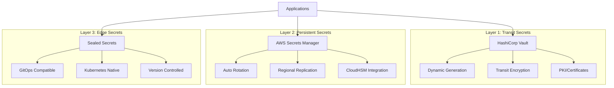

# Candlefish AI Secrets Management Architecture
## Operational Design Atelier - Security as Craft, Protection as Poetry

> *"In the craft of security, the highest art is invisibility. When protection becomes seamless, security transforms from constraint to enablement."*

## 🎯 Vision

This secrets management architecture embodies the Operational Design Atelier philosophy, transforming security from a burden into an elegant operational advantage. Every secret is treated as a living entity with lifecycle, lineage, and purpose.

## 🏗️ Architecture Overview

### The Trinary Vault System



## 🚀 Quick Start

### Prerequisites

```bash
# Required tools
brew install terraform vault kubectl helm aws-cli jq

# AWS credentials configured
aws configure

# Kubernetes context set
kubectl config current-context
```

### Deployment

```bash
# Clone the repository
cd infrastructure/secrets-management

# Run deployment script
./deploy.sh staging us-east-1 plan  # Review changes
./deploy.sh staging us-east-1 apply # Deploy infrastructure

# For production (requires additional confirmation)
./deploy.sh production us-east-1 apply
```

## 📦 Components

### Infrastructure as Code
- **`terraform/`** - Complete Terraform modules for all infrastructure
- **`policies/`** - Security policies and compliance configurations
- **`scripts/`** - Automation and operational scripts

### Software Development Kits
- **`sdk/typescript/`** - TypeScript SDK with full type safety
- **`sdk/python/`** - Python SDK with async support (coming soon)
- **`sdk/go/`** - Go SDK with connection pooling (coming soon)

### Documentation
- **`docs/ADR-001-secrets-architecture.md`** - Architectural decisions
- **`docs/runbooks/`** - Operational procedures
- **`docs/compliance/`** - Compliance mappings

## 💻 Developer Experience

### TypeScript/JavaScript

```typescript
import { secrets } from '@candlefish/secrets';

// Simple secret retrieval
const apiKey = await secrets.get('stripe/api_key');

// Temporal access with auto-refresh
const dbCreds = await secrets.temporal('database/primary', {
  duration: '1h',
  autoRefresh: true
});

// Development with automatic mocking
const token = await secrets.getOrMock('service/token');
```

### Environment-Aware Configuration

```typescript
// Automatically uses mocks in development
// Real secrets in staging/production
const config = {
  development: { mockMode: true },
  staging: { vaultEndpoint: 'https://vault-staging.candlefish.ai' },
  production: { 
    vaultEndpoint: 'https://vault.candlefish.ai',
    requireMFA: true 
  }
};
```

## 🔐 Security Features

### Zero-Trust Architecture
- ✅ Never trust, always verify
- ✅ Assume breach mentality
- ✅ Least privilege access
- ✅ Defense in depth

### Multi-Layer Encryption
1. **Application Layer**: Client-side encryption
2. **Transport Layer**: TLS 1.3
3. **Service Mesh**: mTLS via Istio
4. **Storage Layer**: KMS encryption
5. **Hardware Layer**: CloudHSM for critical keys

### Automated Secret Rotation

| Secret Type | Rotation Frequency | Method |
|------------|-------------------|--------|
| API Keys | 90 days | Blue-Green |
| Passwords | 30 days | Rolling |
| Database | 7 days | Dynamic |
| Certificates | 30 days before expiry | Graceful |

## 📊 Monitoring & Compliance

### Real-time Dashboards
- Secret age distribution
- Rotation success rates
- Access patterns
- Compliance status

### Compliance Frameworks
- ✅ SOC2 Type II
- ✅ ISO 27001
- ✅ GDPR
- ✅ HIPAA
- ✅ PCI DSS

### Alerting Channels
- 📧 Email: All severities
- 💬 Slack: Warnings and above
- 🚨 PagerDuty: Critical only

## 🚨 Break-Glass Procedures

Emergency access with strong controls:

```bash
# Requires dual authorization and video consent
candlefish-secrets break-glass \
  --reason "Production database recovery" \
  --duration 4h \
  --approvers security-team,cto \
  --record-session
```

## 💰 Cost Optimization

### Tiered Storage Strategy

| Tier | Use Case | Cost | Technology |
|------|----------|------|------------|
| Hot | High-frequency access | $0.40/secret/month | Secrets Manager |
| Warm | Standard access | $0.10/secret/month | Vault |
| Cold | Compliance archives | $0.02/GB/month | S3 + KMS |

### Estimated Monthly Costs

- **Development**: ~$200/month
- **Staging**: ~$500/month
- **Production (without HSM)**: ~$800/month
- **Production (with HSM)**: ~$2,400/month

## 🗺️ Implementation Roadmap

### Month 1: Foundation ✅
- [ ] Deploy Vault cluster
- [ ] Configure AWS Secrets Manager
- [ ] Establish base policies
- [ ] Set up monitoring

### Month 2: Integration 🔄
- [ ] Service mesh integration
- [ ] SDK deployment
- [ ] Developer training
- [ ] Initial migrations

### Month 3: Migration 📦
- [ ] Rotate all secrets
- [ ] Application cutover
- [ ] Legacy decommission
- [ ] Performance tuning

### Month 4: Optimization 🎯
- [ ] Cost optimization
- [ ] Process refinement
- [ ] Automation enhancement
- [ ] Documentation completion

## 📚 Documentation

### For Developers
- [Getting Started Guide](docs/getting-started.md)
- [SDK Reference](docs/sdk-reference.md)
- [Best Practices](docs/best-practices.md)
- [Troubleshooting](docs/troubleshooting.md)

### For Operations
- [Deployment Guide](docs/deployment.md)
- [Operational Runbooks](docs/runbooks/)
- [Disaster Recovery](docs/disaster-recovery.md)
- [Monitoring Guide](docs/monitoring.md)

### For Security
- [Security Policy](policies/security-policy.yaml)
- [Compliance Mappings](docs/compliance/)
- [Audit Procedures](docs/audit.md)
- [Incident Response](docs/incident-response.md)

## 🎭 Philosophy in Practice

This architecture embodies the Operational Design Atelier philosophy:

- **Invisible Security**: Protection that doesn't impede workflow
- **Temporal Design**: All secrets have limited, purposeful lifespans
- **Craft Over Configuration**: Thoughtful design over complex rules
- **Operational Poetry**: Complex security made elegantly simple

## 🤝 Support

### Internal Resources
- **Slack**: `#secrets-management`
- **Wiki**: https://wiki.candlefish.ai/secrets
- **Office Hours**: Tuesdays 2-3pm EST

### Emergency Contacts
- **Security On-Call**: security-oncall@candlefish.ai
- **Platform Team**: platform@candlefish.ai
- **Break-Glass Hotline**: +1-555-SEC-RETS

## 📈 Success Metrics

| Metric | Target | Current |
|--------|--------|---------|
| Secret-related incidents | 0 | - |
| Availability | 99.99% | - |
| Rotation success rate | 99.9% | - |
| Developer satisfaction | 90% | - |
| Compliance audit score | 100% | - |
| Retrieval latency | <100ms | - |

## 🔄 Next Steps

1. **Review** the [Architecture Decision Record](docs/ADR-001-secrets-architecture.md)
2. **Deploy** infrastructure using the provided scripts
3. **Integrate** applications using the SDKs
4. **Monitor** using the dashboards
5. **Iterate** based on metrics and feedback

## 📝 License

Copyright © 2025 Candlefish AI. All rights reserved.

---

*"Security is not a feature, it's a philosophy. When done right, it becomes invisible infrastructure that enables rather than constrains."*

**— Operational Design Atelier**