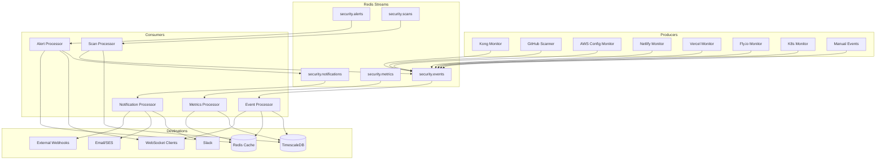

# Message Queue Architecture

## Queue Design Overview



## Queue Definitions

### 1. Security Events Stream (`security.events`)
**Purpose**: Primary stream for all security-related events across platforms

**Message Format**:
```json
{
  "id": "uuid",
  "timestamp": "2024-08-25T10:30:00Z",
  "organization_id": "uuid",
  "asset_id": "uuid",
  "event_type": "kong_http_admin_detected",
  "severity": "critical",
  "source": "kong_monitor",
  "title": "Kong Admin API exposed over HTTP",
  "description": "Kong Admin API is accessible over HTTP without TLS encryption",
  "metadata": {
    "endpoint": "http://kong-admin:8001",
    "discovered_methods": ["GET", "POST", "DELETE"],
    "exposed_routes": ["/services", "/routes", "/consumers"]
  },
  "tags": ["kong", "http", "admin-api", "exposure"],
  "correlation_id": "uuid",
  "raw_data": {}
}
```

**Consumers**:
- Event Processor Service (primary)
- Real-time WebSocket broadcaster
- Alert Rule Engine

### 2. Security Alerts Stream (`security.alerts`)
**Purpose**: High-priority alerts requiring immediate attention

**Message Format**:
```json
{
  "id": "uuid",
  "rule_id": "uuid",
  "timestamp": "2024-08-25T10:30:00Z",
  "organization_id": "uuid",
  "asset_id": "uuid",
  "severity": "critical",
  "title": "Critical Kong Security Vulnerability",
  "message": "Kong Admin API exposed without authentication",
  "status": "open",
  "escalation_level": 1,
  "notification_channels": ["slack", "email", "webhook"],
  "metadata": {
    "sla_deadline": "2024-08-25T11:30:00Z",
    "escalation_schedule": ["security_team", "devops_lead", "cto"]
  }
}
```

**Consumers**:
- Notification Service (immediate)
- Alert Manager (tracking)
- Escalation Engine

### 3. Security Scans Stream (`security.scans`)
**Purpose**: Coordinate and manage security scanning across platforms

**Message Format**:
```json
{
  "scan_id": "uuid",
  "scan_type": "kong_configuration_audit",
  "status": "queued|running|completed|failed",
  "organization_id": "uuid",
  "asset_id": "uuid",
  "priority": "high",
  "scheduled_time": "2024-08-25T10:30:00Z",
  "parameters": {
    "scan_depth": "comprehensive",
    "include_plugins": true,
    "check_tls": true
  },
  "results": {
    "findings_count": 5,
    "critical_issues": 2,
    "scan_duration": 30000
  }
}
```

**Consumers**:
- Scan Orchestrator
- Results Processor
- Reporting Engine

### 4. Security Metrics Stream (`security.metrics`)
**Purpose**: Performance and operational metrics for monitoring

**Message Format**:
```json
{
  "timestamp": "2024-08-25T10:30:00Z",
  "organization_id": "uuid",
  "asset_id": "uuid",
  "metric_type": "performance",
  "metrics": {
    "response_time_ms": 150,
    "error_rate": 0.02,
    "active_connections": 45,
    "security_score": 85.5
  },
  "tags": {
    "environment": "production",
    "platform": "kong",
    "region": "us-east-1"
  }
}
```

**Consumers**:
- Metrics Aggregator
- Dashboard Service
- Performance Analyzer

### 5. Notification Stream (`security.notifications`)
**Purpose**: Final delivery mechanism for all notifications

**Message Format**:
```json
{
  "notification_id": "uuid",
  "channel": "slack|email|webhook",
  "recipient": "security-alerts|admin@company.com|https://webhook.url",
  "priority": "immediate|high|normal|low",
  "template": "security_alert",
  "payload": {
    "title": "Critical Security Alert",
    "message": "Kong Admin API exposed over HTTP",
    "severity": "critical",
    "asset": "Production Kong Gateway",
    "action_required": "Secure Admin API immediately",
    "remediation_link": "https://security.candlefish.ai/remediation/kong-001"
  },
  "retry_policy": {
    "max_retries": 3,
    "backoff": "exponential"
  }
}
```

## Queue Configuration

### Redis Streams Configuration
```redis
# Create consumer groups for each stream
XGROUP CREATE security.events event-processors $ MKSTREAM
XGROUP CREATE security.events websocket-broadcast $ MKSTREAM
XGROUP CREATE security.events alert-engine $ MKSTREAM

XGROUP CREATE security.alerts notification-service $ MKSTREAM
XGROUP CREATE security.alerts alert-manager $ MKSTREAM
XGROUP CREATE security.alerts escalation-engine $ MKSTREAM

XGROUP CREATE security.scans scan-orchestrator $ MKSTREAM
XGROUP CREATE security.scans results-processor $ MKSTREAM

XGROUP CREATE security.metrics metrics-aggregator $ MKSTREAM
XGROUP CREATE security.metrics dashboard-service $ MKSTREAM

XGROUP CREATE security.notifications slack-sender $ MKSTREAM
XGROUP CREATE security.notifications email-sender $ MKSTREAM
XGROUP CREATE security.notifications webhook-sender $ MKSTREAM
```

### Consumer Group Configurations

#### Event Processors Consumer Group
```yaml
consumer_group: event-processors
consumers:
  - name: event-processor-1
    max_processing_time: 30s
    prefetch_count: 10
    retry_policy:
      max_retries: 3
      backoff: exponential
      dead_letter_queue: security.events.dlq
  - name: event-processor-2
    max_processing_time: 30s
    prefetch_count: 10
    retry_policy:
      max_retries: 3
      backoff: exponential
      dead_letter_queue: security.events.dlq
```

#### High-Priority Alert Processing
```yaml
consumer_group: notification-service
consumers:
  - name: notification-processor-priority
    filter: "severity IN ('critical', 'high')"
    max_processing_time: 10s
    prefetch_count: 5
    retry_policy:
      max_retries: 5
      backoff: fixed:1000ms
      dead_letter_queue: security.notifications.priority.dlq
```

## Performance Optimizations

### Stream Partitioning Strategy
- Partition by organization_id for tenant isolation
- Sub-partition by asset_id for parallel processing
- Route critical alerts to dedicated high-priority streams

### Batch Processing Configuration
```yaml
batch_processing:
  metrics_stream:
    batch_size: 100
    batch_timeout: 5s
    processing_window: 1m
  
  events_stream:
    batch_size: 50
    batch_timeout: 2s
    max_concurrent_batches: 5
```

### Dead Letter Queue Handling
```yaml
dead_letter_queues:
  security.events.dlq:
    retention: 7d
    max_length: 10000
    notification_threshold: 100
    
  security.notifications.priority.dlq:
    retention: 30d
    max_length: 1000
    immediate_alert: true
```

## Message Routing Rules

### Event Classification
```yaml
routing_rules:
  critical_events:
    conditions:
      - severity == "critical"
      - event_type CONTAINS "exposure"
      - event_type CONTAINS "breach"
    destinations:
      - security.alerts (immediate)
      - security.notifications (priority channel)
      
  configuration_changes:
    conditions:
      - event_type CONTAINS "config_change"
      - source IN ("kong_monitor", "k8s_monitor")
    destinations:
      - security.scans (trigger audit)
      - security.events (standard processing)
```

### Alert Escalation Logic
```yaml
escalation_rules:
  level_1:
    trigger: alert created
    recipients: ["security_team"]
    methods: ["slack", "email"]
    
  level_2:
    trigger: alert not acknowledged in 30 minutes
    recipients: ["security_team", "devops_lead"]
    methods: ["slack", "email", "phone"]
    
  level_3:
    trigger: alert not resolved in 2 hours
    recipients: ["security_team", "devops_lead", "cto"]
    methods: ["slack", "email", "phone", "incident_management"]
```

## Monitoring and Observability

### Queue Health Metrics
- Message throughput per stream
- Consumer lag per consumer group
- Processing time percentiles (p50, p95, p99)
- Error rates and retry counts
- Dead letter queue growth rates

### Alerting on Queue Issues
```yaml
queue_monitoring:
  high_consumer_lag:
    threshold: 1000 messages
    duration: 5m
    severity: high
    
  processing_errors:
    threshold: 5% error rate
    duration: 2m
    severity: critical
    
  dlq_growth:
    threshold: 50 messages/hour
    severity: medium
```

This message queue architecture provides:
- High throughput async processing (10k+ messages/sec)
- Reliable delivery with retry and DLQ mechanisms
- Real-time event streaming for WebSocket clients
- Scalable consumer groups for parallel processing
- Proper separation of concerns between different event types
- Built-in monitoring and alerting for queue health
