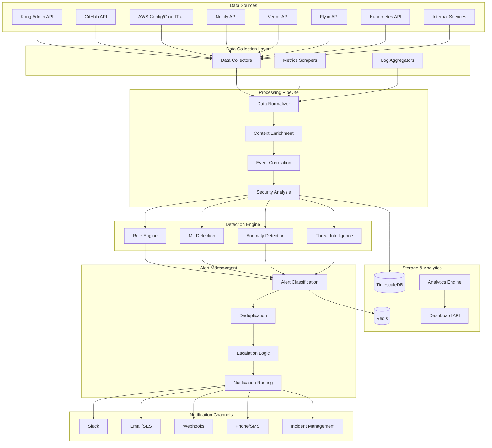

# Monitoring and Alerting Pipeline

## Pipeline Architecture Overview



## Detection Rules and Policies

### 1. Kong Gateway Security Rules

#### HTTP Admin API Detection
```yaml
rule_id: kong_http_admin_api
name: "Kong Admin API HTTP Exposure"
severity: critical
category: configuration_security
description: "Detects Kong Admin API accessible over HTTP"

conditions:
  - source: kong_monitor
  - event_type: service_discovery
  - data.protocol == "http"
  - data.endpoint CONTAINS "admin"
  - data.port IN [8001, 8444]

actions:
  - create_alert:
      title: "Kong Admin API exposed over HTTP"
      message: "Admin API at {{data.endpoint}} is accessible over unencrypted HTTP"
      remediation: "Configure HTTPS and restrict access to admin network"
  - notify:
      channels: [slack_critical, email_security_team]
      escalation: immediate

metadata:
  cwe_id: "CWE-319"
  owasp_category: "A02:2021 – Cryptographic Failures"
  compliance_frameworks: [PCI_DSS, SOC2]
```

#### Unauthorized Plugin Configuration
```yaml
rule_id: kong_plugin_security_change
name: "Kong Security Plugin Modified"
severity: high
category: configuration_change

conditions:
  - source: kong_monitor
  - event_type: plugin_configuration_change
  - data.plugin_type IN ["rate-limiting", "oauth2", "jwt", "acl", "cors"]

actions:
  - create_alert:
      title: "Critical Kong plugin configuration changed"
      message: "Security plugin {{data.plugin_type}} modified on service {{data.service_name}}"
  - trigger_audit:
      scan_type: kong_security_audit
      priority: high
```

### 2. Platform-Specific Security Rules

#### GitHub Actions Security
```yaml
rule_id: github_workflow_security
name: "GitHub Actions Security Violation"
severity: high
category: ci_cd_security

conditions:
  - source: github_scanner
  - OR:
    - data.secrets_in_logs == true
    - data.public_fork_access == true
    - data.unrestricted_workflow_run == true

actions:
  - create_alert:
      title: "GitHub Actions security issue detected"
      message: "Security violation in workflow {{data.workflow_name}}"
  - notify:
      channels: [slack_devops, email_security_team]
```

#### AWS Configuration Drift
```yaml
rule_id: aws_security_group_change
name: "AWS Security Group Modified"
severity: medium
category: infrastructure_change

conditions:
  - source: aws_config
  - event_type: security_group_change
  - data.change_type IN ["ingress_added", "egress_modified"]
  - data.protocol == "*" OR data.port_range == "0-65535"

actions:
  - create_alert:
      title: "Overly permissive security group rule added"
      message: "Security group {{data.group_id}} allows broad access"
  - trigger_compliance_check:
      framework: AWS_Config_Rules
```

### 3. Vulnerability Detection Rules

#### CVE Matching
```yaml
rule_id: cve_detection
name: "Known CVE Detected"
severity: varies_by_cvss
category: vulnerability_management

conditions:
  - source: vulnerability_scanner
  - data.cve_id EXISTS
  - data.cvss_score >= 7.0

dynamic_severity:
  critical: data.cvss_score >= 9.0
  high: data.cvss_score >= 7.0
  medium: data.cvss_score >= 4.0
  low: data.cvss_score < 4.0

actions:
  - create_vulnerability_record
  - if_severity_critical:
      notify:
        channels: [slack_critical, email_ciso]
        escalation: immediate
```

## Anomaly Detection Models

### 1. Behavioral Analysis

#### Traffic Pattern Anomalies
```python
# Traffic anomaly detection model
class TrafficAnomalyDetector:
    def __init__(self):
        self.model = IsolationForest(contamination=0.1)
        self.features = [
            'request_rate',
            'error_rate', 
            'response_time_p95',
            'unique_ips',
            'geographic_diversity'
        ]
    
    def detect_anomalies(self, metrics_window):
        """
        Detect anomalous traffic patterns
        Returns: List of anomalies with severity scores
        """
        features = self.extract_features(metrics_window)
        anomaly_scores = self.model.decision_function(features)
        
        return [
            {
                'timestamp': timestamp,
                'anomaly_score': score,
                'severity': self.classify_severity(score),
                'affected_assets': self.get_affected_assets(timestamp),
                'pattern_type': self.classify_pattern(features[i])
            }
            for i, (timestamp, score) in enumerate(zip(timestamps, anomaly_scores))
            if score < -0.5  # Threshold for anomaly
        ]
```

#### Authentication Pattern Analysis
```python
class AuthenticationAnomalyDetector:
    """
    Detects unusual authentication patterns that may indicate:
    - Credential stuffing attacks
    - Account takeovers
    - Unusual geographic access
    """
    
    def analyze_auth_patterns(self, auth_logs):
        anomalies = []
        
        # Failed login rate analysis
        failed_rate = self.calculate_failed_rate(auth_logs)
        if failed_rate > self.thresholds['failed_login_rate']:
            anomalies.append({
                'type': 'excessive_failed_logins',
                'severity': 'high',
                'rate': failed_rate,
                'threshold': self.thresholds['failed_login_rate']
            })
        
        # Geographic anomalies
        geo_anomalies = self.detect_geographic_anomalies(auth_logs)
        anomalies.extend(geo_anomalies)
        
        return anomalies
```

### 2. Time Series Analysis

#### Security Metrics Forecasting
```python
class SecurityMetricsForecast:
    """
    Predicts security metrics trends and detects deviations
    """
    
    def __init__(self):
        self.models = {
            'vulnerability_count': Prophet(),
            'alert_volume': ARIMA(order=(2,1,2)),
            'security_score': LinearRegression()
        }
    
    def detect_trend_anomalies(self, metric_name, values, timestamps):
        model = self.models[metric_name]
        
        # Fit model on historical data
        model.fit(values[:-24])  # Use all but last 24 hours
        
        # Predict recent values
        predicted = model.predict(timestamps[-24:])
        actual = values[-24:]
        
        # Calculate anomaly scores
        deviations = np.abs(actual - predicted) / np.std(predicted)
        
        return [
            {
                'timestamp': ts,
                'metric': metric_name,
                'actual': act,
                'predicted': pred,
                'deviation_score': dev,
                'is_anomaly': dev > 2.0  # 2 standard deviations
            }
            for ts, act, pred, dev in zip(timestamps[-24:], actual, predicted, deviations)
        ]
```

## Alert Processing Pipeline

### 1. Alert Classification Engine

```python
class AlertClassificationEngine:
    """
    Classifies and enriches security alerts with context
    """
    
    def classify_alert(self, raw_alert):
        classification = {
            'id': raw_alert['id'],
            'severity': self.calculate_severity(raw_alert),
            'category': self.determine_category(raw_alert),
            'business_impact': self.assess_business_impact(raw_alert),
            'urgency': self.calculate_urgency(raw_alert),
            'confidence': self.calculate_confidence(raw_alert)
        }
        
        # Add enrichment data
        classification['enrichment'] = {
            'asset_criticality': self.get_asset_criticality(raw_alert['asset_id']),
            'historical_frequency': self.get_historical_frequency(raw_alert['event_type']),
            'related_incidents': self.find_related_incidents(raw_alert),
            'remediation_playbook': self.get_remediation_playbook(raw_alert['category'])
        }
        
        return classification
    
    def calculate_severity(self, alert):
        """
        Calculate final severity based on multiple factors
        """
        base_severity = alert.get('severity', 'medium')
        
        # Severity modifiers
        modifiers = []
        
        # Asset criticality
        asset_criticality = self.get_asset_criticality(alert['asset_id'])
        if asset_criticality == 'critical':
            modifiers.append(1)  # Increase severity
        elif asset_criticality == 'low':
            modifiers.append(-1)  # Decrease severity
        
        # Environment impact
        if alert.get('environment') == 'production':
            modifiers.append(1)
        
        # Time sensitivity
        if self.is_business_hours():
            modifiers.append(0.5)
        
        # Apply modifiers
        severity_levels = ['low', 'medium', 'high', 'critical']
        current_level = severity_levels.index(base_severity)
        adjusted_level = max(0, min(len(severity_levels)-1, 
                                  current_level + sum(modifiers)))
        
        return severity_levels[adjusted_level]
```

### 2. Deduplication Engine

```python
class AlertDeduplicationEngine:
    """
    Prevents alert spam by intelligently deduplicating similar alerts
    """
    
    def __init__(self):
        self.similarity_threshold = 0.8
        self.time_window = timedelta(hours=1)
    
    def is_duplicate(self, new_alert, existing_alerts):
        """
        Determine if new alert is a duplicate of existing ones
        """
        for existing in existing_alerts:
            if self.calculate_similarity(new_alert, existing) > self.similarity_threshold:
                if self.within_time_window(new_alert, existing):
                    return existing
        return None
    
    def calculate_similarity(self, alert1, alert2):
        """
        Calculate similarity score between two alerts
        """
        similarity_factors = {
            'asset_id': 0.3,
            'event_type': 0.25,
            'severity': 0.2,
            'source': 0.15,
            'title_similarity': 0.1
        }
        
        score = 0
        
        # Exact matches
        for field, weight in similarity_factors.items():
            if field == 'title_similarity':
                score += weight * self.text_similarity(alert1['title'], alert2['title'])
            elif alert1.get(field) == alert2.get(field):
                score += weight
        
        return score
    
    def merge_alerts(self, primary_alert, duplicate_alert):
        """
        Merge duplicate alert information into primary alert
        """
        primary_alert['occurrence_count'] += 1
        primary_alert['last_occurrence'] = duplicate_alert['created_at']
        
        # Merge metadata
        if 'duplicates' not in primary_alert['metadata']:
            primary_alert['metadata']['duplicates'] = []
        
        primary_alert['metadata']['duplicates'].append({
            'alert_id': duplicate_alert['id'],
            'timestamp': duplicate_alert['created_at'],
            'source': duplicate_alert['source']
        })
        
        return primary_alert
```

### 3. Escalation Engine

```python
class AlertEscalationEngine:
    """
    Manages alert escalation based on time, severity, and acknowledgment
    """
    
    def __init__(self):
        self.escalation_rules = {
            'critical': [
                {'level': 1, 'delay': timedelta(minutes=0), 'recipients': ['security_team']},
                {'level': 2, 'delay': timedelta(minutes=15), 'recipients': ['security_lead', 'devops_lead']},
                {'level': 3, 'delay': timedelta(hours=1), 'recipients': ['ciso', 'cto']},
                {'level': 4, 'delay': timedelta(hours=4), 'recipients': ['executive_team']}
            ],
            'high': [
                {'level': 1, 'delay': timedelta(minutes=0), 'recipients': ['security_team']},
                {'level': 2, 'delay': timedelta(hours=1), 'recipients': ['security_lead']},
                {'level': 3, 'delay': timedelta(hours=4), 'recipients': ['ciso']}
            ],
            'medium': [
                {'level': 1, 'delay': timedelta(minutes=0), 'recipients': ['security_team']},
                {'level': 2, 'delay': timedelta(hours=4), 'recipients': ['security_lead']}
            ],
            'low': [
                {'level': 1, 'delay': timedelta(minutes=0), 'recipients': ['security_team']}
            ]
        }
    
    def process_escalation(self, alert):
        """
        Process alert escalation based on current state
        """
        if alert['status'] in ['resolved', 'suppressed']:
            return None
        
        severity = alert['severity']
        current_time = datetime.utcnow()
        created_time = alert['created_at']
        time_elapsed = current_time - created_time
        
        escalation_levels = self.escalation_rules[severity]
        
        for level_config in escalation_levels:
            if time_elapsed >= level_config['delay']:
                if not self.has_been_escalated(alert, level_config['level']):
                    return self.create_escalation(alert, level_config)
        
        return None
    
    def create_escalation(self, alert, level_config):
        """
        Create escalation notification
        """
        return {
            'alert_id': alert['id'],
            'escalation_level': level_config['level'],
            'recipients': level_config['recipients'],
            'escalation_time': datetime.utcnow(),
            'notification_channels': self.get_channels_for_level(level_config['level']),
            'message': f"ESCALATED L{level_config['level']}: {alert['title']}"
        }
```

## Performance Monitoring

### Key Performance Indicators (KPIs)

```yaml
monitoring_kpis:
  detection_performance:
    - name: "Mean Time to Detection (MTTD)"
      target: "< 5 minutes"
      measurement: "Time from event occurrence to alert generation"
    
    - name: "False Positive Rate"
      target: "< 5%"
      measurement: "Percentage of alerts that are false positives"
    
    - name: "Alert Processing Throughput"
      target: "> 1000 alerts/minute"
      measurement: "Number of alerts processed per minute"
  
  response_performance:
    - name: "Mean Time to Acknowledgment (MTTA)"
      target: "< 15 minutes"
      measurement: "Time from alert creation to acknowledgment"
    
    - name: "Mean Time to Resolution (MTTR)"
      target: "< 4 hours for critical alerts"
      measurement: "Time from alert creation to resolution"
  
  system_performance:
    - name: "Processing Latency"
      target: "< 100ms p95"
      measurement: "Alert processing latency percentiles"
    
    - name: "System Availability"
      target: "> 99.9%"
      measurement: "Monitoring system uptime"
```

### Monitoring Dashboards

```yaml
dashboards:
  security_operations_overview:
    panels:
      - title: "Active Alerts by Severity"
        type: "stat"
        queries:
          - "SELECT severity, COUNT(*) FROM alert_instances WHERE status='open' GROUP BY severity"
      
      - title: "Alert Volume Trend (24h)"
        type: "time_series"
        queries:
          - "SELECT created_at, COUNT(*) FROM alert_instances WHERE created_at > NOW() - INTERVAL '24 hours' GROUP BY DATE_TRUNC('hour', created_at)"
      
      - title: "Mean Time to Resolution by Severity"
        type: "bar_chart"
        queries:
          - "SELECT severity, AVG(EXTRACT(EPOCH FROM (resolved_at - created_at))/60) as mttr_minutes FROM alert_instances WHERE resolved_at IS NOT NULL GROUP BY severity"
  
  platform_security_health:
    panels:
      - title: "Kong Security Score"
        type: "gauge"
        query: "SELECT AVG(security_score) FROM assets WHERE platform='kong'"
      
      - title: "GitHub Actions Security Issues"
        type: "stat"
        query: "SELECT COUNT(*) FROM security_events WHERE source='github_scanner' AND severity IN ('critical', 'high') AND created_at > NOW() - INTERVAL '24 hours'"
      
      - title: "Compliance Status by Framework"
        type: "heatmap"
        query: "SELECT cf.name, ca.status, COUNT(*) FROM compliance_assessments ca JOIN compliance_controls cc ON ca.control_id = cc.id JOIN compliance_frameworks cf ON cc.framework_id = cf.id GROUP BY cf.name, ca.status"
```

This monitoring and alerting pipeline provides:
- Real-time detection of security threats across all platforms
- Intelligent alert processing with deduplication and correlation
- Automated escalation based on severity and time
- Comprehensive anomaly detection using ML models
- Performance monitoring with SLA tracking
- Rich dashboards for security operations visibility
- Scalable processing supporting 10k+ alerts per minute
